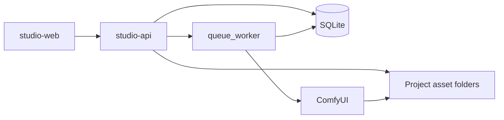

# Adept UI — Full System Architecture

**Document type:** Architectural plan and system inventory  
**Status:** Planning reference (not an implementation checklist to execute blindly)  
**Product:** Adept UI Video Studio (`AIVideoStudio`)  
**Date:** 2026-07-23  

This document describes:

1. **What Adept UI is today** — infrastructure, routes, data, workspaces, and functionality as presently laid out  
2. **What the Unified System Refactor targets** — fewer systems, richer shared data  
3. **How to get from current → unified** — migration, risks, testing, success criteria  

**Product principle (target):**  
*Every major workspace should operate on the same Project, Scene, Profile, Asset, Generation, Timeline, Job, and Memory objects. Preserve variety through modes, views, and shared objects—not through disconnected applications.*

---

## Table of contents

1. [Executive summary](#1-executive-summary)
2. [Present infrastructure](#2-present-infrastructure)
3. [Present routing and navigation](#3-present-routing-and-navigation)
4. [Present component and workspace map](#4-present-component-and-workspace-map)
5. [Present data model](#5-present-data-model)
6. [Present functionality by area](#6-present-functionality-by-area)
7. [Duplication and architectural conflicts](#7-duplication-and-architectural-conflicts)
8. [Target product model](#8-target-product-model)
9. [Target core objects](#9-target-core-objects)
10. [Target workspaces](#10-target-workspaces)
11. [Co-Director architecture](#11-co-director-architecture)
12. [Jobs, workflows, ComfyUI, and FFmpeg](#12-jobs-workflows-comfyui-and-ffmpeg)
13. [Knowledgebase and Project Memory](#13-knowledgebase-and-project-memory)
14. [Library, Assets, and lineage](#14-library-assets-and-lineage)
15. [Local-first storage](#15-local-first-storage)
16. [Navigation and Home/Dashboard](#16-navigation-and-homedashboard)
17. [Shared UI and state rules](#17-shared-ui-and-state-rules)
18. [Migration from existing Adept UI](#18-migration-from-existing-adept-ui)
19. [Implementation phases](#19-implementation-phases)
20. [Files to add, modify, and deprecate](#20-files-to-add-modify-and-deprecate)
21. [Features deferred](#21-features-deferred)
22. [Risk analysis](#22-risk-analysis)
23. [Testing plan and success criteria](#23-testing-plan-and-success-criteria)
24. [Relation to prior Director + Editor plan](#24-relation-to-prior-director--editor-plan)

---

## 1. Executive summary

Adept UI is a **local-first AI filmmaking studio**: React web client + FastAPI/SQLite API + ComfyUI for generation + FFmpeg for media processing. Users create projects and scenes, attach profiles and references, generate images/video, direct timed prompt plans, and (increasingly) assemble and export cuts.

**Today** the product works, but it behaves like a **collection of specialized tools** sharing a project ID:

- ~20 in-app workspace tabs  
- Multiple generate UIs with overlapping controls  
- Scene Master Sheet, Spatial Map, Avatar Studio, Profiles, Script/Storyboard as parallel packages  
- Jobs exist centrally, but Job UI is embedded in several panels  
- Library exists, but AssetTray and Marketplace are additional browse surfaces  
- Editor / Audio Studio tabs are typed but not fully wired as first-class production finishers  

**Target** is one connected environment:

```
Project → Scene → Story → Profiles + Scene Sheet → Director → Generate → Audio → Editor → Export
                              ↑________________ Co-Director across all ________________↑
```

Eight foundations: **Project, Scene, Profile, Asset, Generation, Timeline, Job, Co-Director** (plus **Project Memory**).

---

## 2. Present infrastructure

### 2.1 Repository layout

| Path | Role |
|------|------|
| `studio-web/` | Vite + React + TypeScript UI (dev typically `:5173`) |
| `studio-api/` | FastAPI + SQLite API (dev typically `:8742`) |
| `studio-api/knowledgebase/` | Markdown prompt/generation knowledge (filesystem) |
| `docs/` | Architecture and planning documents (this file) |

### 2.2 Runtime stack

| Layer | Technology | Notes |
|-------|------------|--------|
| Frontend | React, Vite, TypeScript | Single SPA |
| Backend | FastAPI (Python) | Routers under `/api` |
| Metadata DB | SQLite (`studio.db` under settings data dir) | Core tables + satellite package tables |
| Assets | Project folders on disk | Served via `/api/assets/.../file`, `/media` |
| Generation | ComfyUI (via job worker) | Prompt graphs / workflows |
| Media ops | FFmpeg | Lipsync, export, future Editor |
| Client persistence | `localStorage` | Last workspace tab, recent projects |

### 2.3 High-level request flow (today)



### 2.4 API surface (summary)

Mounted under `/api` from `studio-api/app/main.py`:

| Area | Typical prefixes | Source modules |
|------|------------------|----------------|
| Core CRUD / render | `/projects`, `/scenes`, `/assets`, `/jobs`, `/render`, `/lipsync`, `/export` | `routers/api.py` |
| Director / lipsync tracks | `/projects/.../scenes/.../director`, `.../lipsync-tracks` | `routers/api.py` |
| Profiles, learning, spatial, script, storyboard, library extras | `/profiles`, `.../learning`, `.../spatial`, `.../script`, `.../storyboard` | `routers/extra.py` |
| Master sheet | `.../master-sheet`, `.../master-sheets` | `master_sheet.py` |
| Avatar sessions | `.../avatar-sessions` | `avatar_studio.py` |
| Director sequences / editor | `.../director-sequences`, `.../editor` | `editor_sequences.py` |
| Knowledgebase / compile | `/knowledgebase/...`, `/codirector/compile-prompt` | `knowledgebase_api.py` |
| Setup, fal, assistant, tools | `/setup`, `/fal`, `/assistant`, `/tools/...` | various |

---

## 3. Present routing and navigation

### 3.1 URL routes

| Path | Component | Behavior |
|------|-----------|----------|
| `/` | `studio-web/src/pages/Home.tsx` | Studio home / project library |
| `/project/:id` | `studio-web/src/pages/ProjectEditor.tsx` | Entire in-project UI shell |
| `*` | Navigate to `/` | Catch-all |

There are **no nested React Router routes** for Director, Generate, etc. Workspace identity lives in React state + `localStorage` (`adept_ui_last_workspace`), not in the path.

**Gap:** Home Explore links to `/project/:id?tab=<EditorTab>`, but ProjectEditor does **not** currently read `?tab=`.

### 3.2 Workspace tab IDs (`EditorTab`)

Defined in `studio-web/src/workspacePrefs.ts`:

```
home | setup | settings
imagegen | one | txt2vid | three | avatar
director | audiostudio | editor
profiles | tools | spatial | script | shotlist | generate
library | marketplace | mastersheet
```

### 3.3 Hamburger groups (present)

| Group | Tabs |
|-------|------|
| **Generation Modes** | ImageGen, 1 Frame, Txt2Vid, 3 Frame, Avatar |
| **Production** | Director, Scene Master Sheet |
| **Assets** | Profiles, Character / Angles, Libraries, Marketplace |
| **Planning** | Script / Storyboard, Spatial Map, Generate Timeline, Shot List, Project Home |

**Also reachable:** Setup Wizard, Project Settings / Learning (menus), Co-Director overlay.

**Production finishers (landed precursor):** `editor` → `EditorWorkspace`; `audiostudio` → `AudioStudioWorkspace` (stub). Hamburger Production group: Director → Audio Studio → Editor.

### 3.4 Nested Director chrome

Separate from `EditorTab`: `WorkspaceTab = "timeline" | "prompt" | "lipsync" | "settings"` in director selection context. Tabs `one` | `three` | `director` share `DirectorWorkspaceShell`.

---

## 4. Present component and workspace map

| Workspace | Tab ID | Primary UI |
|-----------|--------|------------|
| Project Home | `home` | `ProjectHome.tsx` + dashboard cards |
| ImageGen | `imagegen` | `ImageGenPanel.tsx` |
| 1 Frame / 3 Frame | `one` / `three` | `FrameModes.tsx` inside Director shell |
| Txt2Vid | `txt2vid` | `Txt2VidPanel.tsx` |
| Avatar Studio | `avatar` | `AvatarStudioWorkspace.tsx` + `avatar/types.ts` |
| Director | `director` | `DirectorTracks.tsx`, `LivePreviewMonitor.tsx`, AssetTray, LipSyncTracks |
| Scene Master Sheet | `mastersheet` | `SceneMasterSheetWorkspace.tsx` + `mastersheet/types.ts` |
| Profiles | `profiles` | `ProfilesWorkspace.tsx` |
| Character / Angles | `tools` | `ImageTools.tsx` + embedded `JobPanel` |
| Libraries | `library` | `LibraryPanel.tsx` |
| Marketplace | `marketplace` | `MarketplacePanel.tsx`, `LoRAManager.tsx` |
| Script / Storyboard | `script` | `ScriptStoryboardWorkspace.tsx` |
| Shot List | `shotlist` | Same component, `shotListOnly` |
| Spatial Map | `spatial` | `SpatialSceneWorkspace.tsx` (live); legacy `SpatialMap.tsx` unused |
| Generate Timeline | `generate` | `GenerateTimelinePanel.tsx` |
| Settings / Setup | `settings` / `setup` | `ProjectSettings.tsx`, `SetupWizard.tsx` |
| AI Learning | settings sub | `LearningPanel.tsx` |
| Co-Director | overlay | `AssistantPanel.tsx` + `codirector/*` |
| Editor | `editor` | `EditorWorkspace.tsx` — assembly timeline, Director Sources, lineage |
| Audio Studio (stub) | `audiostudio` | `AudioStudioWorkspace.tsx` — audio assets + handoff stubs |

**Packages (type modules, not npm packages):**

- `studio-web/src/codirector/` — actions, execute, plans, permissions  
- `studio-web/src/mastersheet/` — Master Sheet types / builders  
- `studio-web/src/avatar/` — Avatar session types  
- `studio-web/src/components/dashboard/` — StudioChrome, hero, cover cards, Co-Director briefing widgets  

---

## 5. Present data model

### 5.1 Core tables (`studio-api/app/db.py`)

| Table | Role |
|-------|------|
| **projects** | Production container; many JSON columns (spatial, learning, defaults, settings, tags, preview, render safety) |
| **scenes** | Per-scene generation unit; prompt, duration, start/middle/end/audio asset IDs, `director_json`, lipsync fields, continuity |
| **assets** | Media files (kind, path, scope, labels, prompt meta, parent lineage) |
| **jobs** | Processing queue (kind, status, progress, params, Comfy prompt id, output path) |

### 5.2 Satellite / package tables

| Table | Module | Role |
|-------|--------|------|
| `profile_items` | `profiles.py` | Global profile library (kinds in `data_json`); not project-scoped |
| `asset_versions` / `asset_edges` | `asset_graph.py` | Version history and graph edges |
| `spatial_scenes` | `spatial_scene.py` | Per-scene spatial map JSON (+ legacy project `spatial_map_json`) |
| `script_docs` / `script_segments` / `storyboard_panels` | `script_storyboard.py` | Script + storyboard |
| `scene_master_sheets` | `master_sheet.py` | Scene master sheet packages |
| `avatar_sessions` | `avatar_studio.py` | Avatar studio sessions |
| `director_sequences` | `editor_sequences.py` | Approved / packaged Director outputs |
| `editor_projects` | `editor_sequences.py` | Project-level editor assembly JSON |

### 5.3 Important JSON blobs

| Location | Contents |
|----------|----------|
| `scenes.director_json` | Director Timeline: media mode, image/video clips, prompt segments (incl. audio_intent), camera, audio/sfx, lipsync |
| `scenes.lipsync_tracks_json` | Dual lipsync tracks |
| `scenes.continuity_json` | Continuity notes |
| `projects.learning_json` | Co-Director / learning memory (opaque) |
| Package `data_json` | Master sheet, avatar, director sequence, editor project |

### 5.4 Relationship graph (today)

```
Project
 ├─ Scene ── soft Asset IDs (start/middle/end/audio)
 │ ├─ director_json (timeline)
 │ ├─ master sheet (1:1-ish)
 │ ├─ spatial_scenes
 │ └─ director_sequences → optional asset_id
 ├─ Assets ← Jobs write outputs; versions/edges
 ├─ Jobs (project + optional scene)
 ├─ avatar_sessions
 ├─ editor_projects (≤1 per project)
 └─ script_docs → segments → storyboard_panels

profile_items: global; referenced by ID/tag inside JSON packages
```

### 5.5 Gaps vs unified eight foundations

| Unified entity | Today | Gap |
|----------------|-------|-----|
| Project | First-class | Exists; overloaded JSON |
| Scene | First-class | Exists; weak typed links to packages |
| Profile | `profile_items` | Global; not unified type/metadata contract |
| Asset | First-class | Soft scene binding; mixed kinds |
| Generation | Implicit in Job + versions | No durable Generation package entity |
| Timeline | Director blob + sequences + editor | Three overlapping timelines |
| Job | First-class | Stringly kinds; UI not unified |
| Memory | `learning_json` | No MemoryItem CRUD model |

---

## 6. Present functionality by area

### 6.1 Home and Project Home

- Cinematic hero, new production, templates, project library with status chips  
- Explore feature cards (deep-link intent via `?tab=`)  
- System status strip  
- Co-Director composer entry  
- In-project dashboard: continue working, workspace cards, briefing  

### 6.2 Generation (fragmented)

- **ImageGen** — still image generation UI + job panel  
- **Txt2Vid** — text-to-video  
- **1 Frame / 3 Frame** — frame-conditioned workflows inside Director shell  
- **Avatar Studio** — talking character sessions (look, voice, performance, takes)  
- **Generate Timeline** — timeline-oriented generate panel  
- **Spatial** — can drive spatial-aware generation  

### 6.3 Planning

- **Script / Storyboard** — documents, segments, panels (combined workspace)  
- **Shot List** — filtered view of same  
- **Spatial Map** — scene spatial document / blocking geometry app  
- **Scene Master Sheet** — ingredients, states, prompts, authority for scene look  

### 6.4 Director

- Prompt Timeline authority for a scene  
- Tracks: media, prompt segments, camera, audio, sfx, lipsync  
- Monitor vs Tracks chrome  
- Persists via `GET/PUT …/director`  
- Precursor: package as Director Sequence; send-to-editor APIs emerging  

### 6.5 Profiles, Library, Marketplace, Tools

- Profiles CRUD by kind  
- Library browse (project/global assets; sheets; avatars)  
- Marketplace / LoRA install framing  
- Character sheet / multi-angle tools  

### 6.6 Jobs and learning

- Central jobs table + worker  
- JobPanel embedded in multiple generate surfaces  
- Learning panel stores accepted preferences in project learning JSON  

### 6.7 Co-Director (present)

- Assistant panel FAB + plans  
- Typed action registry and execute layer (includes Director sequence / Editor assemble actions)  
- Compile-prompt against generation KB; production KB stubs for editor/assemble/mix  
- Not yet: full Home gateway, operating modes (Guide / Autopilot), single context bus  

### 6.8 Director Sequences + Editor + Audio (landed foundation)

- **API:** `GET/POST …/director-sequences`, `…/from-scene`, `GET/PATCH …/{seq_id}`, `…/send-to-editor`, `GET/PUT …/editor` (`editor_sequences.py`)  
- **Director UI:** Prompt Timeline labels, Audio Intent on segments, Send to Editor  
- **Editor:** Director Sources, trim, Open in Director, Generate Replacement (editorial context), Replace/Alternate/Compare/Ignore  
- **Audio Studio:** thin stub (list/upload audio, add-to-Editor placeholders)  
- **Library / Home:** Director Sequences + Editor cards/sections  
- **Verify:** `npx tsc --noEmit` clean as of foundation landing  

This is a **precursor** to unified Timeline/Editor (Phases 3 and 5), not the final NLE/Audio product.  

---

## 7. Duplication and architectural conflicts

| Conflict | Current reality | Unified intent |
|----------|-----------------|----------------|
| Generate UIs | 5+ separate surfaces | One **Generate** with mode tabs |
| Profiles | Profiles + Avatar + Master Sheet + Spatial attachments | One **Profile** system |
| Master Sheet vs Scene Sheet | Ingredient Master Sheet app | **Scene Sheet** (5 sections); DNA in Profiles |
| Spatial Map | Full nav + dual stores | Remove from nav; lightweight blocking on Scene Sheet |
| Avatar Studio | Dedicated app | **Generate → Avatar** mode |
| Creative Brain | Learning panel / learning_json | **Project Memory** |
| Marketplace | Storefront framing | **Resources** (local installs) |
| Library / Jobs | Split browse + embedded queues | One Library (filters); one Jobs workspace |
| Editor / Audio | Production nav + workspaces landed (foundation stub depth) | Focused Finish workspaces; deepen toward unified Timeline + real Audio tabs |
| Timeline | Three models | Discriminated Timeline (`director` \| `editor`) |

---

## 8. Target product model

### 8.1 Final flow

```
Project
   ↓
Scene
   ↓
Story (Script + Storyboard)
   ↓
Profiles + Scene Sheet
   ↓
Director (Timed Prompt Plan)
   ↓
Generate (Image + Video + Frames + Avatar + Enhance)
   ↓
Audio (Dialogue + Music + SFX + Ambience)
   ↓
Editor (Full Project Assembly)
   ↓
Export

Co-Director operates across the entire flow.
```

### 8.2 Design slogan

> One project. One scene model. One Profile system. One Generate workspace. One Library. One Jobs system. One Co-Director.

### 8.3 Eight primary foundations

| Foundation | Role |
|------------|------|
| **Project** | One complete production |
| **Scene** | Central working object inside a project |
| **Profile** | Reusable character / env / prop / voice / style DNA |
| **Asset** | Every media item |
| **Generation** | Durable record of a generate request → outputs (job-backed) |
| **Timeline** | Director prompt plan or Editor assembly |
| **Job** | All processing in one queue |
| **Co-Director** | Persistent orchestrator with typed actions |

Supporting: **Project Memory**, **Workflow Templates**, **Scene Sheet**, **Script Segment**, **Storyboard Panel**.

---

## 9. Target core objects

### 9.1 Project

```ts
interface Project {
  id: string;
  name: string;
  description?: string;
  projectType: ProjectType; // Short Film | Feature | Series Episode | Commercial | Music Video | Animation | Social | Custom
  status: ProjectStatus;
  coverAssetId?: string;
  aspectRatio: string;
  width: number;
  height: number;
  frameRate: number;
  defaultImageModel?: string;
  defaultVideoModel?: string;
  defaultAudioModel?: string;
  sceneIds: string[];
  profileIds: string[];
  assetIds: string[];
  timelineIds: string[];
  projectRules: ProjectRule[];
  createdAt: string;
  updatedAt: string;
}
```

### 9.2 Scene (central production object)

Opening one Scene should expose: Script, Storyboard, Cast, Environment, Props, Scene Sheet, Director Sequences, Generated media, Audio, Editor usage, Production status—without re-linking the scene across apps.

```ts
interface Scene {
  id: string;
  projectId: string;
  title: string;
  sceneNumber: number;
  sequenceId?: string;
  status: SceneStatus;
  location?: string;
  timeOfDay?: string;
  durationEstimate?: number;
  scriptDocumentId?: string;
  scriptSegmentIds: string[];
  storyboardPanelIds: string[];
  castProfileIds: string[];
  environmentProfileIds: string[];
  propProfileIds: string[];
  wardrobeProfileIds: string[];
  sceneSheetId?: string;
  directorSequenceIds: string[];
  generatedAssetIds: string[];
  audioAssetIds: string[];
  editorClipIds: string[];
  visualBrief?: string;
  storyPurpose?: string;
  emotionalPurpose?: string;
  createdAt: string;
  updatedAt: string;
}
```

### 9.3 Profile (unified)

```ts
type ProfileType =
  | "character" | "environment" | "prop" | "wardrobe"
  | "vehicle" | "creature" | "world" | "style" | "voice";

interface Profile {
  id: string;
  projectId?: string;
  type: ProfileType;
  name: string;
  description?: string;
  referenceAssetIds: string[];
  tags: string[];
  positivePrompt?: string;
  negativePrompt?: string;
  continuityRules?: string[];
  metadata: Record<string, unknown>; // type-specific fields
  createdAt: string;
  updatedAt: string;
}
```

Same cards, search, Library storage, tagging, attachment, and versioning for all types.

### 9.4 Scene Sheet (replaces Master Sheet product)

Five sections: Cast · Environment and Props · Look and Mood · Action and Blocking · Camera and Generation.

Reusable DNA lives in Profiles. Scene Sheet combines selected profiles + instructions for one scene. Lightweight blocking replaces Spatial Map in the initial roadmap (screen-left/right, depth, facing, entry/exit, relations). Optional simple Blocking Diagram (circles, initials, arrows)—communication aid, not a geometry engine. Preserve spatial metadata for future Virtual Stage.

### 9.5 Story objects

- **ScriptSegment** — ordered heading/action/dialogue/… with speaker profile, emotional intent, linked panels, revision  
- **StoryboardPanel** — image, shot/lens/camera, status including `outdated`  

When a script segment changes: **do not auto-overwrite** storyboard; mark panels outdated; user keeps / updates / duplicates / regenerates.

### 9.6 Director objects

Director remains separate. Purpose: convert a shot/short sequence into a **timed, model-aware prompt plan**—not a full NLE.

Simplified tracks: Visual Action, Camera, Prompt/Model (+ optional Reference Frames, Dialogue Intent, Audio Intent, Continuity Notes).

```ts
interface DirectorSequence {
  id: string;
  projectId: string;
  sceneId: string;
  name: string;
  duration: number;
  modelId?: string;
  workflowTemplateId?: string;
  segmentIds: string[];
  generatedAssetIds: string[];
  status: "draft" | "ready" | "queued" | "generating" | "complete" | "approved";
  createdAt: string;
  updatedAt: string;
}
```

Outputs can be sent to Editor with lineage.

### 9.7 Editor / Timeline / Clip

```ts
interface Timeline {
  id: string;
  projectId: string;
  sceneId?: string;
  type: "editor"; // director timelines are sibling type or discriminator
  name: string;
  duration: number;
  trackIds: string[];
  markerIds: string[];
  status: "draft" | "rough-cut" | "review" | "approved";
  createdAt: string;
  updatedAt: string;
}

interface EditorClip {
  id: string;
  timelineId: string;
  trackId: string;
  assetId: string;
  sourceDirectorSequenceId?: string;
  sourceStoryboardPanelId?: string;
  sourceScriptSegmentId?: string;
  startTime: number;
  duration: number;
  sourceIn: number;
  sourceOut: number;
  volume?: number;
  fadeIn?: number;
  fadeOut?: number;
  createdAt: string;
  updatedAt: string;
}
```

First Editor supports multi video/audio tracks, trim/split/move/delete, basic transitions, placeholders, fades, preview + FFmpeg final render. Not Premiere-class.

**Non-destructive rule:** Regenerated Director output never auto-overwrites Editor clips—offer Replace / Alternate / Compare / Ignore. Provide **Open Source in Director**.

### 9.8 Asset

```ts
type AssetType =
  | "image" | "video" | "audio" | "storyboard" | "reference"
  | "document" | "scene-sheet-render" | "director-output" | "editor-render";
```

Every output appears in one Library with filters: All, Profiles, References, Storyboards, Images, Videos, Audio, Director Outputs, Editor Renders, Scene Sheets.

### 9.9 Job

One Jobs system for Image, Video, Audio, Lip Sync, Enhance, Editor Render, Import. All workspaces share this queue.

### 9.10 Memory

```ts
interface MemoryItem {
  id: string;
  projectId?: string;
  category: MemoryCategory; // Project/Character/Visual/Audio/Editing Rule, Accepted/Rejected Decision, Prompt Learning
  text: string;
  source?: string;
  approved: boolean;
  createdAt: string;
  updatedAt: string;
}
```

View / search / edit / delete / approve / reject. No knowledge graph or vector search in v1.

---

## 10. Target workspaces

### 10.1 Story (unified Script + Storyboard)

Layout: Scene List | Script Editor | Storyboard Panel + strip + metadata. Co-Director suggestions and revision status.

### 10.2 Scene Sheets

Primary scene visual/production summary. Profile attachment + blocking. No separate Master Sheet editors for world/prop/character packages in v1.

### 10.3 Generate (unified)

Mode tabs: **Image · Text to Video · Image to Video · Frames · Avatar · Enhance**

Shared chrome: Prompt, Negative, References, Profiles, Scene Sheet, Model, Workflow, Resolution, Duration/frames, Seed, Queue, Preview, Output versions.

Layout: Prompt and References | Main Preview | Model and Settings (+ Generate/Queue) | Output Variations.

Avatar is a **mode**, not a separate studio app. Enhance covers upscale/restore/interpolate/denoise/reframe/extend/relight where supported.

### 10.4 Director (focused)

Inherits Profiles, Scene Sheet, continuity, storyboard, project settings. Sends approved sequences to Editor.

### 10.5 Audio

Tabs: Dialogue · Music · Sound Effects · Ambience. Generate / preview / variations / Library / Send to Editor. Mixing primarily in Editor. Not a full DAW.

### 10.6 Editor

Assembles the film. Lineage back to Director / Storyboard / Script.

### 10.7 Organize: Profiles, Library, Jobs

### 10.8 Resources (ex-Marketplace)

Installed models, LoRAs, workflows, custom nodes, missing deps, updates, compatibility, enable/disable. No public storefront in v1.

---

## 11. Co-Director architecture

### 11.1 Visual states

1. Home Gateway  
2. Workspace Side Panel  
3. Floating Compact Button  

One system—not reimplemented per workspace.

### 11.2 Context

```ts
interface CoDirectorContext {
  projectId?: string;
  sceneId?: string;
  activeWorkspace?: string;
  selectedProfileId?: string;
  selectedAssetId?: string;
  selectedScriptSegmentId?: string;
  selectedStoryboardPanelId?: string;
  selectedDirectorSequenceId?: string;
  selectedEditorClipId?: string;
}
```

### 11.3 Operating modes

Guide Me · Collaborate · Build for Me · Advise Only · Autopilot  

Autopilot stops on: manual checkpoint, expensive generation, ambiguity, destructive action, final export.

### 11.4 Typed actions (initial registry)

`createProject`, `updateProject`, `createScene`, `updateScene`, `createProfile`, `updateProfile`, `attachProfileToScene`, `createScriptSegment`, `updateScriptSegment`, `createStoryboardPanel`, `generateStoryboardPanel`, `createSceneSheet`, `updateSceneSheet`, `createDirectorSequence`, `createDirectorSegment`, `queueGeneration`, `createAudioJob`, `addAssetToEditor`, `createEditorTimeline`, `addEditorClip`, `trimEditorClip`, `generateEditorPreview`, `saveMemoryItem`, `searchLibrary`

Each action defines: input schema, validation, permission, cost category, confirmation, undo, result schema.

**Not in v1:** multi-agent orchestration; arbitrary invented Comfy graphs.

### 11.5 Home gateway copy (target)

- Heading: *Create your project with Co-Director.*  
- Actions: Start with an Idea · Import a Script · Use Existing Images · Continue a Project  

---

## 12. Jobs, workflows, ComfyUI, and FFmpeg

### 12.1 Curated Workflow Templates

Named, tested templates (Image, Storyboard, Character Ref, Environment, LTX T2V/I2V, WAN I2V, Start-End, Three-Frame, Talking Avatar, Lip Sync, Voice/Music/SFX/Ambience, Upscale, Interpolation, Restoration). Co-Director and Generate fill named inputs; advanced users may open the node graph separately.

### 12.2 ComfyUI adapter boundary

Single service: connect, system stats, list models, validate workflow, queue, job status, cancel, retrieve outputs, map errors. No direct Comfy calls from arbitrary UI components.

### 12.3 FFmpeg Editor boundary

Validated builders only: proxy, extract frame, trim, concatenate, mix audio, preview/final render, waveform, transcode. Co-Director must not run arbitrary shell commands.

---

## 13. Knowledgebase and Project Memory

### 13.1 Simplified KB layout (target)

```
knowledgebase/
├── shared/
│   ├── cinematic-prompting.md
│   ├── character-consistency.md
│   ├── audio-prompting.md
│   └── editing-guidelines.md
├── models/
│   ├── ltx-2.3.md
│   ├── wan-2.2.md
│   ├── seedance.md
│   ├── kling.md
│   ├── veo.md
│   └── runway.md
└── projects/
    └── {projectId}.md
```

One main guide per model initially. Present generation KB under `knowledgebase/generation/` migrates into this structure over Phase 3.

### 13.2 Project Memory

Rename practical Creative Brain / Learning into categorized MemoryItem records (section 9.10).

---

## 14. Library, Assets, and lineage

### 14.1 Production lineage (IDs, not graph DB)

```
Scene
  → Script Segment
  → Storyboard Panel
  → Director Sequence
  → Generated Asset
  → Editor Clip
```

UI affordances: Open Source Script · Open Storyboard Panel · Open Source Director Sequence · View Generation Settings · Find Usage.

### 14.2 Library filters

All · Profiles · References · Storyboards · Images · Videos · Audio · Director Outputs · Editor Renders · Scene Sheets  

---

## 15. Local-first storage

### 15.1 Stack

SQLite metadata · Project folders for assets · JSON/DB for workflow metadata · Markdown KB · FFmpeg · ComfyUI API  

No cloud dependency for core operation.

### 15.2 Suggested project folder layout

```
projects/
└── {project-id}/
    ├── project.json
    ├── assets/
    │   ├── images/
    │   ├── videos/
    │   ├── audio/
    │   ├── references/
    │   └── renders/
    ├── documents/
    ├── scene-sheets/
    ├── workflows/
    ├── editor/
    ├── exports/
    └── backups/
```

---

## 16. Navigation and Home/Dashboard

### 16.1 Target navigation

**Create:** Co-Director · Story · Scene Sheets · Generate · Director  

**Finish:** Audio · Editor  

**Organize:** Profiles · Library · Jobs  

**Resources · Settings**  

Do not expose unfinished future modules (Spatial Map, public Marketplace, Virtual Stage, etc.) in main nav.

### 16.2 Home

Cinematic Hero · Co-Director Gateway · New Project · Recent Projects · Quick Start Templates · System Status  

### 16.3 Project Dashboard

Project Hero · Production Stats · Continue Working · Scene Progress · Recent Assets · Jobs · Co-Director Briefing · Production Health  

Reusable cards: ProjectCard, SceneCard, ProfileCard, AssetCard, JobCard, WorkspaceCard, CoDirectorActionCard  

---

## 17. Shared UI and state rules

### 17.1 Recommended shared components

AppHeader, ProjectSelector, WorkspaceNavigation, SceneSelector, CoDirectorPanel, PromptEditor, ReferencePicker, ProfilePicker, ModelSelector, WorkflowSelector, GenerationSettings, AssetGrid, AssetCard, JobProgress, TimelineRuler/Track/Clip, InspectorPanel, EmptyState, StatusBadge, ConfirmActionDialog, VersionSelector  

### 17.2 State separation

| Concern | Store |
|---------|--------|
| Persistent project data | Database + project filesystem |
| Temporary UI state | Frontend state store |
| Generation execution | Jobs service |
| Comfy execution | ComfyUI adapter |
| Co-Director conversation | Conversation + action history store |

Avoid authoritative data only in ephemeral component state.

---

## 18. Migration from existing Adept UI

| Current | Target |
|---------|--------|
| ImageGen | Generate / Image |
| Txt2Vid | Generate / Text to Video |
| 1 Frame / 3 Frame | Generate / Frames |
| Avatar Studio | Generate / Avatar |
| Character / Angles | Profiles / Character (+ Generate as needed) |
| Spatial Map | Remove from nav; blocking → Scene Sheet; preserve design docs/metadata |
| Director | Keep as Director |
| Library | Unified Library |
| Render Queue / JobPanel | Jobs workspace |
| Assistant | Co-Director |
| Creative Brain / Learning | Project Memory |
| Marketplace | Resources |
| Master Sheet | Scene Sheet |
| Script + Shot List | Story |
| director_sequences / editor_projects | Timeline + EditorClip lineage |

**Rule:** Do not delete working routes until replacement views are verified. Use redirects or compatibility wrappers. Prefer additive schema migrations.

### 18.1 Safety before architecture changes

1. Full project backup  
2. Record routes, DB/localStorage shapes, Comfy workflow mappings  
3. Identify reusable vs duplicated components  
4. Migration scripts for schema  
5. Preserve sample projects; keep app recoverable  

---

## 19. Implementation phases

| Phase | Scope |
|-------|--------|
| **0 — Safety freeze** | Backup script; inventory routes/schema/storage/workflows |
| **1 — Foundations** | Shared types; Project/Scene/Profile/Asset/Job; Library filters; Comfy adapter; workflow registry |
| **2 — Story + Scene Sheets** | Story workspace; Scene Sheet + blocking; Master Sheet migration; profile attach |
| **3 — Generate + Director** | Unified Generate modes; Director focus; model KB |
| **4 — Co-Director** | Home gateway; panel; modes; action registry; Project Memory |
| **5 — Audio + Editor** | Audio tabs; Editor; FFmpeg boundary; Director↔Editor lineage |
| **6 — Polish** | Dashboard cards; Resources; deprecate wrappers; e2e |

**Locked sequencing:** Do not begin large UI expansion until Phase 1 foundations are stable.

---

## 20. Files to add, modify, and deprecate

### 20.1 Add (representative)

**API:** unified schemas, migrations, `comfy_adapter.py`, `ffmpeg_service.py`, `workflow_templates.py`, `memory.py`, KB `shared/` + `models/`  

**Web:** `core/types.ts`, Generate/Story/SceneSheet/Audio/Jobs/Resources workspaces, shared pickers/timeline/cards, Co-Director gateway + context store  

### 20.2 Modify (representative)

`db.py`, `main.py`, routers, `profiles.py`, `master_sheet.py` → Scene Sheet path, `editor_sequences.py`, `director_timeline.py`, `queue_worker.py`, `knowledgebase_api.py`, `workspacePrefs.ts`, `ProjectEditor.tsx`, `Home.tsx`, `ProjectHome.tsx`, `api.ts`, `LibraryPanel.tsx`, `AssistantPanel.tsx`, `codirector/*`, `LearningPanel.tsx`, `MarketplacePanel.tsx`  

### 20.3 Deprecate from nav (then delete after verification)

Spatial top-level · separate Avatar Studio · Master Sheet product name · fragmented generate tabs · Marketplace storefront · AI Learning branding · unused legacy SpatialMap editor  

---

## 21. Features deferred

Do **not** implement in the initial unified refactor:

- Spatial Maps UI / full Virtual Stage  
- Professional DAW  
- Premiere-class NLE  
- Multi-agent orchestration  
- Knowledge graph DB / Production Graph visualization  
- Public Marketplace  
- Distributed GPU workers  
- Advanced multi-user collaboration  
- Automated complex character tracking  
- Advanced spatial audio  
- Automatic mouth-mask detection  
- Full model-training suite  
- Dynamic arbitrary ComfyUI graph construction  

Preserve expansion points; do not expose unfinished modules in main navigation.

---

## 22. Risk analysis

| Risk | Mitigation |
|------|------------|
| Schema breakage | Additive migrations; dual-read old JSON; backups |
| Generation regressions | Adapters keep existing job kinds; phase smoke tests |
| Partial Editor/Director precursor drift | Fold into Timeline model; freeze orphan-tab feature growth |
| Profiles global → project-scoped | Link/copy-on-attach; do not orphan rows |
| Nav confusion mid-migration | Compatibility redirects + “Moved to…” states |
| Scope creep into deferred work | Phase gates + success checklist |
| Autopilot destructive actions | Permissions + confirmation on expensive/destructive ops |

---

## 23. Testing plan and success criteria

### 23.1 Core workflow

Create Project → Create Scene → Add Profiles → Write Script Segment → Generate Storyboard Panel → Build Scene Sheet → Create Director Sequence → Queue Video → Save to Library → Generate Dialogue or Music → Add to Editor → Render Preview  

### 23.2 Additional cases

Project reopen · Asset lineage · Failed Comfy job · Missing model · Cancelled job · Scene deletion protection · Version replacement · Undo Co-Director action · Editor clip source recovery · Backup/restore · `npx tsc --noEmit`  

### 23.3 Success criteria

- User understands where to begin  
- Co-Director can guide through the product  
- Same Profiles and assets reused across workspaces  
- Scene data is not repeatedly entered  
- Generate modes share one interface  
- Director stays prompt-timing focused  
- Editor stays assembly focused  
- Audio assets usable in Editor  
- One Library; one Jobs queue  
- Outputs preserve source lineage  
- Existing working generation remains functional  
- Navigation is substantially simpler  
- System remains expandable later  

---

## 24. Relation to prior Director + Editor plan

The **Director + Editor Architecture Foundation** is **landed** (see §6.8). Summary:

- Director remains Prompt Timeline (not renamed/gutted)  
- `director_sequences` / `editor_projects` APIs + Editor/Audio Studio tabs wired  
- Non-destructive lineage (Replace / Alternate / Compare / Ignore)  
- Production KB stubs + Co-Director editor/director actions  

Treat that work as a **precursor** to Phases 3 and 5 of this unified refactor:

- Absorb sequence/editor packages into unified Timeline + EditorClip  
- Do **not** expand separate Avatar Studio or Spatial Map as competing product tracks  
- Grow Audio stub toward the focused Audio workspace (Dialogue / Music / SFX / Ambience)  

This document remains the **system-wide** source of truth. Phase execution should follow sections 18–19 after review and approval.

---

## Appendix A — Present vs target navigation cheat sheet

| Present hamburger | Target home |
|-------------------|-------------|
| ImageGen, 1 Frame, Txt2Vid, 3 Frame, Avatar | **Generate** (modes) |
| Director | **Director** |
| Scene Master Sheet | **Scene Sheets** |
| Profiles | **Profiles** |
| Character / Angles | Fold into Profiles / Generate |
| Libraries | **Library** |
| Marketplace | **Resources** |
| Script / Storyboard, Shot List | **Story** |
| Spatial Map | Removed from nav (blocking in Scene Sheet) |
| Generate Timeline | Fold into Generate / Director |
| Project Home | Project Dashboard |
| (missing finish) | **Audio**, **Editor** |
| Embedded JobPanels | **Jobs** |
| Assistant FAB | **Co-Director** (gateway + panel + compact) |

---

## Appendix B — Audit sources

This document synthesizes:

- Live codebase audit of `studio-web` and `studio-api` (routes, tabs, components, SQLite schema, package modules)  
- Product specification: *Adept UI Unified System Refactor* (§1–§37)  
- Cursor planning output: Unified System Refactor plan  

**Implementation must not begin broad refactoring until this architecture is reviewed.**

---

*End of document.*
