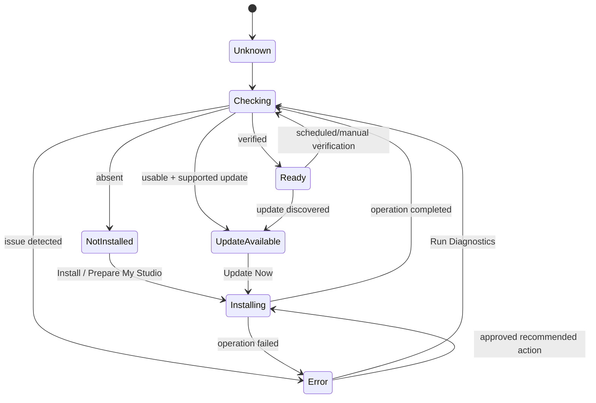

# Setup Wizard Refactor — Automated Installation Experience

**Status:** Implementation-ready design  
**Scope:** Setup experience only; preserve existing installation and maintenance behavior  
**Primary goal:** A new user can press **Prepare My Studio**, wait, and reach a clear ready state with minimal interaction.

## 1. Product intent

The Setup Wizard is a guided installation experience, not a package manager.

The default screen must answer only:

1. What is ready?
2. What still needs to be installed?
3. Is anything broken?

Every component card answers one question: **Is this ready to use?**

Maintenance choices, executable paths, environment details, logs, and destructive actions remain available, but move behind **Advanced**. The default experience emphasizes status, confidence, and one appropriate next action.

## 2. Current problems

The current implementation is split across:

- `studio-web/src/components/SetupWizard.tsx`
- `studio-web/src/api.ts`
- `studio-api/app/setup_wizard.py`
- setup routes in `studio-api/app/routers/extra.py`
- persisted state in `{STUDIO_DATA_DIR}/setup_state.json`

Current user-facing problems:

- Every component card exposes Verify, Approve Install/Link, Repair, Update, and Remove at the same time.
- Users must choose a maintenance operation before knowing what is wrong.
- Detection results, component catalog data, and maintenance controls compete for attention.
- Installation/model paths are always exposed for linkable components.
- Required and optional components are visually similar.
- There is no single overall readiness decision.
- There is no one-click required-component preparation workflow.
- Operations provide only a busy component ID, not durable progress, stage, elapsed time, or estimated remaining time.
- Verification is manual after installation.
- Diagnostics are implicit and component-specific rather than a normalized workflow.
- Update availability is not represented as a first-class readiness result.
- Raw hardware and service details are presented before the user needs them.

Current backend constraints must be represented honestly:

- Detection already checks GPU, RAM, disk, Python, FFmpeg, ComfyUI, Ollama, fal.ai key state, and stored model locations.
- Existing actions and state persistence must remain compatible.
- `approve_install()` currently performs path checks and records action state; several install, repair, and update paths are placeholders rather than complete installers.
- The refactor must not relabel a recorded approval or linked path as a verified working installation.
- Large model downloads, license acceptance, credentials, administrator elevation, and user-selected external paths may still require explicit interaction.

## 3. Experience architecture

### Default experience

```text
Launch Setup
    ↓
Automatic status check
    ↓
System summary + status-first cards
    ↓
Prepare My Studio
    ↓
Install/configure required components
    ↓
Automatically verify each result
    ↓
Ready to Generate
```

The automation pauses only for a necessary checkpoint:

- operating-system elevation;
- license or terms acceptance;
- credentials;
- user-owned installation path;
- insufficient disk space;
- a download source or dependency that cannot be resolved safely;
- a destructive action.

Optional components are detected and displayed but are never installed by **Prepare My Studio**.

### Information hierarchy

1. Overall readiness and **Prepare My Studio**
2. Counts for Ready, Not Installed, and Needs Attention
3. Required component cards
4. Optional component cards
5. Collapsed Advanced section

GPU, RAM, disk, service URLs, environment, source links, licenses, modes, VRAM recommendations, and raw paths move to Advanced details unless they directly explain a blocking issue.

## 4. Component state model

### Canonical readiness states

- `unknown` — no trustworthy result yet
- `checking` — detection or verification is running
- `ready` — installed, verified, available, and usable
- `not_installed` — absent and no fault was detected
- `update_available` — usable now, with a newer supported version available
- `installing` — an install, repair, or update operation is active
- `error` — installed or configured state is unusable or diagnostics failed

`not_installed` is required even though it was omitted from the abbreviated state sequence in the request; without it, the UI cannot distinguish a clean absence from an error.

Updating and verification do not need additional durable states. They are operation phases:

```ts
type SetupOperationPhase =
  | "installing"
  | "updating"
  | "repairing"
  | "configuring"
  | "verifying";
```

The canonical state remains `installing` or `checking`, while the phase supplies the visible label:

- `installing` → “Installing…”
- `updating` → “Updating…”
- `repairing` → “Repairing…”
- `configuring` → “Configuring…”
- `verifying` → “Checking Installation…”

### State diagram



### State invariants

- A component reaches `ready` only after verification succeeds.
- A stored path or prior approval alone never means `ready`.
- `error` includes a machine-readable issue code and a user-safe explanation.
- Only one primary action appears in default mode.
- A failed install automatically enters diagnostics before recommending another action.
- Update dismissal preserves usability and records “Later” without hiding the available update permanently.

## 5. Status presentation

Visible labels:

- **Ready** — green
- **Not Installed** — neutral gray
- **Needs Attention** — red
- **Update Available** — amber
- **Installing…** — blue
- **Updating…** — blue
- **Checking Installation…** — blue

Use accessible iconography plus text. Color alone must not communicate state.

### Overall summary

The top section contains:

```text
System Status
8 Ready · 2 Not Installed · 1 Needs Attention

Overall Status
Ready to Generate
```

Overall status rules:

- **Ready to Generate**: every required component is `ready` or a usable `update_available`.
- **Preparing Studio**: a required operation is active.
- **Additional Setup Required**: a required component is missing.
- **Needs Attention**: a required component is in `error`.
- Optional missing/error components do not block readiness, but remain visible under Optional.

Primary summary action:

- Show **Prepare My Studio** when required work remains.
- Show no maintenance action when all required components are ready.
- Optionally show a quiet **Check Again** action in the overflow menu, not as a competing primary button.

## 6. Component card redesign

Every default card contains:

- component name;
- one-sentence description;
- Required or Optional badge;
- status light and status text;
- installed version when known;
- estimated disk usage;
- one primary action only when needed;
- operation progress and estimated remaining time when active.

### Ready

Display:

- green **Ready** status;
- installed version;
- compact disclosure containing installation path and last verified timestamp.

Display no action buttons.

### Not Installed

Display:

- gray **Not Installed** status;
- estimated download and installed size;
- one **Install** action.

For required components, the global **Prepare My Studio** action is preferred. The card action supports installing one item independently.

### Needs Attention

Display:

- red **Needs Attention** status;
- short, non-technical issue summary;
- one **Run Diagnostics** action.

Do not show Repair, Reinstall, Update, path controls, or Remove until diagnostics produces a recommendation.

### Update Available

Display:

- amber **Update Available** status;
- current and available versions;
- **Update Now** as the primary action;
- **Later** as a quiet secondary choice.

### Active operation

Display:

- blue operation label;
- progress bar;
- current stage;
- estimated remaining time when the estimate is reliable;
- cancellation only when the underlying operation is safely cancellable.

Do not show a false time estimate. Use “Estimating…” when there is not enough progress data.

## 7. Prepare My Studio automation

### Responsibilities

**Prepare My Studio**:

1. acquires an operation lock so two setup runs cannot overlap;
2. refreshes hardware, service, path, and component detection;
3. calculates required-component work in dependency order;
4. confirms disk capacity before downloads;
5. creates required application directories;
6. detects and reuses valid existing installations;
7. installs or configures missing required components where supported;
8. applies safe path configuration;
9. runs component diagnostics;
10. automatically verifies every changed component;
11. refreshes the complete status model;
12. stops at a user checkpoint only when automation cannot proceed safely;
13. returns one overall readiness result.

### Planning before execution

The backend first produces a preparation plan:

```ts
interface StudioPreparationPlan {
  requiredActions: SetupPlannedAction[];
  skippedOptionalComponentIds: string[];
  requiredDiskBytes: number;
  availableDiskBytes?: number;
  userCheckpoints: SetupCheckpoint[];
  canRunUnattended: boolean;
}
```

The UI may summarize material facts before a large operation:

```text
Prepare My Studio
3 required components · 12.4 GB download · about 18 minutes
```

This is not a package-by-package decision screen. One confirmation covers the approved plan unless a separate license, credential, elevation, or path checkpoint is legally or technically required.

### Dependency ordering

Initial order:

1. directories and write permissions;
2. Python/runtime requirements;
3. FFmpeg;
4. ComfyUI connectivity/installation;
5. required custom nodes and dependencies;
6. required model paths and weights;
7. application configuration;
8. end-to-end verification.

The catalog should gain explicit dependencies rather than relying on array order.

### Failure behavior

- Continue independent checks when one component fails.
- Stop dependent installs, not the entire plan.
- Preserve completed work.
- Run diagnostics for the failed component.
- Return one recommended next action.
- Never retry indefinitely.
- Persist a resumable operation summary without persisting secrets in logs.

## 8. Diagnostics workflow

### Checks

Diagnostics evaluate, as applicable:

- executable or files exist;
- version is supported;
- file and directory permissions;
- environment compatibility;
- runtime dependencies;
- configuration validity;
- configured and discovered paths;
- service connectivity;
- required models/custom nodes;
- available disk space;
- checksums or file integrity where supported;
- a minimal non-destructive capability probe.

### Result contract

Diagnostics return one outcome and one recommended action:

```ts
type DiagnosticRecommendation =
  | "none"
  | "install"
  | "repair"
  | "reinstall"
  | "update"
  | "correct_path"
  | "grant_permission"
  | "configure"
  | "manual_help";

interface ComponentDiagnosticResult {
  componentId: string;
  healthy: boolean;
  issueCode?: string;
  summary: string;
  technicalDetails?: string[];
  recommendation: DiagnosticRecommendation;
  recommendedActionLabel?: string;
  requiresUserInteraction: boolean;
  checkedAt: string;
}
```

Default UI examples:

```text
FFmpeg is installed correctly.
No action required.
```

```text
Python installation could not start.
Recommended action: Repair Installation
```

Only after the second result may **Repair Installation** appear.

### Automatic verification

Every install, repair, update, link, or configuration action transitions to automatic verification:

```text
Operation → Checking Installation… → Ready | Needs Attention
```

The API must not report success until verification has completed.

## 9. Advanced Mode

Advanced Mode preserves expert and support capabilities without competing with the primary setup journey.

Access:

- collapsed **Advanced** disclosure at the bottom of Setup;
- optional component-level **Details** disclosure;
- no default expansion for new users.

Advanced capabilities:

- Verify
- Repair
- Update
- Remove
- Logs
- Environment
- Executable paths
- Model paths
- Version details
- Source and license details
- Dependency and compatibility results
- Raw diagnostic details
- Copy support report

Safety rules:

- Remove remains destructive and requires confirmation.
- Large downloads show size and license/source before execution.
- Secrets are never displayed in logs or support reports.
- Manual path edits are validated before persistence.
- Advanced actions use the same automation and verification engine as default mode; they do not create a second maintenance implementation.

## 10. Backend design

### Normalized component model

Extend the catalog/state boundary without deleting current fields:

```py
class ComponentStatus(str, Enum):
    UNKNOWN = "unknown"
    CHECKING = "checking"
    READY = "ready"
    NOT_INSTALLED = "not_installed"
    UPDATE_AVAILABLE = "update_available"
    INSTALLING = "installing"
    ERROR = "error"

@dataclass
class SetupComponentStatus:
    component_id: str
    status: ComponentStatus
    operation_phase: str | None
    installed_version: str | None
    available_version: str | None
    installation_path: str | None
    last_verified_at: str | None
    progress: float | None
    estimated_remaining_seconds: int | None
    diagnostic: dict | None
```

Catalog additions:

- dependency IDs;
- supported platforms;
- detection strategy;
- installer strategy;
- verifier strategy;
- diagnostics strategy;
- update strategy;
- estimated download/installed bytes;
- interaction requirements;
- version support policy.

### Automation services

Add boundaries under `studio-api/app/setup/` or an equivalent focused package:

- `catalog.py` — component metadata and dependencies;
- `detectors.py` — environment/component detection;
- `diagnostics.py` — normalized checks and recommendations;
- `installers.py` — install/link/configure operations;
- `verifiers.py` — post-operation verification;
- `updates.py` — update discovery and execution;
- `orchestrator.py` — Prepare My Studio planning and execution;
- `operations.py` — progress, cancellation, checkpoints, and logs;
- `state.py` — versioned persistence and compatibility conversion.

The current `setup_wizard.py` remains a compatibility facade during migration.

### API evolution

Add:

- `GET /api/setup/status` — normalized summary and component states;
- `POST /api/setup/prepare/plan` — preparation plan;
- `POST /api/setup/prepare` — start one-click setup;
- `GET /api/setup/operations/{operation_id}` — progress snapshot;
- `POST /api/setup/operations/{operation_id}/checkpoint` — answer required user interaction;
- `POST /api/setup/components/{id}/diagnostics` — normalized diagnostics;
- `POST /api/setup/components/{id}/recommended-action` — execute only the diagnostic recommendation;
- `POST /api/setup/components/{id}/update/later` — persist update dismissal.

Use polling initially to match the existing application. An SSE progress stream may be added behind the same operation model later.

Preserve during migration:

- `GET /api/setup/detect`
- `GET /api/setup/state`
- `POST /api/setup/components/{id}/action`
- `PUT /api/setup/model-locations`

Legacy actions route through the new services once parity is proven.

### Persistence

Version `setup_state.json` and preserve existing `components` and `model_locations`:

```json
{
  "schema_version": 2,
  "components": {},
  "model_locations": {},
  "status": {},
  "operations": {},
  "update_dismissals": {}
}
```

Persist:

- last verified time;
- detected version/path;
- last diagnostic summary and issue code;
- resumable operation metadata;
- update dismissal;
- configuration generated by Setup.

Do not persist:

- plaintext credentials;
- full environment dumps;
- unbounded logs;
- volatile progress events after operation retention expires.

Write state atomically through a temporary file and replace operation to avoid corruption.

## 11. Frontend design

Refactor `SetupWizard.tsx` into a thin workspace composed from:

- `SetupSummary`
- `PrepareStudioAction`
- `RequiredComponents`
- `OptionalComponents`
- `SetupComponentCard`
- `SetupProgress`
- `DiagnosticResult`
- `SetupCheckpointDialog`
- `SetupAdvancedPanel`
- `SetupSupportReport`

Add typed API models; remove `any` from Setup state and catalog usage.

Default UI state is derived from backend status. React state owns only transient presentation such as expanded details, Advanced visibility, and an active checkpoint response.

The card component receives one backend-computed `primary_action`. It must not recreate diagnostic or maintenance policy in JSX.

## 12. Screens and files requiring updates

Primary updates:

- `studio-web/src/components/SetupWizard.tsx`
- `studio-web/src/api.ts`
- `studio-web/src/types.ts` or a focused `studio-web/src/setup/types.ts`
- `studio-web/src/styles.css`
- `studio-api/app/setup_wizard.py`
- setup routes in `studio-api/app/routers/extra.py`
- `{STUDIO_DATA_DIR}/setup_state.json` compatibility handling

Likely additions:

- focused backend setup automation modules;
- focused frontend Setup components/types;
- backend tests for detection, diagnostics, planning, progress, verification, and compatibility;
- frontend tests for card action invariants and summary states.

Related screens to verify, not redesign:

- `ProjectEditor.tsx` Setup entry;
- Setup access from project menus or Home;
- Project Settings integrations/path displays;
- GPU/VRAM status surfaces;
- Resources/model installation handoffs;
- fal.ai credential setup;
- Co-Director setup actions and support guidance.

## 13. Implementation steps

### Step 1 — Contract and compatibility

- Add typed status, diagnostic, operation, checkpoint, and plan contracts.
- Version setup persistence.
- Convert current detect/state results into the normalized status model.
- Add contract tests around all current catalog entries.
- Preserve existing endpoints and action semantics.

### Step 2 — Reliable detection and verification

- Split detection from catalog serialization.
- Add component-specific verifier strategies.
- Capture version, path, last verified, dependencies, and issue codes.
- Ensure only verified components become `ready`.
- Add disk and permission checks.

### Step 3 — Diagnostics

- Implement normalized diagnostics and recommendation policy.
- Return one recommendation per run.
- Add technical details for Advanced while keeping default summaries plain.
- Test missing, corrupted, unsupported, inaccessible, disconnected, and insufficient-disk cases.

### Step 4 — Operation engine

- Add operation IDs, stage progress, safe cancellation, retained logs, and checkpoints.
- Automatically verify after every action.
- Prevent overlapping component/global operations.
- Redact secrets and cap logs.

### Step 5 — Prepare My Studio

- Build dependency-aware plans for required components only.
- Estimate disk/download requirements.
- Reuse valid installations.
- Execute unattended steps and pause only at checkpoints.
- Resume after checkpoint completion.
- Produce one final readiness result.

### Step 6 — Status-first UI

- Replace the hardware/control grid and button-heavy cards.
- Add summary counts and overall readiness.
- Render exactly one primary action per card.
- Add progress, remaining-time, and diagnostics result states.
- Separate Required and Optional sections.

### Step 7 — Advanced Mode

- Move legacy Verify, Repair, Update, Remove, paths, environment, versions, sources, licenses, and logs into Advanced.
- Route all advanced actions through the same operation/verification engine.
- Preserve destructive confirmations and download disclosures.

### Step 8 — Update behavior

- Add supported-version detection.
- Introduce `update_available`.
- Add Update Now/Later behavior.
- Verify automatically after update.
- Do not auto-update silently during application launch.

### Step 9 — Validation and rollout

- Run state-transition and failure-injection tests.
- Test fresh Windows setup, existing valid install, broken path, offline operation, insufficient disk, permission denial, partial model installation, and interrupted setup.
- Verify keyboard navigation, screen-reader labels, non-color status communication, and 200% zoom.
- Run a first-time-user comprehension test with a 10-second page-understanding target.

## 14. Migration plan

### Compatibility phase

- Ship normalized read models beside current detect/state responses.
- Read existing `setup_state.json` without modification.
- Keep existing UI available behind a temporary Setup legacy flag or Advanced fallback.
- Do not run installs automatically on page load.

### Dual-path phase

- Make current action endpoints delegate to the operation engine.
- Keep action names and response compatibility.
- Write schema version 2 state while retaining legacy fields.
- Compare old detection results with normalized states in tests/logs.

### Default-switch phase

- Enable the status-first UI after backend parity.
- Keep legacy controls in Advanced.
- Monitor failed operations, diagnostic recommendations, setup completion rate, and checkpoint frequency.

### Cleanup phase

- Remove duplicate UI policy only after all actions use the automation engine.
- Retain state migration readers for at least one supported release cycle.
- Do not remove maintenance capabilities.

Rollback:

- disable the new Setup UI/automation feature flag;
- continue serving legacy endpoints and fields;
- restore the previous reader while leaving additive state fields intact;
- use Phase 0 backup/recovery tooling if setup-state or path persistence is damaged.

## 15. Testing strategy

Backend:

- state transition tests;
- catalog dependency validation;
- atomic state persistence;
- diagnostics recommendation tests;
- plan ordering and optional-component exclusion;
- disk/permission/path/version/connectivity checks;
- install → verify → ready;
- install → verify failure → error;
- update now/later;
- checkpoint pause/resume;
- operation lock and cancellation;
- secret/log redaction;
- legacy endpoint and state compatibility.

Frontend:

- one primary action maximum per card;
- no action for Ready;
- Install only for Not Installed;
- Run Diagnostics only for Error before recommendation;
- recommended action only after diagnostics;
- summary counts and overall readiness;
- Required versus Optional behavior;
- progress and unknown ETA;
- Advanced collapsed by default;
- accessible status labels and keyboard operation.

End-to-end:

- clean machine;
- valid existing installation;
- mixed ready/missing required components;
- optional components absent;
- interrupted preparation and resume;
- offline/cloud-service unavailable;
- insufficient disk;
- invalid model path;
- update available and deferred;
- successful Ready to Generate result.

## 16. Success criteria

The refactor is successful when:

- a new user understands the page within 10 seconds;
- the default page clearly answers what is ready, missing, or broken;
- one **Prepare My Studio** action can complete all automatable required setup;
- optional components are never installed by the global action;
- Ready components show no action buttons;
- Not Installed components show only Install;
- broken components show only Run Diagnostics before a recommendation;
- diagnostics produce one understandable result and one recommendation;
- every install, repair, update, link, or configuration is automatically verified;
- update availability uses Update Now/Later rather than permanent maintenance clutter;
- no default component card exposes Verify, Repair, Remove, or raw paths;
- all existing maintenance capabilities remain available in Advanced;
- progress survives normal UI refreshes and reports honest stages;
- paths, credentials, permissions, licenses, and elevation prompt only when necessary;
- no component is marked Ready from approval or path existence alone;
- existing Setup state and API consumers remain compatible through migration;
- Setup failures do not alter unrelated project data;
- the average user does not need Advanced Mode.

## 17. Non-goals

- Turning Setup into a general-purpose package manager
- Automatically installing optional components
- Silent acceptance of third-party licenses or terms
- Silent administrator elevation
- Displaying or logging secrets
- Replacing Resources/model management beyond required Setup handoffs
- Redesigning unrelated workspaces
- Removing expert maintenance tools

