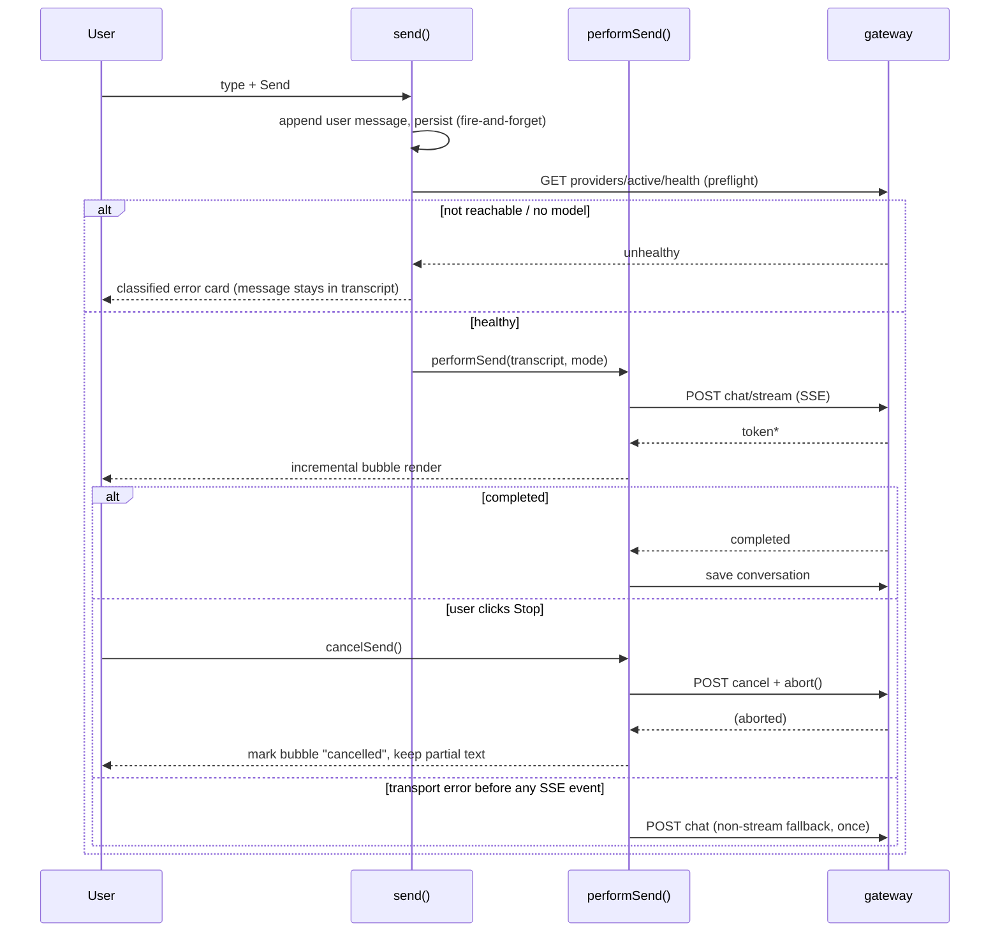

# Co-Director Milestone 1 — Reliability Runtime Implementation Plan

**Date:** 2026-07-24
**Branch:** `phase1b/codirector-provider-reliability`
**Related:** `docs/audit/CODIRECTOR_PROVIDER_ROOT_CAUSE.md`,
`docs/audit/CODIRECTOR_PROVIDER_RELIABILITY_REPORT.md`,
`docs/architecture/CODIRECTOR_PRODUCTION_BRAIN.md`
**Status:** Milestone 1 complete (as-built). This document describes what M1 covers and the
seams left for M2/M3 — it is not a forward-looking speculative plan.

---

## 1. Goal and scope

Milestone 1 delivers the **reliability runtime** for Co-Director chat: a provider-neutral
gateway, structured errors, streaming with cancel, and server-side conversation persistence.
It deliberately does **not** include:

- Production Bible / project knowledge graph
- Orchestrator / task graph / multi-step tool execution
- Tool calling, approvals workflow
- Prompt compilers beyond the existing `mode` nudges (`chat` / `prompt` / `guide` / `setup`)
- Asset lineage tracking
- Continuity engine

Those are M2/M3 concerns — see `CODIRECTOR_PRODUCTION_BRAIN.md` for that vision. M1's job is
narrower and more foundational: **make the chat surface never lie about what went wrong, and
never lose the user's message.**

### Non-negotiable invariants (drove every design decision below)

1. The browser never renders a bare `Failed to fetch` / raw `TypeError` string.
2. The user's message is never silently dropped, regardless of what fails downstream.
3. The mock provider can never activate outside `STUDIO_E2E=1` — a stray env var must not
   mask a broken production Ollama setup.
4. A cancelled request is not an error. A retried request does not duplicate the user's turn.

---

## 2. Architecture

```mermaid
flowchart LR
  subgraph FE [studio-web]
    Composer[CoDirectorComposer] --> Session[CoDirectorSession.send/performSend]
    Session -->|preflight| HealthAPI[api.codirectorHealth]
    Session -->|prefers| StreamAPI[api.codirectorChatStream]
    Session -->|fallback| ChatAPI[api.codirectorChat]
    Session --> CancelAPI[api.codirectorCancel]
    Session --> ConvoAPI[api.codirector{Get,Save,Delete}Conversation]
  end
  subgraph BE [studio-api]
    Router[routers/codirector.py] --> Service[codirector/service.py]
    Service --> Provider{active provider}
    Provider --> Mock[providers/mock.py]
    Provider --> Ollama[providers/ollama.py]
    Service --> ConfigStore[codirector/config_store.py]
    Service --> DB[(codirector_conversations)]
    Service --> Cancel[asyncio.Task registry]
  end
  Session --> Router
```

Everything the browser needs from an LLM goes through `/api/codirector/*`. There is no direct
browser → Ollama path, and no inline Ollama plumbing left in `routers/api.py` — `assistant_chat`
/ `assistant_health` are thin aliases over the same gateway functions, kept only so any
lingering caller of the legacy path keeps working during migration.

### 2.1 Provider interface

`app/codirector/providers/base.py` defines the contract every provider implements:

- `list_models() -> list[ProviderModel]`
- `health() -> ProviderHealthResult` — `{status, reachable, endpoint, selectedModel,
  modelAvailable, models, message, code, recommendedAction}`
- `generate(request: ChatRequest) -> ChatResult` — the non-streaming path
- `stream(request) -> AsyncIterator[dict]` — yields `request_started` →
  `provider_connected` → `token`* → `completed` (or raises `CoDirectorError`, converted to an
  `error` SSE event by the router)
- `supports_stream() -> bool`

Two providers implement it today:

| Provider | Selected when | Notes |
|---|---|---|
| `ollama` | default, or `ADEPT_CODIRECTOR_PROVIDER=ollama` | Talks to a real local Ollama at the endpoint from `config_store` (falls back to `Settings.ollama_url`). `stream()` currently calls `generate()` once and re-chunks the reply into synthetic `token` events — see "Deferred" below. |
| `mock` | only when `e2e_enabled()` (`STUDIO_E2E=1`) **and** `ADEPT_CODIRECTOR_PROVIDER=mock` | Deterministic scenarios via `ADEPT_CODIRECTOR_MOCK_SCENARIO`: `healthy` (default), `connection_refused`, `no_models`, `model_missing`, `timeout`, `slow`. Flippable mid-suite via `POST /api/e2e/codirector/scenario` (E2E-only route) without restarting the API process. |

`service.build_provider()` and `service.list_provider_ids()` both gate `mock` behind
`e2e_enabled()` — this is enforced at the service layer, not just the router, so nothing can
bypass it.

### 2.2 Streaming protocol (SSE)

`POST /api/codirector/chat/stream` returns `text/event-stream`. Each frame is
`data: {json}\n\n`. Event shapes (camelCase, shared verbatim by the FE `CoDirectorStreamEvent`
union in `api.ts`):

```json
{"type": "request_started", "requestId": "..."}
{"type": "provider_connected", "requestId": "...", "providerId": "mock"}
{"type": "token", "requestId": "...", "content": "..."}
{"type": "completed", "requestId": "...", "content": "...", "modelId": "...", "providerId": "...", "sceneSetup": null, "suggestedPrompt": null}
{"type": "cancelled", "requestId": "..."}
{"type": "error", "requestId": "...", "error": {"code": "...", "message": "...", "details": {}, "recoverable": true, "recommendedAction": "..."}}
```

The endpoint owns its own `SessionLocal()` for the lifetime of the generator rather than using
`Depends(get_db)` — FastAPI tears a yield-dependency's session down as soon as the endpoint
*returns* the `StreamingResponse`, which happens before the generator body is ever iterated.

The FE client (`api.codirectorChatStream`) is a hand-rolled `fetch` + `ReadableStream` reader
(no SSE library): it buffers bytes, splits on `\n\n`, and parses each `data:` line as JSON. A
non-2xx or bodyless response is converted into the same `ApiError` shape `req()` produces, so
`classifyCoDirectorError()` handles both paths identically.

### 2.3 Send/cancel/retry state machine (`CoDirectorSession.tsx`)



Key correctness properties, each backed by a Playwright test in
`tests/e2e/codirector/{chat-reliability,streaming-cancel}.spec.ts`:

- **Message always survives.** The user's message is appended and persisted *before* the
  health preflight runs, not after. A blocked send (provider down / no models) still shows
  the message in the transcript with an error card and Retry — not a silent drop.
- **Retry doesn't duplicate.** `pendingRetryRef` records the transcript index of the already-
  appended message; `retryLastSend()` replays that same slice through `performSend()` rather
  than calling `send(text)` again.
- **Cancel isn't an error.** `cancelSend()` aborts the fetch and calls
  `POST /api/codirector/cancel`; the resulting `AbortError` is classified as
  `status: "cancelled"`, not routed through `sendError`. Partial streamed text is preserved,
  not discarded.
- **No stale writes.** Every `onEvent` callback and post-await state update checks
  `activeRequestIdRef` (superseded request) and `mountedRef` (component torn down) before
  calling `setState`.

### 2.4 Conversation persistence

`codirector_conversations` (SQLite, `project_id` PK) stores `messages_json`, `model_id`,
`provider_id`, `updated_at`. The FE treats the server as authoritative whenever a `projectId`
is bound:

- On project bind, `CoDirectorSession` fetches `GET /api/codirector/conversations/{projectId}`
  and hydrates `messages` from it (falling back to the `sessionStorage` draft cache only if
  the server is unreachable, or to the welcome message if there's no saved conversation yet).
- Every completed/failed/cancelled turn is persisted via `POST` (same endpoint), including the
  turn that never got a reply (so a reload mid-failure still shows the question).
- A `sessionStorage` flag (`markStreamingStart` / `markStreamingEnd` /
  `consumeAbandonedStreamingFlag`) records "a stream is in flight for project X". If the page
  reloads while that flag is still set (tab crash, hard refresh mid-stream), the next load
  appends an `status: "interrupted"` assistant turn instead of showing nothing.
- "Clear conversation" asks for confirmation, then resets local state and calls
  `DELETE /api/codirector/conversations/{projectId}`.

### 2.5 Error taxonomy

`app/codirector/errors.py` defines `CoDirectorError(code, message, details, recoverable,
recommended_action)` and `status_code_for_error()` (code → HTTP status: 503 for
connection/provider-unavailable, 400 for model/validation problems, 404 for missing project,
504 for timeout, 499 for cancellation). `redact_secrets()` strips anything that looks like a
credential/token from error detail text before it's ever returned to the client or logged.

On the FE, `classifyCoDirectorError()` is the single choke point every catch block runs
through — it turns a structured `ApiError` into `{code, message, recommendedAction,
recoverable}`, and turns a raw `TypeError: Failed to fetch` into a generic
`BACKEND_UNAVAILABLE` message. No code path is allowed to interpolate a raw error message
directly into the transcript.

---

## 3. Testing strategy

- **Unit (`studio-api/tests/test_codirector_provider.py`, 42 tests)**: endpoint normalization,
  error classification + secret redaction, provider selection/guarding (including the
  mock-only-in-E2E invariant), streaming line parsing, cancellation, config store round-trip,
  and the full HTTP surface via `TestClient` with the provider forced to `mock`.
- **E2E (`tests/e2e/codirector/*.spec.ts`, `@critical @isolated`)**: exercises the real gateway
  end-to-end through the mock provider (`STUDIO_E2E=1` defaults
  `ADEPT_CODIRECTOR_PROVIDER=mock`), using `POST /api/e2e/codirector/scenario` to flip
  provider behavior mid-suite without restarting the API. Covers ready-chat, provider-down,
  no-models, streaming, Stop Generating, retry-dedup, and reload persistence.
- Both suites are run together before merge; see the Verification section of
  `CODIRECTOR_PROVIDER_RELIABILITY_REPORT.md` for the latest pass/fail counts and the two
  real bugs (`get_health` exception handling, `mountedRef` + `StrictMode`) this caught.

---

## 4. Deferred to M2/M3 (not gaps in M1, just later work)

- Native Ollama NDJSON streaming (currently `stream()` re-chunks a fully-generated reply —
  correct behavior, just not incrementally generated).
- Cloud providers (`fal_*` etc.) — `PROVIDER_NOT_CONFIGURED` already fires cleanly for any
  provider id that isn't `ollama`/`mock`, so adding one later is additive.
- ~~Production Bible~~ and ~~a scoped slice of tool calling + approvals~~ — **implemented in
  Milestone 2.1**, see `CODIRECTOR_PRODUCTION_BIBLE.md` and
  `CODIRECTOR_PROPOSALS_AND_APPROVALS.md`. M1's design bets paid off unchanged: Bible injection
  plugged into the single `_prepare_chat_request` context-building call site, the new
  `context_manifest`/`proposal_created` SSE events extended the open union without touching FE
  parsing logic, and proposal execution failures reuse the same `CoDirectorError` /
  `classifyCoDirectorError` taxonomy as every other error path.
- Still open: orchestrator/task graph, general tool calling (M2.1 has exactly one "tool" — propose
  a Bible mutation, not a registry), prompt compilers, asset lineage, continuity engine. See
  `CODIRECTOR_PRODUCTION_BRAIN.md`.
