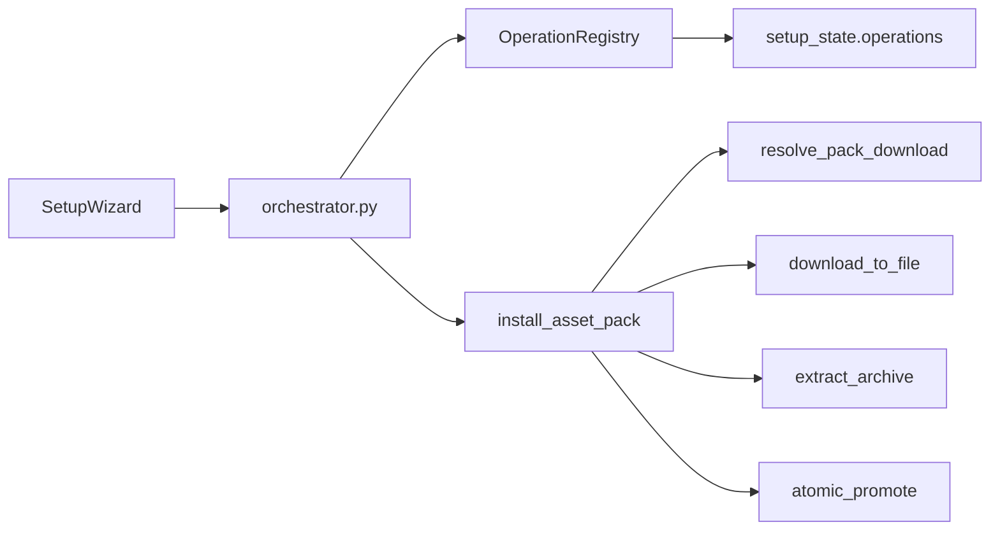
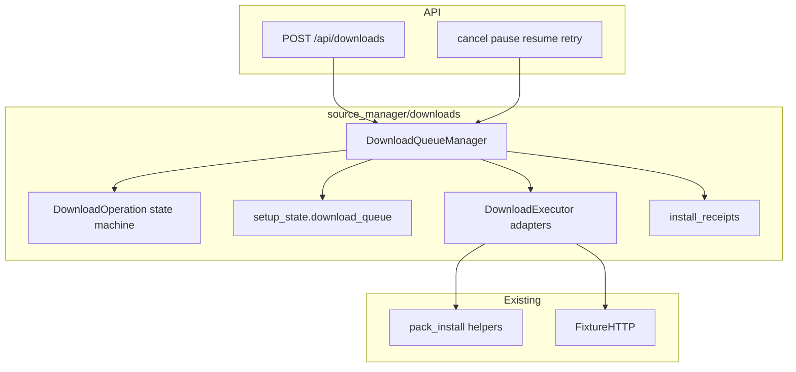

# Phase 1B — Download Engine Architecture Plan

**Date:** 2026-07-24  
**Branch:** `phase1b/download-queue-install-receipts`  
**Baseline:** Phase 1A Source Manager foundation (`phase1/source-manager-foundation`)  
**Status:** Implementation plan — do not redesign Phase 1A

---

## 1. Goals

Deliver a persistent, provider-neutral download and installation engine with:

1. Download queue management  
2. Real progress reporting (bytes, speed, ETA)  
3. Accurate operation phases + transition rules  
4. Cancellation, retry, pause/resume where genuinely supported  
5. Restart recovery  
6. Disk-space preflight  
7. Staging + atomic finalization  
8. Installation receipts + install history  
9. Setup Wizard + Source Manager integration  
10. Deterministic fixture-only tests  

**Non-goals:** production multi-GB model downloads in CI; full rollback UI (placeholder only until 1F); Asset Intelligence (1C); dependency graph (1D); Health Dashboard (1E).

---

## 2. Current execution path (reuse)



| Piece | Path | Reuse |
|-------|------|-------|
| Setup ops | `setup/operations.py` | Interrupt-on-restart pattern; keep for Prepare/checkpoint UX |
| Pack install | `setup/pack_install.py` | Staging, checksum, safe extract, atomic promote |
| Fixture provider | `pack_providers/fixture_http.py` + `e2e-fixture-server.mjs` | Deterministic downloads |
| Source Manager | `source_manager/*` | SourceRecords, providers, empty `download_queue` / `install_receipts` |
| FE polling | `SetupWizard.tsx` + `nextPollDelayMs` | Pattern for shared downloads poll |

**Gaps:** no multi-item queue; no speed/ETA; no cancel mid-stream; no Range resume; stage wiped always; receipts absent; SM plans deferred to pack install.

---

## 3. Proposed queue architecture



New package: `studio-api/app/source_manager/downloads/`

| Module | Role |
|--------|------|
| `phases.py` | Central phase enum + valid transitions |
| `models.py` | DownloadOperation, InstallPlan, progress, failure |
| `progress.py` | Rolling speed/ETA (not simulated) |
| `disk.py` | Disk-space preflight |
| `persistence.py` | Persist queue + locks in `setup_state.download_queue` |
| `queue.py` | DownloadQueueManager |
| `receipts.py` | Install receipts + link records |
| `executors/base.py` | DownloadExecutor protocol |
| `executors/fixture.py` | FixtureDownloadExecutor |
| `executors/direct_http.py` | DirectHttpDownloadExecutor (+ Range probe) |
| `executors/local_copy.py` | LocalCopyExecutor |
| `executors/github_cli.py` | Thin adapter (progress via staging size) |
| `executors/huggingface_cli.py` | Thin adapter |
| `recovery.py` | Startup classification |
| `api.py` | `/api/downloads*` + install-history routes |

Setup orchestrator **enqueues** pack installs through the queue when Source Manager / fixture path is used; legacy checkpoint path remains for path/license prompts.

---

## 4. Operation state model

### Phases

`queued` → `preflighting` → `resolving` → `verifying_source` → `waiting_for_auth` | `waiting_for_disk_space` → `downloading` → `pausing`/`paused`/`resuming` → `extracting` → `validating` → `finalizing` → `installed`

Terminal / control: `failed`, `cancelling` → `cancelled`, `interrupted`, `cleaning_up`, `rolling_back` → `rolled_back`

Transitions enforced only via `transition(op, new_phase)` — no arbitrary mutation.

### Persistence

`setup_state.download_queue`:

```json
{
  "operations": { "<id>": { "...DownloadOperation..." } },
  "locks": { "component:<id>": "<opId>", "dest:<hash>": "<opId>" },
  "settings": { "maxActiveLarge": 1, "maxActiveSmall": 2 },
  "updatedAt": "ISO"
}
```

`setup_state.install_receipts`: `{ "<installId>": { ... } }`

Throttle: persist progress every ~750ms; always on phase change.

---

## 5. Provider integration

Executors implement `getCapabilities` / `execute` / `cancel` / optional `pause`/`resume`.

| Executor | canPause | canResume | Notes |
|----------|----------|-----------|-------|
| Fixture | false (unless range fixture) | false default | E2E primary |
| DirectHttp | true if Range honored | true if Range + fingerprint | Probe with Range |
| LocalCopy | false | false | Chunked copy |
| GitHubCli | false | false unless proven | “Pause not supported” |
| HuggingFaceCli | false | false unless proven | Same |
| GitHubApi | same as DirectHttp | same | Asset URL via API |

Queue owns concurrency/locks; executors only fetch/copy.

---

## 6. Progress strategy

- Real byte counters from stream / staging file size / copied bytes  
- Rolling window (~5–10s) for speed; ETA null until enough samples and total known  
- Persist `bytesDownloaded`, `bytesTotal`, `percent`, `speedBytesPerSecond`, `etaSeconds`  
- Never fake percent without bytes  

---

## 7. Restart recovery

On API lifespan (after existing `recover_stale_operations`):

1. Load non-terminal download ops  
2. Classify: `resumable` | `restart_required` | `cleanup_required` | `source_reverification_required` | `unrecoverable`  
3. Active downloading without worker → `interrupted`  
4. Auto-resume **off** by default (`ADEPT_DOWNLOAD_AUTO_RESUME=1` opt-in)  
5. Keep resumable partials; cleanup only on explicit cleanup  

---

## 8. Receipt model

Managed install → immutable receipt with artifacts, checksums, ownership.  
Link Existing → link record (`managed: false`, rollback unavailable).  
No secrets; UI shows destination summary not raw secrets.

---

## 9. Migration plan

- Keep `schema_version` ≥ 3; ensure `download_queue` / `install_receipts` populated  
- Dual-path: Setup Wizard pack install may still call orchestrator; orchestrator delegates download phase to queue when `ADEPT_DOWNLOAD_QUEUE=1` (default on)  
- Existing `operations` summaries unchanged for Prepare checkpoints  
- Map queue ops into status cards via `componentId` lookup  

---

## 10. Test plan

| Layer | Coverage |
|-------|----------|
| Unit | transitions, queue order, locks, disk calc, progress/ETA, receipts, redaction, recovery class |
| Integration | fixture slow/fail/range/cancel/retry/receipt with tiny files |
| Playwright | queue two packs, progress, cancel, retry, history, wizard card, no pause on non-resumable |
| Gate | existing critical E2E must stay green |

Fixture-only; no production models.

---

## 11. Out of scope

- Full HF/GitHub CLI pause semantics without proof  
- Functioning Rollback button (placeholder)  
- Asset Intelligence / dependency graph / Health Dashboard  
- WebSocket progress (shared polling is enough for 1B)  
- Silent overwrite of unmanaged destinations  

---

## 12. Implementation order (execution)

1. This document  
2. Phases + models + persistence  
3. Queue manager + fixture executor  
4. Direct HTTP + progress/ETA + disk preflight  
5. Cancel / retry / pause-for-range  
6. Staging finalize + receipts  
7. API + FE Active Downloads / History  
8. Setup Wizard integration  
9. Recovery + CLI executor stubs  
10. Tests + clean-room + report  

After coherent chunks: focused tests → critical E2E → Git checkpoint.
