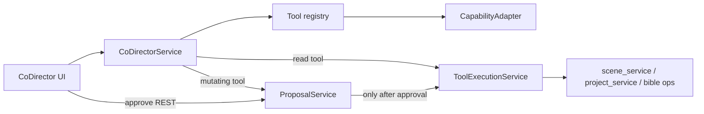

# Co-Director Milestone 2.2 — Final Summary Report

**Date:** 2026-07-24  
**Branch:** `phase2/codirector-m2-2-tool-registry`  
**Status:** Complete  
**Checkpoint:** tag `checkpoint/codirector-m2-2-start` → `a5b7106`  
**Ship commit:** `2545ab1` — *Co-Director M2.2: bounded tool registry and approved project actions*  
**Diff:** 40 files, +6107 / −134

**Related docs**

- [Preflight](CODIRECTOR_M2_2_PREFLIGHT.md)
- [Detailed implementation report](CODIRECTOR_M2_2_IMPLEMENTATION_REPORT.md)
- [Tool registry architecture](../architecture/CODIRECTOR_TOOL_REGISTRY.md)
- [Tool security model](../architecture/CODIRECTOR_TOOL_SECURITY.md)
- [Proposals and approvals (M2.1)](../architecture/CODIRECTOR_PROPOSALS_AND_APPROVALS.md)
- [Production Bible (M2.1)](../architecture/CODIRECTOR_PRODUCTION_BIBLE.md)
- [M2.1 final report](CODIRECTOR_MILESTONE2_1_FINAL_REPORT.md)
- [Implementation plan](../architecture/CODIRECTOR_IMPLEMENTATION_PLAN.md)
- [Production Brain vision](../architecture/CODIRECTOR_PRODUCTION_BRAIN.md)

---

## Verdict

Co-Director can now **look at the project and act on it** — and the second half only ever happens
with a human in the loop. Milestone 2.2 adds:

1. A **closed** registry of 19 tools — no shell, filesystem, SQL, or dynamic registration
2. **15 read tools** that run inline in a turn, because they have no write path at all
3. **4 mutating tools** that can only reach a write through an approved `tool_call` proposal
4. A **server-owned payload**: the model supplies a tool id and arguments, nothing else
5. A **durable invocation ledger** that records blocked attempts, not just successful ones

M2.1's invariant is unchanged and now applies to actions as well as knowledge: the model may
propose, and it may never mutate. M1 streaming, cancel, retry, and persistence remain intact.

---

## Architecture (as shipped)

```text
User message
  → CoDirectorService → provider reply
  ├─ no fence ................ message, nothing runs
  ├─ ```tool (read) .......... capability check → run now → result back to model
  │                            → ONE follow-up completion → answer
  ├─ ```tool (mutating) ...... capability check → server-computed preview
  │                            → tool_call proposal (pending) → approval card
  └─ ```proposal ............. unchanged M2.1 Bible path

Approve → ProposalService.approve()
  ├─ bible_mutation → ops.apply_mutation_set   (M2.1, unchanged)
  └─ tool_call      → ToolExecutionService.execute_approved_proposal
                      → handler.apply() → receipt + ledger row
```



The single most important edge in that diagram is the one labelled *only after approval*. It is the
sole path to `handler.apply()`, and there is deliberately no HTTP endpoint that executes a tool.

---

## What shipped

| Area | Deliverable |
|------|-------------|
| Registry | `definitions.py` (data) + `registry.py` (bindings), validated at import — a missing or orphaned handler stops the app from starting |
| Read tools | 15: project profile/status, scenes (list/get/active), Bible (version/entity/list/relevant context), provider health, selected model, ComfyUI, Source Manager, references, engine capabilities |
| Mutating tools | 4: `create_scene`, `update_scene_title`, `set_scene_prompt`, `record_director_decision` |
| Approvals | New `tool_call` proposal type; **one** branch added to `approve()`; reject/revision/cancel untouched |
| Capabilities | `CapabilityAdapter` over 7 existing probes, fail-closed, 6s timeout, cached per request |
| Safety | Argument validation against declared schemas; result scrubbing of secrets and absolute paths; size budgets with disclosed truncation |
| Staleness | Generalized to `baseResourceVersions` (bible / project / scene fingerprint) |
| Schema / DB | Migration `m003_codirector_tools` + `codirector_tool_invocations` ledger |
| APIs | `GET /tools`, `GET /projects/{id}/tools`, `.../availability`, `POST .../read`, `POST .../proposals`, `GET .../tool-invocations` — and **no execute endpoint** |
| SSE (additive) | `tool_requested`, `tool_started`, `tool_completed`, `tool_failed`, `tool_result_truncated`, `tool_proposal_created`, `capability_blocked` |
| Errors | 10 `TOOL_*` + 3 `CAPABILITY_*` codes with explicit HTTP mappings |
| Mock | 8 scenarios covering success, blocked, unconfigured, proposal, stale, execution success/failure, loop limit |
| FE | `CoDirectorToolStatus` (compact read-tool line) + `CoDirectorProposalCard` generalized to Bible *and* tool proposals |
| Services | `scene_service.py` / `project_service.py` extracted so handlers call services, not HTTP |
| Tests | `test_codirector_tools.py` (75) + `tools.spec.ts` (8, `@critical`) |
| Docs | Preflight, registry architecture, security model, implementation report, this summary, plus plan/brain updates |

---

## Completion gates

| Gate | Met? |
|------|------|
| Registry is closed; no shell / filesystem / SQL / arbitrary handler | Yes |
| Read tools have no write path and need no approval | Yes |
| Mutating tools cannot execute without a recorded human approval | Yes |
| Tool payloads are server-owned; the model supplies only id + arguments | Yes |
| Model-claimed `responseType` cannot force immediate execution | Yes |
| One approval system reused (single branch, shared guards) | Yes |
| Arguments validated; results scrubbed and size-capped with disclosure | Yes |
| Capability failures fail closed and still finish the turn | Yes |
| Blocked attempts are recorded, not just successes | Yes |
| Stale tool proposals cannot be approved | Yes |
| Execution failure changes nothing and leaves a receipt + ledger row | Yes |
| At most one read tool per turn + one follow-up | Yes |
| M1 streaming / cancel / retry / persistence intact | Yes |
| M2.1 Bible and proposal behavior unchanged | Yes |
| Migration and `create_all` produce identical schema | Yes |

---

## Test results

| Suite | Result |
|-------|--------|
| `pytest tests/test_codirector_tools.py tests/test_production_bible.py tests/test_codirector_provider.py` | **148 passed** |
| `pytest` (full backend) | **261 passed, 8 failed** — the same 8 fail at the checkpoint (see below) |
| `playwright test tests/e2e/codirector` | **23 passed** (3.2m) |
| `playwright test --grep "@critical"` | **34 passed** (5.5m) |

The 8 backend failures are pre-existing and unrelated (pack-install / GitHub pack provider / setup
refactor). This was verified rather than assumed: a throwaway worktree at
`checkpoint/codirector-m2-2-start` produces **the same 8 failures**, with 186 passed there vs. 261
here — a delta of exactly the 75 new tool tests.

### Two findings worth keeping

- **The model's `responseType` was initially trusted.** A reply could label `create_scene` as a
  `read_tool_call` and have it executed without approval. The response type is now derived from the
  registry's declared `kind`, and a test asserts the mislabelled case becomes a proposal.
- **A 25-minute, 13-failure E2E run was environmental, not a regression.** Stale `e2e-start.mjs`
  supervisors from earlier runs were competing for port 8742, so the API flapped mid-suite and
  unrelated M1 specs failed with `ECONNREFUSED`. Clean run: 23 passed in 3.2 minutes. An
  `ECONNREFUSED` cluster spanning unrelated specs is a stack-health symptom.

---

## Key APIs

- `GET /api/codirector/tools` — the catalog, project-independent, no probes run
- `GET /api/codirector/projects/{id}/tools` — catalog + availability + capability snapshot
- `GET /api/codirector/projects/{id}/tools/availability`
- `POST /api/codirector/projects/{id}/tools/read` — read tools only (`TOOL_KIND_MISMATCH` otherwise)
- `POST /api/codirector/projects/{id}/tools/proposals` — creates a pending proposal, applies nothing
- `GET /api/codirector/projects/{id}/tool-invocations` — the ledger, newest first

Mutations go through the existing `/proposals/{id}/approve|reject|request-revision|cancel`.

---

## Frontend surfaces

1. **Read-tool status line** — one compact row ("Checking: List scenes…"), no buttons by design.
   The partially-streamed tool request is cleared when it appears, so the user never sees the model
   talking to itself.
2. **Tool proposal cards** — the same shell as Bible proposals, rendering the **server-computed**
   preview (summary, lines, warnings) with a distinct accent and project-flavoured stale copy.
   Nothing here routes through the legacy frontend-local `runSteps` execution.

---

## Explicitly deferred (not M2.2)

- Shell / filesystem / SQL / arbitrary handlers; dynamic or config-defined tools
- Auto-approval, trusted-tool allowlists, remembered approvals
- Task graphs and autonomous multi-step chains (a turn is capped at one read tool + one follow-up)
- `queue_render` and reference attach/remove — both start long-running or externally visible work,
  which needs its own progress and cancellation story before it can sit behind a one-click approval
- Full Production Systems Readiness matrix (the `CapabilityAdapter` is a thin read over existing
  probes and nothing more)
- Emitting the reserved proposal-lifecycle SSE events (inherited from M2.1; approve/reject remain
  synchronous REST for a single reviewing user)

---

## Files to know

| Path | Role |
|------|------|
| `studio-api/app/codirector/tools/definitions.py` | What the tools are (data) |
| `studio-api/app/codirector/tools/registry.py` | What they run (bindings + import-time validation) |
| `studio-api/app/codirector/tools/execution.py` | Read execution, proposing, approved execution, ledger |
| `studio-api/app/codirector/tools/sanitize.py` | Both trust boundaries |
| `studio-api/app/codirector/tools/capabilities.py` | Fail-closed probe adapter |
| `studio-api/app/codirector/bible/proposals.py` | The single approval lifecycle, now two-flavoured |
| `studio-api/app/scene_service.py`, `project_service.py` | Shared by routers and handlers |
| `studio-web/src/components/CoDirector/CoDirectorProposalCard.tsx` | Bible + tool approval UI |
| `studio-api/tests/test_codirector_tools.py` | Unit/integration |
| `tests/e2e/codirector/tools.spec.ts` | Playwright |

---

## Recommended next milestone

**M2.3+:** the natural next step is *long-running* approved actions — `queue_render` and reference
attach/remove — which need progress, cancellation, and resumability on top of the approval pattern
rather than a new tool surface. After that: configuration-driven modes and a specialist registry,
then (M3) prompt compilers, asset lineage, and continuity analysis. None of it should weaken the
invariant this milestone extended from knowledge to action: **propose, never auto-mutate.**
