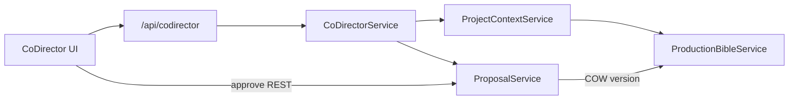

# Co-Director Milestone 2.1 — Final Summary Report

**Date:** 2026-07-24  
**Branch:** `phase2/codirector-m2-1-production-bible`  
**Status:** Complete  
**Checkpoint:** tag `checkpoint/codirector-m2-1-start` → `82ee3fa`  
**Ship commit:** `db06c4f` — *Co-Director M2.1: Production Bible and durable proposals*  
**Diff:** 34 files, +4385 / −20

**Related docs**

- [Preflight](CODIRECTOR_M2_1_PREFLIGHT.md)
- [Detailed implementation report](CODIRECTOR_M2_1_IMPLEMENTATION_REPORT.md)
- [Production Bible architecture](../architecture/CODIRECTOR_PRODUCTION_BIBLE.md)
- [Proposals and approvals](../architecture/CODIRECTOR_PROPOSALS_AND_APPROVALS.md)
- [M1 final report](CODIRECTOR_MILESTONE1_FINAL_REPORT.md)
- [Implementation plan](../architecture/CODIRECTOR_IMPLEMENTATION_PLAN.md)
- [Production Brain vision](../architecture/CODIRECTOR_PRODUCTION_BRAIN.md)

---

## Verdict

Co-Director is no longer “only a reliable chat runtime.” Milestone 2.1 adds:

1. A **project-scoped, versioned Production Bible**
2. **Bounded Bible context** injected into every chat turn
3. **Durable proposals** with mandatory user approval before mutation
4. **Auditable execution receipts** and immutable Bible versions
5. **Strict project isolation**

The model can propose Bible changes; it **cannot** apply them. M1 streaming, cancel, retry, persistence, and mock-only-in-E2E behavior remain intact.

---

## Architecture (as shipped)

```text
User message
  → CoDirectorService
  → ProjectContextService (conversation + project + scene + Bible excerpt + mode)
  → Provider (message | structured proposal)
  → Proposal persisted (pending)
  → FE proposal card
  → Approve / Reject / Request revision / Cancel
  → Transactional apply → execution receipt → new Bible version
```



---

## What shipped

| Area | Deliverable |
|------|-------------|
| Schema / DB | Migration `m002_production_bible` + 7 tables (bible, versions, entities, facts, proposals, approvals, receipts) |
| Bible service | Create/import, COW versioning, entity/fact ops, preview/apply |
| Context | `ProjectContextService` + token budget + `context_manifest` |
| Proposals | Durable lifecycle: pending → approved/rejected/revision/cancelled/stale/executing/completed/failed |
| APIs | `/api/codirector/projects/{id}/bible…` and `/proposals…` |
| SSE (additive) | `context_manifest`, `proposal_created` (+ FE union reserved for future lifecycle events) |
| Mock | `proposal_character_update`, `malformed_proposal` |
| FE | `ProductionBibleWorkspace` + `CoDirectorProposalCard` |
| Tests | `test_production_bible.py` + `production-bible.spec.ts` |
| Docs | Preflight, architecture, implementation, this final summary |

---

## Completion gates

| Gate | Met? |
|------|------|
| Project-scoped Bible records | Yes |
| Immutable versions (COW) | Yes |
| Mutations require durable approval | Yes |
| Model cannot mutate Bible directly | Yes |
| One receipt + one new version per successful apply | Yes |
| Reject / revision leave Bible unchanged | Yes |
| Pending proposals survive reload / restart | Yes |
| Stale proposals cannot overwrite newer versions | Yes |
| Bounded context + manifest | Yes |
| M1 streaming / cancel / retry / persistence intact | Yes |
| Mock unavailable outside E2E | Yes |
| No bare `Failed to fetch` regressions | Yes |

---

## Test results

| Suite | Result |
|-------|--------|
| `pytest tests/test_production_bible.py tests/test_codirector_provider.py` | **73 passed** |
| `playwright test tests/e2e/codirector` | **15 passed** |
| `playwright test --grep "@critical"` | **31 passed** |

### Notable bug fixed during verification

A non-fatal `STRUCTURED_OUTPUT_INVALID` arriving after a `completed` SSE event was overwriting the finished reply and could leak raw malformed-proposal JSON into the transcript. Fixed by tracking post-completion structured errors separately from fatal stream errors.

---

## Key APIs

- `GET/POST /api/codirector/projects/{projectId}/bible…` — current Bible, versions, entities, import preview/confirm
- `GET/POST /api/codirector/projects/{projectId}/proposals…` — list/create
- `POST /api/codirector/proposals/{id}/preview|approve|reject|request-revision|cancel`
- `GET /api/codirector/proposals/{id}/receipt`

Route-scoped `projectId` always wins over body fields.

---

## Frontend surfaces

1. **Project → Production Bible** — Overview / entities / version history; Create Bible via import preview → confirm (version 1). Committed records are view-only; edits go through proposals.
2. **Co-Director proposal cards** — Summary, field-level diff, Approve / Reject / Request Revision; stale warning; no raw JSON as default UI.

---

## Explicitly deferred (not M2.1)

- Autonomous task graphs / multi-agent orchestration
- Arbitrary model tool calling / shell / filesystem tools
- Prompt compilers, asset lineage, vision-based continuity
- Emitting every reserved proposal-lifecycle SSE event (approve/reject are synchronous REST today — intentional for single-reviewer sessions)

---

## Files to know

| Path | Role |
|------|------|
| `studio-api/app/codirector/bible/` | Schemas, service, operations, context, proposals |
| `studio-api/app/migrations/m002_production_bible.py` | Migration |
| `studio-api/app/routers/codirector.py` | Bible + proposal routes |
| `studio-web/src/components/ProductionBibleWorkspace.tsx` | Bible UI |
| `studio-web/src/components/CoDirector/CoDirectorProposalCard.tsx` | Proposal cards |
| `studio-api/tests/test_production_bible.py` | Unit/integration |
| `tests/e2e/codirector/production-bible.spec.ts` | Playwright |

---

## Recommended next milestone

**M2.2+:** read-only tools → write tools with the same approval/receipt pattern; configuration-driven modes; specialist registry; then (M3) prompt compilers, lineage, and continuity analysis — without weakening M2.1’s “propose, never auto-mutate” invariant.
