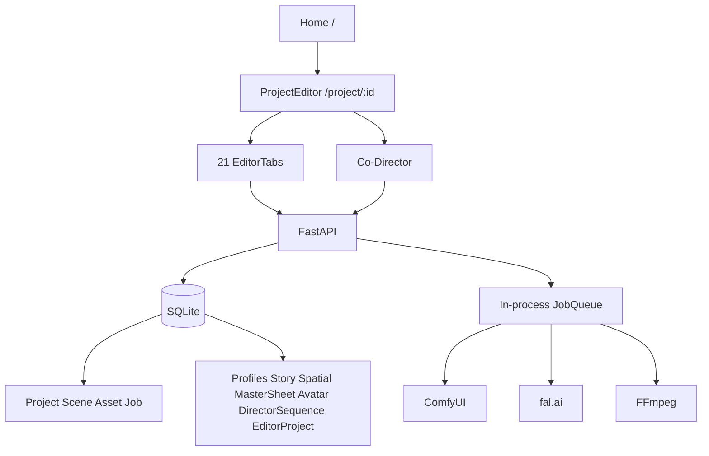

# Adept UI Unified Refactor Audit and Connection Plan

**Status:** Phase 0 documentation updated; approved Phase 0 seams are bounded below; broad refactor coding is not approved  
**Authority:** `docs/ADEPT_UI_SYSTEM_ARCHITECTURE.md`  
**Audit mode:** Read-only source inspection. Baseline commands are not yet executed.

## 1. Executive conclusion

Adept UI is a functional local-first filmmaking suite with four strong core records (Project, Scene, Asset, Job), working generation pipelines, a focused Director Prompt Timeline, and a useful Director→Editor precursor. It is not yet a unified system: Profile ownership is global/fragmented, Generation and Memory are not durable entities, Timeline has three stores, primary render outputs may bypass Asset, and navigation exposes deprecated product tracks.

The safest next step is **Phase 0 only**: create and verify backup/restore, capture Git/schema/workflow baselines, establish isolated smoke tests, and define or land only the approved reversible seams listed in §4.1. The Phase 0 boundary now includes a Generation Provider Layer, Workflow Registry, Desktop Platform Layer, Repository Layer, and User Journey Audit. This approval moves the four interface/registry foundations into Phase 0; it does **not** approve broad workspace rewrites, schema cutovers, navigation replacement, data migration, or deletion.

## 2. Current architecture map

Runtime details: [runtime-audit.md](runtime-audit.md)

## 3. Alignment score by system

Scoring: A=100, B=75, C=50, D=25, E=10, F=0. The score is directional, not test coverage.

| System | Class | Score | Conclusion |
|---|---:|---:|---|
| Project | B | 75 | Strong row; JSON-heavy |
| Scene | B | 75 | Exists but not central hub yet |
| Profile | C | 50 | Global and fragmented |
| Asset | B | 75 | Canonical table; output gaps |
| Generation | F | 0 | Missing durable entity |
| Timeline | C | 50 | Triple-store |
| Job | B | 75 | Shared table; restart/UI gaps |
| Co-Director | C | 50 | One partial system |
| Memory | F | 0 | Learning blob only |
| Story | B | 75 | Good base; scene binding gaps |
| Scene Sheet | C | 50 | Master Sheet precursor |
| Generate | D | 25 | Fragmented product surfaces |
| Director | A/B | 88 | Focused and reusable |
| Audio | C | 50 | Stub |
| Editor | B/C | 63 | Good lineage UI; no render |
| Library | B/C | 63 | Multiple browse surfaces |
| Resources | C/D | 38 | Marketplace framing/disconnects |
| Test/safety infrastructure | F | 0 | Missing |

## 4. Critical blockers

1. No verified backup/restore; Gate 9 is blocked.
2. No automated baseline test harness or sample fixture.
3. No migration versioning or rollback runner.
4. Project/scene deletion can orphan satellites and lineage.
5. Job queue state is not recovered after API restart.
6. Generation output→Asset→Sequence version connection is incomplete.
7. Editor assembly is not connected to FFmpeg preview/final export.
8. No durable Generation, unified Timeline, or Memory tables.

### 4.1 Approved first-class Phase 0 additions

These are architectural foundations in their own right, not incidental helpers:

| Addition | Phase 0 boundary | Explicitly not authorized in Phase 0 |
|---|---|---|
| **Generation Provider Layer** | Provider-neutral contracts for capabilities, model discovery, request validation, submit, status, cancel, outputs, and normalized errors; existing ComfyUI/fal behavior remains authoritative behind adapters | Replacing working builders, changing queue semantics, adding providers, or unifying Generate UI |
| **Workflow Registry** | Curated metadata for existing workflow builders: stable ID, mode, provider, inputs, capabilities, dependencies, compatibility, and builder mapping; validation can report unavailable dependencies | Inventing arbitrary graphs, rewriting workflow JSON/builders, or changing generation defaults |
| **Desktop Platform Layer** | Interfaces for runtime/process lifecycle, paths, sidecar health, media URL/protocol handling, packaged dependency discovery, and shutdown/recovery | Selecting or building an Electron/Tauri shell, packaging Python/FFmpeg/ComfyUI, or duplicating backend services |
| **Repository Layer** | Data-access interfaces around existing Project, Scene, Profile, Asset, Job, and package persistence; preserve legacy reads/writes and transaction boundaries | Repository-wide ORM rewrite, schema cutover, destructive migration, or changing API behavior |
| **User Journey Audit** | Document the first-time filmmaker path, friction, dead ends, terminology, shortcuts, and bounded recommendations | Visual redesign, navigation replacement, or implementation |

Any Phase 0 implementation of these approved additions must be additive wrappers/contracts with parity checks and a direct fallback to current behavior. Runtime and restore proof remain required before Phase 0 can be declared complete.

## 5. Broken connections

- Home query deep links → workspace
- Editor/Library focus keys → exact Director scene/sequence
- Story Script Segment → selected Scene
- Storyboard Panel → Director Sequence (currently may create Scene)
- Profile → Project/Scene role
- Master Sheet ingredient → Profile UI
- Generation request → durable Generation
- Scene/lipsync output → Asset
- Job completion → Director Sequence version
- Director Sequence → Job ID
- Editor Clip → export output
- Co-Director → central selection context
- approved Project Memory → prompt compiler
- LoRA/reference inputs → actual Comfy workflow

## 6. Required connection audit

| Link | Current | Typed/persistent | UI/recoverable | Required migration/test |
|---|---|---|---|---|
| Project→Scene | ORM relation | Typed; persists | Visible | Keep; deletion test |
| Scene→Script Segment | optional soft `scene_id`, UI unused | Partial; persists | Not reliably exposed | bind in Story; reopen test |
| Segment→Storyboard Panel | table relation | Typed-ish; persists | Visible | revision/outdated test |
| Panel→Scene Sheet | no direct link | Missing | No | Scene hub + context test |
| Scene Sheet→Director Sequence | package snapshot links partial | Soft JSON | Limited | source IDs + prompt test |
| Director Sequence→Generation Job | missing | No | No | Generation/job IDs |
| Job→Generated Asset | partial output ID/path | JSON/path; persists | Inconsistent | always register Asset |
| Asset→Library | Asset rows only | Typed; persists | Yes if row exists | output ingestion test |
| Library→Audio | audio filter/import | Typed Asset | Visible | unified filter/handoff |
| Audio→Editor Clip | direct asset or placeholder | Partial; persists | Visible | source IDs + track test |
| Editor Clip→Export | missing | No | No | `editor_render` job |

Detailed lineage: [director-editor-audio-audit.md](director-editor-audio-audit.md) and [assets-jobs-resources-audit.md](assets-jobs-resources-audit.md).

## 7. Duplicate systems

- Generate: ImageGen, Txt2Vid, Frames, Avatar, Generate Timeline, Spatial generation
- Timeline: Director JSON, Director Sequences, Editor Project JSON, legacy stitch
- Profile DNA: profile rows, Master Sheet ingredients, Spatial avatars, Avatar sessions
- Spatial: project JSON + per-scene table + legacy component
- Library: LibraryPanel, AssetTray, dashboard/audio/profile browsing
- Jobs: many embedded JobPanels/pollers
- Context: props, localStorage, sessionStorage, compiler/client spec builders
- Learning/Memory: explicit Learning UI, silent Txt2Vid writes, Co-Director stub

## 8. Deprecated systems and destinations

| Current product track | Destination | Classification |
|---|---|---|
| Spatial Map | Scene Sheet lightweight blocking; retain metadata | D→E after verification |
| Avatar Studio | Generate / Avatar | C |
| ImageGen | Generate / Image | C |
| Txt2Vid | Generate / Text to Video | C |
| 1 Frame / 3 Frame | Generate / Frames | C |
| Generate Timeline | Director/Co-Director planning | D |
| Shot List tab | Story view | C |
| Scene Master Sheet naming | Scene Sheets | C |
| Marketplace | Resources | D naming; B service |
| AI Learning | Project Memory | C |
| Embedded JobPanels | Jobs + compact JobProgress | C |

## 9. Reusable components

- DirectorTracks, Director timeline parser/sync
- ScriptStoryboardWorkspace internal views
- Scene Master Sheet ingredients/states/types
- Profiles CRUD and profile picker logic
- Frame mode keyframe controls
- ImageGen/Txt2Vid prompt/settings sections
- Avatar prompt/session/takes logic
- Library asset grid/search
- JobPanel row/status/cancel logic
- Editor track board and non-destructive replacement UI
- dashboard card/chrome components
- Co-Director registry, plans, permission metadata

## 10. Reusable APIs and services

- Project/Scene/Asset/Job CRUD
- Script/storyboard CRUD/generation
- Director GET/PUT
- Director Sequence and Editor compatibility APIs
- Profiles CRUD
- Master Sheet API as Scene Sheet wrapper
- Library search
- setup/health/secrets
- `comfy_client.py`, workflow builders, fal client/catalog
- FFmpeg stitch/mux/export helpers
- KB retrieval/compiler

## 11. Reusable database tables

Keep and extend: `projects`, `scenes`, `assets`, `jobs`, `script_docs`, `script_segments`, `storyboard_panels`, `profile_items`, `asset_versions`, `director_sequences`.  
Compatibility/migration: `scene_master_sheets`, `spatial_scenes`, `avatar_sessions`, `editor_projects`, `asset_edges`, learning JSON.

## 12. Required migrations

See [schema-migration-plan.md](schema-migration-plan.md).

Dependency order:

1. migration runner/schema version
2. Generation
3. Timeline
4. Timeline clips
5. Memory items
6. Scene Sheets
7. Scene hub links
8. Profile attachments
9. reference indexes
10. deletion audit/archive

All are additive with legacy dual-read/write and feature-flag rollback.

## 13. Required compatibility wrappers

- central workspace registry and legacy tab aliases
- `/master-sheet` → `/scene-sheet`
- `/learning` → `/memory`
- scene `/director` → director Timeline dual-write
- `/editor` → editor Timeline/Clip dual-write
- legacy Job history → Generation fallback
- path-based video clips until every render is an Asset
- Spatial metadata export/read-only access after nav hide

## 14. Safe removals

Only after replacement gates pass:

- legacy labels (Marketplace, AI Learning, Master Sheet)
- duplicate nav entries and embedded full JobPanel lists
- unused `SpatialMap.tsx`
- Asset Graph UI after typed lineage parity
- legacy workspace render branches after alias telemetry/manual verification

## 15. Unsafe removals

- any user data/table
- Spatial rows before metadata preservation
- AssetTray drag/upload before replacement picker parity
- existing job handlers/workflow builders
- Director JSON or Editor JSON before dual-read parity
- resource state / profile rows / asset versions
- anything classified F

## 16. Recommended phase sequence

### Phase 0 — Safety Freeze

Backup + restore verification; Git/schema/workflow/env-name inventories; isolated baseline smoke; fixture project; User Journey Audit; additive contracts for the Generation Provider, Desktop Platform, and Repository layers; curated Workflow Registry over current builders. These seams belong to Phase 0 by approval, but must preserve current behavior and remain independently reversible.

### Phase 1 — Foundations

Shared domain types and API conventions; workspace registry; context object; migration runner; Generation/Timeline/Memory shells; Jobs workspace; integration through the Phase 0 provider/platform/repository contracts. Phase 1 may deepen the approved seams only after Phase 0 evidence is complete; it does not own their initial interfaces or registry.

### Phase 2 — Story and Scene Sheets

Scene-scoped Story; Profile attachments; Scene Sheet dual-read and blocking; revision tracking; compatibility redirects.

### Phase 3 — Generate and Director

Fix dropped generation inputs; unified Generate shell/modes; durable Generation; Director inheritance/lineage; shared Jobs.

### Phase 4 — Co-Director and Memory

Context bus, gateway, panel state, modes, typed actions, confirmation/undo, Memory.

### Phase 5 — Audio and Editor

Audio modes, normalized Timeline/Clip, FFmpeg Editor preview/final, complete lineage/export.

### Phase 6 — Deprecation and Polish

Hide then remove obsolete routes/code; Resources; dashboard; final gates; packaging readiness.

## 17. File-by-file implementation plan

### Phase 0 additions

- Generation Provider Layer contracts/adapters over current ComfyUI/fal execution
- curated Workflow Registry metadata and current-builder mappings
- Desktop Platform Layer contracts for paths, lifecycle, media access, and dependency discovery
- Repository Layer contracts over current persistence behavior
- User Journey Audit and executable acceptance observations

These additions establish seams only. The domain entities, workspaces, migrations, shell implementation, and consumer cutovers listed below remain Phase 1 or later.

### Add

- `studio-api/app/migrations/*`
- `studio-api/app/generations.py`, `timelines.py`, `memory.py`
- `studio-api/app/comfy_adapter.py`, `ffmpeg_service.py`, `workflow_templates.py`
- `studio-api/tests/*`, `requirements-dev.txt`
- `studio-web/src/core/types.ts`, workspace registry/context
- unified Generate/Story/SceneSheet/Jobs/Resources workspaces
- shared prompt/reference/profile/model/workflow/job/timeline components

### Modify

- API `db.py`, `main.py`, routers, worker, profiles, Master Sheet, Director/Editor, KB
- Web `workspacePrefs.ts`, `ProjectEditor.tsx`, `api.ts`, Home/ProjectHome
- existing workspaces as compatibility subviews
- Co-Director registry/executor and Learning UI

### Move/deprecate

- Avatar UI into Generate mode
- Character/Angles actions into Profiles/Generate
- Shot List into Story view
- Spatial blocking fields into Scene Sheet
- Marketplace UI into Resources
- JobPanel full list into Jobs

### Delete later

Legacy Spatial UI, old workspace shells, storefront-only UI, graph-only UI—only after all deletion rules pass.

## 18. Smoke-test gates

Full plan: [test-and-smoke-plan.md](test-and-smoke-plan.md)  
Baseline record: [BASELINE_SMOKE_TESTS.md](BASELINE_SMOKE_TESTS.md)

No phase completes without relevant G1–G10 gates. No deletion occurs before replacement parity and backup restore.

## 19. Rollback strategy

1. Record branch, commit, Git status.
2. Checksum and copy SQLite, project folders, secrets key, workflow/resource state.
3. Restore into an isolated directory and start against it.
4. Apply schema changes additively under feature flags.
5. On failure, disable new path and restore DB/files; never attempt destructive reverse DDL.
6. Retain compatibility routes for at least one migration cycle.

## 20. Risk register

### High

- no verified restore
- destructive deletion/orphans
- Generation/Asset/Sequence lineage gaps
- job restart loss
- unifying UI before adapter/schema foundations
- global Profile references

### Medium

- dual-write drift
- asset path split
- machine-specific Comfy paths/models
- session-only context
- client-only Co-Director permissions
- missing Editor render

### Low

- naming/label compatibility
- stale dashboard metrics
- query precedence changes

## 21. Recommended first implementation batch

The following work is inside the approved Phase 0 boundary, but execution requires an available terminal/runtime and must stop if baseline or restore safety cannot be established:

1. backup/restore tooling and verified restore
2. baseline harness with temporary data
3. Generation Provider Layer interfaces wrapping existing ComfyUI/fal behavior
4. curated Workflow Registry describing and mapping current builders
5. Desktop Platform Layer interfaces around paths, sidecar lifecycle, media access, and dependency discovery
6. Repository Layer interfaces over current persistence behavior
7. User Journey Audit and acceptance observations

The following remain **Phase 1 or later** and are not authorized by the Phase 0 additions: workspace routing changes, shared context behavior, Jobs workspace UI, migration runner/entity shells, schema cutover, unified Generate, desktop shell implementation, visual redesign, and removals.

Every approved seam must be small, additive, parity-preserving, and reversible. Broad refactor work remains blocked.

## 22. Definition of done for this audit phase

- all domain audit documents exist
- every major system is classified
- connection and removal destinations are explicit
- schema plan is additive and rollback-aware
- baseline report distinguishes unexecuted/pre-existing failures
- the five approved first-class additions are documented and bounded
- provider/platform/repository contracts and workflow registry, if implemented, preserve legacy behavior and have rollback paths
- runtime smoke and isolated restore evidence are recorded; “not run” is not a pass
- broad coding remains stopped pending approval

## 23. Audit document index

- [runtime-audit.md](runtime-audit.md)
- [navigation-audit.md](navigation-audit.md)
- [data-model-audit.md](data-model-audit.md)
- [schema-migration-plan.md](schema-migration-plan.md)
- [story-profile-scenesheet-audit.md](story-profile-scenesheet-audit.md)
- [generate-workflow-audit.md](generate-workflow-audit.md)
- [director-editor-audio-audit.md](director-editor-audio-audit.md)
- [assets-jobs-resources-audit.md](assets-jobs-resources-audit.md)
- [codirector-memory-audit.md](codirector-memory-audit.md)
- [test-and-smoke-plan.md](test-and-smoke-plan.md)
- [BASELINE_SMOKE_TESTS.md](BASELINE_SMOKE_TESTS.md)
- [../USER_JOURNEY_AUDIT.md](../USER_JOURNEY_AUDIT.md)
- [../PHASE0_COMPLETION.md](../PHASE0_COMPLETION.md)

