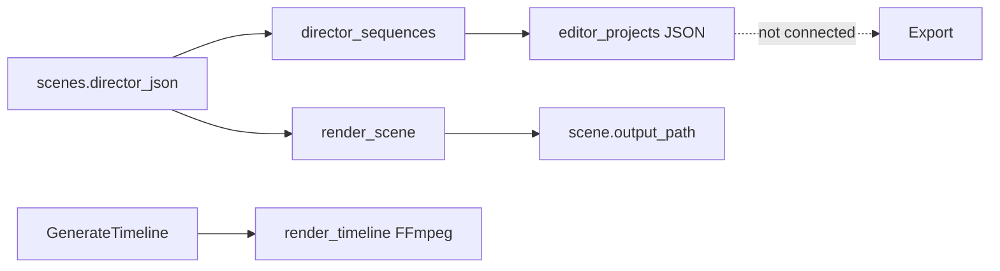

# Director, Timeline, Audio, and Editor Audit

## Executive conclusion

The Director→Editor foundation is useful and architecture-aligned in intent, but lineage is incomplete. Three timeline stores and a legacy scene-stitch path compete. Editor does not render its assembly through FFmpeg, and regeneration does not reliably bump Director Sequence versions.

## Classification

| System | Class | Disposition |
|---|---|---|
| Scene Director Prompt Timeline | A/B | Keep as Director authority |
| Director Sequences | B | Keep approval/version package |
| Editor project JSON | B/C | Normalize behind Timeline/Clip |
| Replace/Alternate/Compare/Ignore | A | Preserve |
| Open Source in Director | B | Fix selection handoff |
| Audio Studio stub | C | Grow into focused Audio |
| Generate Timeline scene stitch | D | Compatibility only |
| Scene export pack | B/D | Must prefer Editor assembly later |

## Timeline overlap

## Broken connections

1. Director focus scene/sequence keys are written but not read.
2. Re-render updates Scene output, not linked Sequence asset/path/version.
3. Sequence `asset_id` is often null because scene renders are not Asset rows.
4. Pending-newer UI triggers only on explicit sequence patch.
5. Editor preview is one selected clip, not assembly preview.
6. Export ignores Editor order/tracks.
7. Proxy flag is metadata only.
8. Audio handoff placeholders have no source lineage until bound.
9. Lipsync state is duplicated in Scene columns and Director JSON.

## Required durable chain

| Link | Today | Required |
|---|---|---|
| Scene → Director Sequence | Snapshot API | Preserve + typed Scene ID |
| Sequence → Generation Job | Missing | `generation_id` / `job_id` |
| Job → Asset | Partial | Always register outputs |
| Asset → Editor Clip | asset ID or path | Require Asset ID; path compatibility |
| Clip → Export | Missing | Editor render job/output Asset |

## Migration plan

1. Consume scene/sequence focus handoffs.
2. Register scene/lipsync outputs as Assets.
3. On generation completion, refresh linked Sequence and bump only when output changes.
4. Add Generation source IDs.
5. Dual-write Editor JSON to normalized Timeline/Clip.
6. Add validated FFmpeg service and `editor_render` job.
7. Deprecate user-facing legacy full-scene stitch after Editor parity.
8. Preserve all non-destructive replacement choices.

## Audio direction

Keep upload/handoff behavior; add Dialogue, Music, SFX, Ambience as Job-backed modes. Replace intent placeholders by binding generated/imported Asset IDs. Mixing remains Editor-owned.

## Risks

- Dual-write drift
- excessive version bumps
- breaking existing Editor JSON
- removing legacy stitch before render parity
- session-only editorial context loss

## Smoke tests

- Director save/reload
- Sequence from scene; send to Editor; reload
- Regenerate → pending-newer → Replace/Alternate/Compare/Ignore
- Open Source selects exact scene/sequence
- lipsync output registers Asset
- Editor preview/final render follows track order
- export preserves source lineage

## Files inspected / unchanged

Director, sequences, Editor, Audio, lipsync, worker, FFmpeg helpers, Library/Home, Co-Director actions and KB. No code/media changed.

