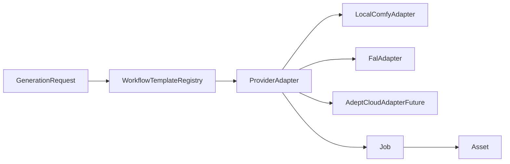

# Generate, Workflow, and Provider Audit

## Executive conclusion

Generation has one central Job table/worker but six top-level UIs and two execution paths. Existing workflow builders are reusable; unification should wrap them behind a normalized request, provider adapter, and curated template registry before changing UI.

## Mode map

| Current | Target mode | Class |
|---|---|---|
| ImageGen | Image | B |
| Txt2Vid | Text to Video | B |
| Scene render / Director retake | Image to Video | B |
| 1 Frame / 3 Frame | Frames | A/B |
| Avatar Studio | Avatar | C |
| Image edit stubs | Enhance | C/F |
| Character/Angles | Profile/Generate action | B/C |
| Generate Timeline | Director/Co-Director planning | D |

## Runtime workflow inventory

- Image: Comfy txt2img/img2img builders
- Scene video: LTX/WAN builders or fal scene path
- Txt2Vid: fal path; local engines reject no-frame T2V
- Avatar: generic image + video jobs, then Director lipsync
- Lipsync: LatentSync builder
- Character/Angles: Z-Image reference workflow

Root `workflows/*.json` are metadata; Python builders are runtime authority.

## Broken connections

1. Image references are collected but not consumed by the worker.
2. LoRA stacks are persisted/logged but not injected into workflows.
3. Avatar video sends a start asset that Txt2Vid ignores.
4. Avatar polling checks a nonexistent direct `job.asset_id`.
5. Enhance operations share one img2img stub.
6. local LTX/WAN appear in T2V UI but fail without a start frame.
7. WAN three-frame path ignores the middle frame.
8. Co-Director generation actions pass minimal context.

## Adapter target

Normalized request: mode, template ID, provider, project/scene, prompts, refs, profiles, Scene Sheet, model/settings, seed, source IDs.

## Provider feasibility

| Provider | Feasibility | Action |
|---|---|---|
| Local ComfyUI | High | Wrap current client/builders |
| fal.ai | High | Wrap current catalog/client |
| Future Adept Cloud | Architectural slot only | Do not implement now |

## Shared UI extraction

PromptEditor, ReferencePicker, ProfilePicker, ModelSelector, WorkflowSelector, GenerationSettings, OutputVariations, JobProgress. Reuse aspect/resolution/style helpers already in workspace preferences.

## Migration sequence

1. Correct dropped parameters (refs, LoRAs, Avatar start image/polling).
2. Add adapter and curated template registry.
3. Add durable Generation records.
4. Build unified Generate shell around existing panels.
5. Redirect legacy tabs to Generate modes.
6. Remove old shells only after parity smoke tests.

## Risks

- UI unification before provider/template normalization
- real provider costs
- missing Comfy nodes/models
- scene-scoped vs project-scoped generation mismatch
- misleading Enhance capability

## Smoke tests

Image, T2V, I2V, one/three-frame, Avatar chain, Character Sheet, missing model, cancellation, provider-normalized errors, refs/LoRA graph impact, Asset/Generation lineage.

## Files inspected / unchanged

All generation panels, worker/clients/builders, configs, routes, Co-Director actions, workflow metadata and inventory. No jobs or source files were changed.

