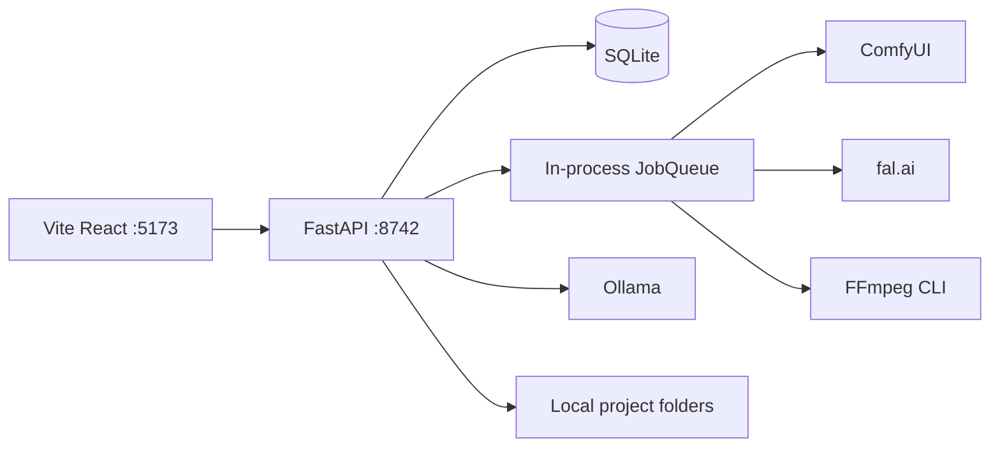

# Runtime Audit

**Mode:** Read-only audit; no installs, builds, services, or data writes were executed.  
**Authority:** `docs/ADEPT_UI_SYSTEM_ARCHITECTURE.md`

## Files inspected

- Root: `package.json`, `README.md`, `INVENTORY.md`, `.gitignore`, `workflows/*.json`
- API: `app/main.py`, `config.py`, `db.py`, `queue_worker.py`, `comfy_client.py`, `media_ops.py`, routers, workflow builders, setup/secrets/preview services
- Web: manifests, Vite/TS configuration, `App.tsx`, `api.ts`, `types.ts`, workspace shell and major components

## Current runtime

- Two-package web stack; no Electron/Tauri shell.
- API startup creates data directories, initializes SQLite, ensures package tables, and starts an in-process queue.
- `studio-web` proxies `/api` and `/media` to the backend.
- Environment uses `STUDIO_*` settings. Values/secrets were not inspected or printed.
- Encrypted fal credentials use `secrets_store.py`; keep this mechanism unchanged.

## Alignment

| Area | Class | Finding |
|---|---|---|
| Local-first web topology | A | Matches approved architecture |
| Project/Scene/Asset/Job core | B | Exists, but JSON-heavy |
| Comfy client | B | Central client exists; full adapter boundary missing |
| FFmpeg helpers | B | Reusable, but no validated Editor service boundary |
| Generate workspace | D | Six fragmented surfaces |
| Unified Timeline/Generation/Memory | F | Durable foundations missing |
| Desktop shell | F | No Electron preparation; API can become a sidecar |
| Automated tests / safety tooling | F | No test suite or backup/restore harness |

## Broken or incomplete connections

- Home `?tab=` links are not consumed by `ProjectEditor`.
- Health/model detection contains machine-specific path assumptions.
- Assets occupy multiple roots (`data/assets`, `data/projects/*/assets`, renders).
- Root workflow JSON files are descriptive; Python builders are runtime authority.
- `psutil` is optional/undeclared and RAM detection falls back silently.
- API startup swallows some satellite schema errors.
- In-process queued/running jobs are not recovered after API restart.

## Desktop-shell reuse

High reuse: settings/paths, SQLite, queue worker, Comfy client, secrets, setup/health, KB API.  
Needs wrapping: FFmpeg operations, media protocol, packaged Comfy lifecycle, Python/FFmpeg distribution.

## Migration recommendation

1. Phase 0 backup/restore and baseline smoke harness.
2. Extract adapter interfaces around current Comfy and FFmpeg implementations.
3. Normalize asset paths through dual-read/dual-write.
4. Add workflow-template registry before unifying Generate UI.
5. Keep API as a future desktop sidecar; do not duplicate services in Electron.

## Risks

- Machine-specific Comfy paths
- Split asset roots
- Silent schema initialization failure
- Missing WAN/LatentSync components
- No automated regression coverage
- Loss of the secrets master key during backup

## Required smoke tests

- Frontend/backend startup using a temporary `STUDIO_DATA_DIR`
- `/api/health`, assistant health, setup detection
- TypeScript typecheck/build and Python imports
- One image or video job through the existing worker
- API restart with queued/running job
- FFmpeg availability and a tiny deterministic media operation

## Leave unchanged during audit/foundation freeze

`ADEPT_UI_SYSTEM_ARCHITECTURE.md`, working workflow builders, `queue_worker.py`, `director_timeline.py`, `editor_sequences.py`, `secrets_store.py`, existing KB content, and user `data/`.

