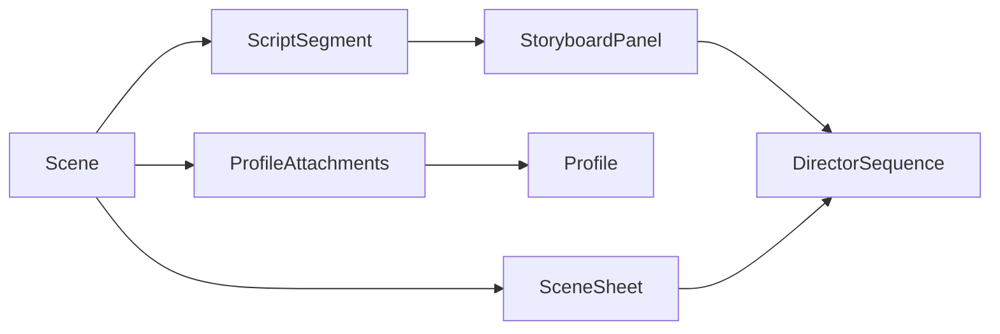

# Story, Profiles, and Scene Sheet Audit

## Current implementation

- Script documents, segments, and storyboard panels are durable tables.
- `ScriptStoryboardWorkspace` already combines script/storyboard/shot-list views, but Shot List is also a top-level tab.
- Profiles are global records with heterogeneous kinds and no project/scene attachment API.
- Character/Angles is a separate generation tool.
- Scene Master Sheet is a per-scene JSON package with useful ingredients/states.
- Spatial has project-level legacy JSON plus a full per-scene Spatial workspace.

## Classification

| System | Class | Destination |
|---|---|---|
| Script/storyboard tables/API | A/B | Story |
| `script` workspace | B | Story shell |
| `shotlist` tab | C | Story view |
| Profiles CRUD | B | Unified Profiles |
| Character/Angles | C/D | Profile actions + Generate |
| Master Sheet data | B | Scene Sheet |
| Master Sheet naming/tab | C | Compatibility alias |
| Spatial metadata/table | C | Preserve for future use |
| Spatial primary workspace | D | Hide after blocking parity |
| legacy `SpatialMap.tsx` | E | Remove after verification |

## Broken connections

1. Story UI does not bind segments to the selected Scene.
2. Storyboard “Send to Director” creates Scene rows instead of Director Sequences.
3. Panels have `script_revision`, but revision synchronization is incomplete.
4. Profile→Scene attachment does not exist.
5. Master Sheet `profile_id` fields are not populated by UI.
6. Director segment script/storyboard lineage fields are underused.
7. Spatial→Master Sheet synchronization actions are stubs.
8. Saving per-scene Spatial can overwrite project legacy spatial JSON.

## Target connection

## Migration plan

1. Add Scene navigator to Story and persist `segment.scene_id`.
2. Make Shot List an internal Story view.
3. Mark panels `outdated` with the source segment revision; preserve Keep/Duplicate/Regenerate.
4. Add Profile project/scene role links and “Attach to current scene.”
5. Rename Master Sheet UI/API through a Scene Sheet compatibility wrapper.
6. Map ingredients into Cast; Environment/Props; Look/Mood; Action/Blocking; Camera/Generation.
7. Add lightweight blocking JSON and optionally a simple diagram.
8. Preserve `spatial_scenes` as archived/future metadata; stop exposing Spatial as a primary workspace.
9. Rewire Storyboard→Director to create/update Director Sequence lineage, not new Scene rows.

## Removal review

| Current | Reusable value | Hide when | Delete when |
|---|---|---|---|
| Shot List tab | Existing filter/view | Story view works | Alias period ends |
| Spatial workspace | Structured positions/relations | Scene Sheet blocking migrates | Metadata export verified; code unused |
| Master Sheet naming | Ingredients/states/API | Scene Sheet wrapper works | Legacy endpoint no longer used |
| Character/Angles tab | Working job kinds | Profile/Generate actions exist | Compatibility route unused |

## Risks

- Duplicate scenes from existing Storyboard handoff
- Breaking global profile references
- Losing rich Spatial metadata
- Scene/project script scoping ambiguity
- Approved panels incorrectly invalidated

## Smoke tests

- Script import/edit/reopen
- Action edit marks panel outdated with revision
- Dialogue-only edit behavior
- Profile attach by role
- Scene Sheet profile prompt merge and blocking round-trip
- Storyboard → Director Sequence without new Scene
- Hidden Spatial still exports/reads existing metadata

## Files inspected / unchanged

Script/storyboard, Profiles, Master Sheet, Spatial, tools, Director lineage, related routes/types and KB guides. No source files changed.

