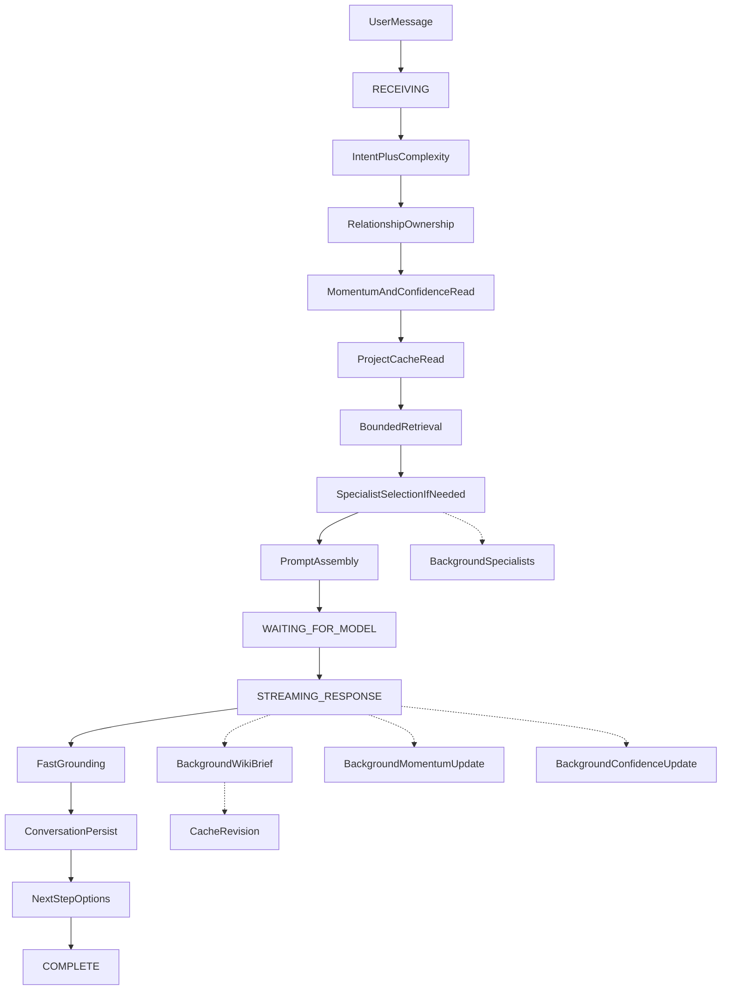

# Co-Director Final Optimization — Pipeline Manifest

Authoritative stage contracts live in code:

`studio-api/app/codirector/conversation/pipeline_manifest.py`

## Flow (foreground vs background)

## Rules

- Background stages never block first SSE token.
- Specialists are subordinate (`creatorFacingAllowed: false`); Co-Director synthesizes.
- Wiki enrichment succeeds only after read-back.
- Momentum / Creative Confidence update after stream begins.
