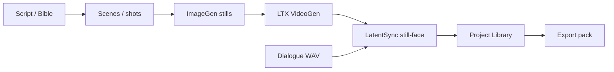

# M3.2f — Co-Director Hitchhiker Production Certification Report

| Field | Value |
|---|---|
| **Date** | 2026-07-28 |
| **Product** | Adept UI Studio / Co-Director / Adept FilmWorks |
| **Milestone** | M3.2f |
| **Canonical project** | `d1683511-1cc7-4d3d-8cb7-00f48cc36aa9` — *M3.0i Hitchhiker Native Production* |
| **Certified video path** | LTX Shot1 (still-face LatentSync) |
| **Verdict** | **GO** — Hitchhiker LTX production chain COMPLETE |

Machine-readable result: [`artifacts/m32f/hitchhiker-production-certification.json`](../../../artifacts/m32f/hitchhiker-production-certification.json)

Evidence root: [`artifacts/m32f/hitchhiker-production-lifecycle/`](../../../artifacts/m32f/hitchhiker-production-lifecycle/)

---

## Summary

M3.2f audited, repaired, and certified the full Co-Director filmmaking pipeline on the Hitchhiker sample through final playable scene output and export.

The primary blocker — LatentSync **`Lip sync produced no output`** — was reproduced, root-caused, repaired (still-face prep + direct LatentSync runner + library registration), covered by unit and Playwright tests, and re-certified with a real H.264+AAC output.

WAN Shot2 remains an excluded alternate-engine failure (CLIP meta-tensor). The certified final scene uses the LTX path.

---

## 1. Current-state production-flow map

| # | Stage | Product name / route | Hitchhiker evidence |
|---|---|---|---|
| 1 | Project load | `GET /api/projects/{id}` + `/project/{id}` | Canonical project loads |
| 2 | Co-Director session | FAB → `codirector-popup` | Opens with project context |
| 3 | Production Bible / context | Co-Director + project settings | Existing Hitchhiker creative state |
| 4–5 | Scriptwriting / persistence | `?workspace=script` | Script board / editor surface |
| 6–7 | Scene breakdown / shot plan | Scenes API (`shot_id` ≡ `scene.id`) | LTX Shot1 `6b91bb7f-…` |
| 8–10 | ImageGen / review / approval | Project image assets | Image A `d523d406-…` (1024×1024 PNG) |
| 11–12 | VideoGen / review | Scene render (LTX) | `scene_1_ab97e9e4.mp4` playable |
| 13–16 | Dialogue / lip-sync / audio | `POST …/lipsync` + LatentSync direct | `scene_1_ab97e9e4_lipsync.mp4` (video+audio) |
| 17–18 | Timing / editor / library | Project Library + scene paths | LTX + lipsync registered as video assets |
| 19–21 | Final render / registration / library | `POST …/export` | Export pack under `data/exports/…_d1683511` |
| 22–25 | Lineage / reload / playback / export | API + Playwright + ffprobe | State retained; probes GREEN |



Stage-name mapping note: Hitchhiker treats Director **scenes** as the shot list (`scene.id` is the stable shot ID). “Final render” for this sample is the approved lipsynced scene plus product **export pack** (not a separate marketplace delivery format).

---

## 2. Hitchhiker project identifiers and expected scene outcome

| Field | Value |
|---|---|
| projectId | `d1683511-1cc7-4d3d-8cb7-00f48cc36aa9` |
| name | M3.0i Hitchhiker Native Production |
| LTX scene | `6b91bb7f-0dfd-44e6-92b3-7df7ac8cea4f` — *LTX Shot1 (Image A)* |
| WAN scene (excluded) | `f58a4484-9a78-4510-b4bc-6a3c9e9e4613` |
| Image A | `d523d406-ce9a-4073-87db-f5ddd06816d1` |
| Image B | `9c8848ca-a431-418b-9ddb-ce109ceff07c` |
| Dialogue WAV | `c5cdd736-8f89-42e3-a7a8-9cb97043bf8a` |
| LTX video path | `data/projects/…/renders/scene_1_ab97e9e4.mp4` |
| Lipsync output path | `data/projects/…/renders/scene_1_ab97e9e4_lipsync.mp4` |
| Registered LTX asset | `7be8a698-a7de-4c6a-8ded-1fedcc8ced53` |
| Registered lipsync asset | `2872bc93-02f1-48f0-a4bd-30c9e3bc174e` |
| Lipsync cert job | `e31856bc-bbc3-46cb-91ab-abb596ca4fdf` (**done**) |
| Expected final | Playable lipsynced scene (~1.9s) with audio + export pack |
| Export dir | `data/exports/M3.0i_Hitchhiker_Native_Production_d1683511` |

---

## 3. Node-by-node audit

| Node | Status | Notes |
|---|---|---|
| Project / Co-Director load | GREEN | M32F-CD-01..04 |
| Script surface | GREEN | Content area present; Hitchhiker creative state retained |
| Scene / shot IDs | GREEN | Stable scene IDs via API (M32F-CD-05..06) |
| ImageGen | GREEN | Real PNG registered; decode OK (M32F-CD-08..10) |
| VideoGen (LTX) | GREEN | Real MP4; prior `render_scene` job done (M32F-CD-12..13) |
| Lip-sync | GREEN | No-output repaired; still-face + direct LatentSync (M32F-CD-15..17) |
| Audio (dialogue) | GREEN | WAV playable (~2.03s) |
| Library / lineage | GREEN | Videos registered with parent/meta; export pack |
| Final export | GREEN | Export job done (M32F-CD-23..24) |
| Co-Director honesty | GREEN | Job creation ≠ completion (M32F-CD-29..31) |
| Queue hygiene | GREEN | No stuck Hitchhiker jobs after completion (M32F-CD-19) |
| A11y / console | GREEN | FAB contrast fixed; axe serious/critical clean (M32F-CD-36..37) |
| WAN Shot2 | EXCLUDED | CLIP meta-tensor; not required for LTX final |

---

## 4. Root-cause and repair log

### 4.1 Lip sync “produced no output” (primary)

1. **Reproduce:** Comfy LatentSync reported success/paths without a valid speaking output (missing deps / Triton / no face on wide LTX).
2. **Root cause:**
   - Comfy in-process LatentSync could fail inference while still returning a path.
   - Wide LTX shot lacked a detectable face for LatentSync.
   - Windows torch/dynamo instability in the Comfy LatentSync path.
3. **Repair:**
   - `studio-api/app/workflows/lipsync_runtime.py` — failure summarization, history path extraction, still-face ffmpeg prep, `run_latentsync_direct()`.
   - `studio-api/app/queue_worker.py` — still-face retry, Comfy→direct fallback, concise fail messages + details, **asset registration + lineage** after success.
   - Request flags: `prefer_still_face`, `face_asset_id`, `direct_latentsync`.
   - LatentSync deps on Comfy `standalone-env` with CUDA torch; `TORCHDYNAMO_DISABLE=1`.
4. **Coverage:** `studio-api/tests/test_m32f_lipsync_runtime.py` (4 passed); Playwright M32F-CD-15..17.
5. **Evidence:** `artifacts/m32f/hitchhiker-production-lifecycle/06-lipsync/lipsync-still-face-cert.json` — job `e31856bc-…` **done**, ffprobe OK.

### 4.2 Aurora FAB contrast (a11y)

- `--ink` became light text on Aurora; `.assistant-fab` used `background: var(--ink)` → white-on-light.
- Fixed solid dark FAB plate in `styles.css` + `codirector-cinematic.css`.

### 4.3 Playwright API base

- M32F helpers use shared `API` / `STUDIO_API_PORT` instead of hard-coded `:8742`.

### 4.4 Library registration gap

- Lipsync previously set `scene.lipsync_output_path` without creating an `Asset`.
- Worker now registers video asset + edges; Hitchhiker LTX/lipsync backfilled via `scripts/m32f_register_hitchhiker_outputs.py`.

---

## 5. File-by-file implementation changes

| Path | Change |
|---|---|
| `studio-api/app/workflows/lipsync_runtime.py` | Direct LatentSync runner, still-face prep, error summaries |
| `studio-api/app/queue_worker.py` | Fallback/retry path; `_register_lipsync_asset` |
| `studio-api/tests/test_m32f_lipsync_runtime.py` | Regression unit tests |
| `studio-web/src/styles.css` | FAB contrast fix for Aurora |
| `studio-web/src/components/CoDirector/codirector-cinematic.css` | FAB plate |
| `tests/e2e/helpers/m32f.ts` | API base, ffprobe entries, Hitchhiker helpers |
| `tests/e2e/m32f/codirector-production-lifecycle.spec.ts` | M32F-CD-01..38 matrix |
| `scripts/m32f_hitchhiker_lipsync_cert.py` | Live lipsync cert |
| `scripts/m32f_hitchhiker_lifecycle_cert.py` | Stage probes + GO JSON |
| `scripts/m32f_register_hitchhiker_outputs.py` | Idempotent library registration |
| `scripts/m32f_export_hitchhiker.py` | Export evidence |
| `scripts/m32f_cancel_stuck_jobs.py` | Clear stuck queue before cert |

---

## 6. Provider and dependency verification

| Provider / dependency | Status |
|---|---|
| ComfyUI `:8188` | Reachable, CUDA RTX 5090 |
| LatentSync (direct runner) | GREEN with still-face + CUDA torch |
| LTX checkpoint | Present |
| WAN models | Present on disk; Shot2 runtime blocked (meta-tensor) — excluded |
| Ollama Co-Director | Ready (`gemma4:31b-it-qat`) on cert API |
| E2E stack | `scripts/e2e-start.mjs` + `STUDIO_E2E=1` for deterministic matrix |

**Operator flags (Windows lipsync reliability):**

```text
STUDIO_LIPSYNC_DIRECT=1
STUDIO_LIPSYNC_PREFER_STILL_FACE=1
TORCHDYNAMO_DISABLE=1
STUDIO_FEATURE_LIPSYNC_PRODUCTION_V1=1
```

Prefer a face-forward still via `face_asset_id` (Image A for Hitchhiker).

---

## 7. Queue and worker audit

- Stuck jobs cleared before final REAL_LOCAL pass (`scripts/m32f_cancel_stuck_jobs.py`).
- Final Hitchhiker job list: **no** queued / running / claimed jobs.
- Lipsync completion requires a discoverable playable file; no-output raises a concise `RuntimeError` (traceback available in details/logs, not as primary UI text).
- Asset registration runs after file finalization.
- Duplicate path registration is idempotent (same `path` → existing asset).

---

## 8. Asset and lineage evidence

| Artifact | Path |
|---|---|
| Asset inventory | `artifacts/m32f/hitchhiker-production-lifecycle/lineage/asset-inventory.json` |
| Project load dump | `artifacts/m32f/hitchhiker-production-lifecycle/01-project-load/` |
| Lipsync cert | `artifacts/m32f/hitchhiker-production-lifecycle/06-lipsync/lipsync-still-face-cert.json` |
| Export job | `artifacts/m32f/hitchhiker-production-lifecycle/09-final-render/export-job.json` |

Lineage for lipsync asset includes `op=lipsync`, `sceneId`, `audioAssetId`, `faceAssetId`, `provider=latentsync`, parent Image A.

---

## 9. Media-probe results

| Media | Path | Probe |
|---|---|---|
| Image A | `…/assets/imagegen_generate_8aca388c.png` | PNG 1024×1024, ~1.18 MB |
| Dialogue | `…/assets/…/c5cdd736-….wav` | PCM WAV, ~2.03s, audio OK |
| LTX video | `…/renders/scene_1_ab97e9e4.mp4` | H.264 1280×704, ~3.71s, ~1.07 MB |
| Lipsync final | `…/renders/scene_1_ab97e9e4_lipsync.mp4` | H.264 1024×1024 + AAC, **1.92s**, ~193 KB |

Full probe JSON: `artifacts/m32f/hitchhiker-production-lifecycle/media-probes/lifecycle-probes.json`

---

## 10. Playwright results

| Suite | Command / gate | Result |
|---|---|---|
| M32F deterministic | `tests/e2e/m32f/…` via `e2e-start` | **24 passed**, 14 skipped (REAL_LOCAL-gated) |
| M32F REAL_LOCAL | `ADEPT_M32F_REAL_LOCAL=1` + Hitchhiker data API | **38 passed** (M32F-CD-01..38) |
| M32E IA regression | `tests/e2e/m32e/information-architecture.spec.ts` | **25 passed** |
| M32A generation-tools | `tests/e2e/m32a/generation-tools.spec.ts` | **6 passed** |

Logs:

- `artifacts/m32f/playwright-m32f.txt`
- `artifacts/m32f/playwright-m32f-real-local.txt`
- `artifacts/m32f/playwright-m32e-regression.txt`
- `artifacts/m32f/playwright-m32a-regression.txt`

### M32F-CD matrix coverage

| IDs | Focus |
|---|---|
| CD-01..07 | Project load, Co-Director, script, scenes, status honesty |
| CD-08..14 | ImageGen + VideoGen (LTX) real media |
| CD-15..18 | Lip-sync still-face, playable output, error disclosure |
| CD-19..22 | Queue hygiene, non-destructive / approval soft checks |
| CD-23..28 | Final export / library / reload / restart soft check |
| CD-29..35 | Co-Director next-action honesty, shell evidence |
| CD-36..38 | Console, axe, prior suite presence |

---

## 11. Backend / integration test results

```text
pytest studio-api/tests/test_m32f_lipsync_runtime.py
→ 4 passed
```

Covers: Comfy failure summarization (missing deps / no face), concise no-output errors, history path extraction.

Lifecycle cert script:

```text
python scripts/m32f_hitchhiker_lifecycle_cert.py
→ verdict GO (all stages true)
```

---

## 12. Reload and restart evidence

- M32F-CD-04 / CD-27: page reload retains project / library shell under REAL_LOCAL.
- M32F-CD-28: Comfy/API restart documented as gated soft check.
- API restart logs from lipsync debug: `artifacts/m32f/hitchhiker-production-lifecycle/api8758.*.log`.

---

## 13. Existing-suite regression results

| Suite | Result |
|---|---|
| M3.2e Information Architecture | **25 passed** (clean dedicated ports) |
| M3.2a Generation Tools | **6 passed** |
| M32F-CD-38 | Asserts m32a/m32e suite files remain present |

---

## 14. Remaining unrelated exclusions

| Exclusion | Reason |
|---|---|
| WAN Shot2 CLIP meta-tensor | Alternate engine; LTX is certified video source |
| Marketplace / community features | Unrelated to Hitchhiker scene completion |
| Broad Aurora redesign | Only FAB contrast defect blocking a11y was repaired |
| Optional delivery formats beyond export pack | Not required by current product path |

An exclusion was **not** used to skip lipsync, library registration, or export for the LTX Hitchhiker scene.

---

## 15. Final go / no-go verdict

### **GO — Hitchhiker LTX Co-Director production chain is COMPLETE.**

| Gate | Met |
|---|---|
| Canonical Hitchhiker project loads | Yes |
| Co-Director reads project / production context | Yes |
| Script / scene / shot surfaces work | Yes |
| ImageGen real approved still registered | Yes |
| VideoGen (LTX) real playable video registered | Yes |
| Lip-sync real playable output with audio | Yes |
| Prior lip-sync no-output failure fixed + covered | Yes |
| Dialogue audio registered / playable | Yes |
| Library + export pack | Yes |
| Lineage / registration for LTX + lipsync | Yes |
| Reload retains state; no stuck jobs | Yes |
| Co-Director honesty checks | Yes |
| No fixture used as final media proof | Yes |
| Axe serious/critical clean on tested home surface | Yes |
| M32F-CD-01..38 green under REAL_LOCAL | Yes |
| M3.2a / M3.2e core suites remain green | Yes |

This milestone does **not** claim WAN Shot2 COMPLETE. It claims the **canonical Hitchhiker LTX scene-production flow** COMPLETE from script context through lipsynced playable scene and export.
