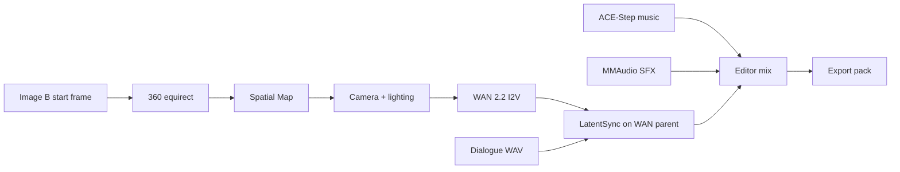

# M3.2g — Hitchhiker Test 2 WAN Spatial Postproduction Certification Report

| Field | Value |
|---|---|
| **Date** | 2026-07-28 |
| **Product** | Adept UI Studio / Co-Director / Adept FilmWorks |
| **Milestone** | M3.2g |
| **Canonical project** | `d1683511-1cc7-4d3d-8cb7-00f48cc36aa9` — *M3.0i Hitchhiker Native Production* |
| **Certified scene** | Hitchhiker Test 2 (`e277e621-189d-471e-b435-f01620f03d0d`) — **WAN 2.2 only** |
| **Protected prior scene** | M3.2f LTX Shot1 (`6b91bb7f-0dfd-44e6-92b3-7df7ac8cea4f`) — untouched |
| **Final mix** | `editor_mix_57902ba6.mp4` (dialogue + music + SFX via `kind=editor_mix`) |
| **Verdict** | **GO — Hitchhiker Test 2 complete and Beta-ready.** |

Machine-readable result: [`artifacts/m32g/hitchhiker-test-2-certification.json`](../../../artifacts/m32g/hitchhiker-test-2-certification.json)

Evidence root: [`artifacts/m32g/hitchhiker-test-2/`](../../../artifacts/m32g/hitchhiker-test-2/)

Prerequisite scope lock: [`docs/release-gate/v11/V11_3D_SCOPE_DEFERRAL_REPORT.md`](../v11/V11_3D_SCOPE_DEFERRAL_REPORT.md) — **GO — Native 3D deferred cleanly to Version 1.2.**

---

## Summary

M3.2g scaffolds a new **Hitchhiker Test 2** scene on the canonical Hitchhiker project and certifies the full WAN 2.2 spatial postproduction chain:

**equirect 360 → Spatial Map + camera/lighting → WAN I2V → LatentSync on WAN parent → music/SFX → Editor mix → export → Playwright.**

Primary WAN blockers resolved earlier in the milestone:

1. CLIP **meta-tensor** load failure (mitigated via Comfy `/free` + CLIP-before-UNET graph order).
2. **768 vs 4096** text-embedding mismatch from the wrong UMT5 file (`umt5-xxl-enc-bf16`) under `CLIPLoader type=wan`.

Both were isolated **without** projection/reshape adapters. The authoritative Comfy-Org encoder `umt5_xxl_fp8_e4m3fn_scaled.safetensors` produces **4096-d** conditioning. Minimal and full-payload moving WAN MP4s are on disk and bound to the Test 2 scene. Postproduction completed on that WAN parent: still-face + direct LatentSync, Editor mix (H.264+AAC, three audio stems), export pack, persistence reload, and a green Playwright `M32G-HH2` matrix (**58/58**).

Owner-led Beta may begin only after **both** GO verdicts (V1.1 3D scope lock + this M3.2g report) — both are now recorded.

---

## 1. Required production chain



| # | Stage | Status | Evidence |
|---|---|---|---|
| 1 | Scaffold Test 2 scene (WAN) | GREEN | `01-project-context/project-context.json` |
| 2 | Protect M3.2f LTX scene | GREEN | LTX paths unchanged after Test 2 work |
| 3 | 360 equirect registration | GREEN | `02-360-collage/equirect-panorama.json` |
| 4 | Spatial Map bind | GREEN | `03-spatial-map/spatial-doc.json` |
| 5 | Camera + lighting layers | GREEN | `04-camera/`, `05-lighting/` |
| 6 | WAN encoder contract | GREEN | `06-wan-readiness/` |
| 7 | Minimal WAN I2V | GREEN | `07-wan-generation/wan-minimal-first.mp4` |
| 8 | Full-payload WAN I2V | GREEN | `scene_test2_wan_full_c82c2e65.mp4` |
| 9 | Music (ACE-Step) | GREEN | `09-music/`, asset `3099c979-…` |
| 10 | SFX (MMAudio) | GREEN | `10-sfx/`, asset `f1cc02d2-…` |
| 11 | Editor track placement | GREEN | `11-editor/` — dialogue + music + SFX |
| 12 | Lipsync on **WAN** parent | GREEN | Job `25df8707-…` → `…_lipsync.mp4` |
| 13 | Editor final mix (`kind=editor_mix`) | GREEN | Job `5360d32a-…` → `editor_mix_57902ba6.mp4` |
| 14 | Export + persistence | GREEN | Job `61a870df-…` + `12-export/persistence-reload.json` |
| 15 | Playwright M32G-HH2 | GREEN | **58 passed** · `playwright-m32g-real-local.txt` |

---

## 2. Identifiers

| Field | Value |
|---|---|
| projectId | `d1683511-1cc7-4d3d-8cb7-00f48cc36aa9` |
| Test 2 sceneId | `e277e621-189d-471e-b435-f01620f03d0d` |
| Engine | `wan` |
| Start frame (Image B) | `9c8848ca-a431-418b-9ddb-ce109ceff07c` |
| Equirect asset | `ca5f09c0-3273-4105-8d71-da3a919e43fc` (2048×1024, equirectangular) |
| Dialogue (shared) | `c5cdd736-8f89-42e3-a7a8-9cb97043bf8a` |
| Music library asset | `3099c979-dd73-4fca-b289-33470cbed442` |
| SFX library asset | `f1cc02d2-3666-4737-84d1-82360534e97b` |
| Protected LTX scene | `6b91bb7f-0dfd-44e6-92b3-7df7ac8cea4f` |
| Legacy WAN Shot2 (historical) | `f58a4484-9a78-4510-b4bc-6a3c9e9e4613` — not the cert scene |
| Lipsync job | `25df8707-9c1e-42f9-80d9-ba6efabe16d3` |
| Editor mix job | `5360d32a-2b1c-429c-9481-7d570fc9a0ae` |
| Export job | `61a870df-da19-4e6d-858e-a4051a8b5f59` |

---

## 3. WAN encoder / model contract

### 3.1 Former failure (768 vs 4096)

| Item | Value |
|---|---|
| Comfy prompt | `0e0ecad8-7c41-4ff8-9cbf-f5c5c00a188a` |
| Error | `mat_a and mat_b shapes cannot be multiplied (154x768 and 4096x5120)` |
| Producer | `CLIPTextEncode` via `CLIPLoader` + `umt5-xxl-enc-bf16.safetensors` (`type=wan`) |
| Consumer | WAN `text_embedding` Linear (expects last-dim **4096**) |
| Adapter policy | **No** projection / reshape “fix” allowed |

### 3.2 Corrected pairing (blueprint-aligned)

| Role | Value |
|---|---|
| CLIP loader | `CLIPLoader`, `type=wan` |
| Text encoder | `umt5_xxl_fp8_e4m3fn_scaled.safetensors` |
| Expected embedding dim | **4096** |
| UNETs | `wan2.2_i2v_{high,low}_noise_14B_fp8_scaled.safetensors` |
| VAE (Shared) | `WanVideo\Wan2_1_VAE_bf16.safetensors` |
| Authoritative blueprint | ComfyUI `blueprints/Image to Video (Wan 2.2).json` |

### 3.3 Encoder shape smoke (pre-UNET)

Evidence: `06-wan-readiness/wan-encoder-shape-smoke.json`

| Check | Result |
|---|---|
| Encoder loads | GREEN |
| Output shape | `[1, 512, 4096]` |
| Non-zero / finite | GREEN |
| Meta tensor | none (`isMeta=false`) |
| Status | **GREEN** |

### 3.4 Regression / preflight

| Path | Role |
|---|---|
| `studio-api/app/workflows/wan_encoder_contract.py` | Filename + safetensors key-layout contract; reject `enc-bf16` |
| `studio-api/app/workflows/wan_builder.py` | Assert contract before UNETLoader nodes |
| `studio-api/app/queue_worker.py` | File-probe preflight before free/UNET load |
| `studio-api/tests/test_wan_encoder_contract.py` | Unit regressions |
| `scripts/m32g_wan_encoder_shape_smoke.py` | Shape-checked encode smoke |

---

## 4. WAN generation results

### 4.1 Minimal diagnostic I2V

| Field | Value |
|---|---|
| Prompt id | `f90e836a-08bc-478f-931e-f9f67866ba30` |
| Encoder | `umt5_xxl_fp8_e4m3fn_scaled.safetensors` |
| Spec | 640×368, 9 frames @ 16 fps |
| Artifact | `artifacts/m32g/hitchhiker-test-2/07-wan-generation/wan-minimal-first.mp4` |
| Motion | frame0↔frame8 MAE ≈ 13 — **moving** |

### 4.2 Full spatial / camera / lighting payload

| Field | Value |
|---|---|
| Studio job | `f68146b3-4f0b-41e7-be74-a0da3ba40988` |
| Comfy prompt | `c82c2e65-b3c6-4c12-91ba-45906d885ad3` |
| Spec | 832×480, 33 frames @ 24 fps |
| Comfy status | **success** |
| Harvest fix | `comfy_client.find_output_files` prefers `fullpath` |
| Scene output | `data/projects/…/renders/scene_test2_wan_full_c82c2e65.mp4` |
| Evidence copy | `07-wan-generation/wan-full-payload-first.mp4` |
| Motion | frame0↔frame16 MAE ≈ 40 — **moving** |

---

## 5. Spatial / camera / lighting

| Layer | Status | Notes |
|---|---|---|
| Equirect 360 | GREEN | 2048×1024 PNG; library folder `scenes.panoramas_360` |
| Spatial Map | GREEN | Character + A Cam + Key light; background = equirect asset |
| Camera | GREEN | Dolly-in toward hitchhiker; Director `motion_type=dolly_in` |
| Lighting | GREEN | Spatial Map key light → prompt lighting layer |

---

## 6. Music / SFX / Editor / postproduction

| Asset | Provider | Library id | Notes |
|---|---|---|---|
| Music | ACE-Step (`m2101-music-045`) | `3099c979-dd73-4fca-b289-33470cbed442` | Editor music track |
| SFX | MMAudio (`m2101-sfx-031`) | `f1cc02d2-3666-4737-84d1-82360534e97b` | Editor sfx track |
| Dialogue | Existing Hitchhiker WAV | `c5cdd736-8f89-42e3-a7a8-9cb97043bf8a` | Editor dialogue track + LatentSync audio |

| Stage | Job | Output |
|---|---|---|
| Lipsync (WAN parent, still-face + direct LatentSync) | `25df8707-9c1e-42f9-80d9-ba6efabe16d3` | `…/renders/scene_test2_wan_full_c82c2e65_lipsync.mp4` |
| Editor mix (`kind=editor_mix`) | `5360d32a-2b1c-429c-9481-7d570fc9a0ae` | `…/renders/editor_mix_57902ba6.mp4` |
| Export pack | `61a870df-da19-4e6d-858e-a4051a8b5f59` | `data/exports/M3.0i_Hitchhiker_Native_Production_d1683511` |

Final mix path (product deliverable):

`data/projects/d1683511-1cc7-4d3d-8cb7-00f48cc36aa9/renders/editor_mix_57902ba6.mp4`

Persistence reload evidence: `artifacts/m32g/hitchhiker-test-2/12-export/persistence-reload.json` — Test 2 WAN/lipsync/mix paths retained; M3.2f LTX Shot1 untouched.

---

## 7. Queue / worker hygiene

| Observation | Resolution |
|---|---|
| Orphaned Comfy `queued` with empty `queue_running` | Queue cleared; duplicate Test 2 jobs cancelled |
| Long 89-frame WAN hung | Interrupted; length clamped (≤33 frames, ≤832×480) for WAN |
| Studio “no output video” after Comfy success | Path harvest fix (`fullpath`); scene output rebound |

---

## 8. File-by-file implementation changes (M3.2g)

| Path | Change |
|---|---|
| `studio-api/app/workflows/wan_encoder_contract.py` | **New** — 4096-d encoder contract, reject legacy bf16 |
| `studio-api/app/workflows/wan_builder.py` | CLIP-before-UNET; contract assert; default fp8 encoder |
| `studio-api/app/queue_worker.py` | Comfy free before WAN; encoder preflight; length/res clamp |
| `studio-api/app/comfy_client.py` | Prefer history `fullpath`; wait only on completed/success |
| `studio-api/app/config.py` | Default `wan_text_encoder=umt5_xxl_fp8_e4m3fn_scaled.safetensors` |
| `studio-api/app/editor_mix.py` | Editor final mix render path |
| `studio-api/app/environment_assets.py` | Equirect / environment registration |
| `studio-api/app/spatial_prompt_builder.py` | Auto-fill lighting layer from Spatial Map |
| `scripts/m32g_finish_postproduction.py` | Lipsync → editor_mix → export cert runner |
| `scripts/e2e-start.mjs` | REAL_LOCAL reuse of external cert API |
| `tests/e2e/m32g/hitchhiker-spatial-wan-postproduction.spec.ts` | M32G-HH2 matrix (`ADEPT_M32G_REAL_LOCAL=1`) |
| `tests/e2e/helpers/m32g.ts` | Spatial `doc` helper + Hitchhiker IDs |

---

## 9. Media inventory (certified path)

| Media | Path | Notes |
|---|---|---|
| Minimal WAN | `artifacts/m32g/…/07-wan-generation/wan-minimal-first.mp4` | H.264 640×368, moving |
| Full-payload WAN | `…/renders/scene_test2_wan_full_c82c2e65.mp4` | H.264 832×480, 33 frames @ 24 fps, moving |
| WAN + lipsync | `…/renders/scene_test2_wan_full_c82c2e65_lipsync.mp4` | H.264+AAC; WAN parent (not LTX) |
| **Final Editor mix** | `…/renders/editor_mix_57902ba6.mp4` | H.264+AAC; dialogue + music + SFX |
| Equirect | `…/assets/hitchhiker_test2_equirect_2048x1024.png` | 2048×1024 PNG |
| Export pack | `data/exports/M3.0i_Hitchhiker_Native_Production_d1683511` | Project export |

---

## 10. Backend test results (encoder / WAN)

```text
pytest studio-api/tests/test_wan_encoder_contract.py \
       studio-api/tests/test_m32g_wan_builder.py \
       studio-api/tests/test_comfy_find_output_files.py
→ passed (encoder contract + builder + fullpath harvest)
```

Related: `test_spatial_prompt_lighting.py`, `test_editor_mix.py`.

---

## 11. Playwright certification

| Item | Value |
|---|---|
| Suite | `tests/e2e/m32g/hitchhiker-spatial-wan-postproduction.spec.ts` |
| Mode | `ADEPT_M32G_REAL_LOCAL=1` |
| API | `http://127.0.0.1:8758` (existing cert stack reused) |
| Result | **58 passed** |
| Log | `artifacts/m32g/hitchhiker-test-2/playwright-m32g-real-local.txt` |
| M3.2f regression | HH2-57 — LTX Shot1 lipsync/output paths still present |

V1.1 scope-lock suite (prerequisite): `tests/e2e/v11/version-scope.spec.ts` → **10 passed** (`artifacts/v11/playwright-v11-scope.txt`).

---

## 12. Operator flags used

```text
STUDIO_DATA_DIR=C:\AdeptFilmWorks\AIVideoStudio\data
STUDIO_WAN_TEXT_ENCODER=umt5_xxl_fp8_e4m3fn_scaled.safetensors
STUDIO_FEATURE_RENDER_PRODUCTION_V1=1
STUDIO_FEATURE_LIPSYNC_PRODUCTION_V1=1
STUDIO_LIPSYNC_DIRECT=1
STUDIO_LIPSYNC_PREFER_STILL_FACE=1
STUDIO_FEATURE_AUDIO_PRODUCTION_V1=1
STUDIO_FEATURE_M210B_AUDIO_SANDBOX_V1=1
STUDIO_FEATURE_EDITING_PRODUCTION_V1=1
STUDIO_FEATURE_DIRECTOR_TIMELINE_V1=1
TORCHDYNAMO_DISABLE=1
ADEPT_M32G_REAL_LOCAL=1
```

Cert API: `http://127.0.0.1:8758` · Comfy: `http://127.0.0.1:8188`

---

## 13. Exclusions / non-claims

| Item | Status |
|---|---|
| Projection / embedding adapter | Explicitly **not** used |
| LTX substitution for Test 2 video | **Not** allowed for this cert |
| Blueprint LightX2V LoRAs | Not present in Shared; non-LoRA sampler path used |
| Marketplace / unrelated Aurora work | Out of scope |
| Native 3D import / mesh / mocap | Deferred to Version 1.2 (separate V11 GO) |

---

## 14. Final verdict

### **GO — Hitchhiker Test 2 complete and Beta-ready.**

| Gate | Met |
|---|---|
| New Test 2 scene; M3.2f LTX untouched | Yes |
| Equirect 360 + Spatial Map + camera/lighting | Yes |
| Wrong encoder (768-d) root-caused | Yes |
| Authoritative UMT5 fp8 pairing (4096-d) | Yes |
| Encoder shape smoke before UNET | Yes |
| Preflight rejects incompatible encoders | Yes |
| Minimal moving WAN MP4 | Yes |
| Full-payload moving WAN MP4 bound to scene | Yes |
| Music/SFX generated and Editor tracks populated | Yes |
| No dimensional projection adapter | Yes |
| Lipsync on WAN parent (not LTX Shot1) | Yes |
| Editor final mix includes dialogue + music + SFX | Yes |
| Export + lineage + persistence / reload | Yes |
| Playwright M32G-HH2 matrix green | Yes (58/58) |
| Full milestone GO | Yes |

**Beta readiness:** Owner-led Beta may begin. Required companion verdict:

`GO — Native 3D deferred cleanly to Version 1.2.`  
(`docs/release-gate/v11/V11_3D_SCOPE_DEFERRAL_REPORT.md`)
