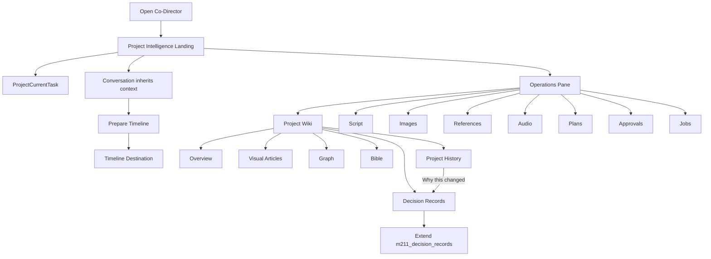

# M5.4 — Co-Director Project Intelligence

## Freeze header

| Field | Value |
| --- | --- |
| Master specification path | `docs/release-gate/m54-project-intelligence/M54_MASTER_IMPLEMENTATION_SPEC.md` |
| Master specification SHA-256 | `ac78f6c62627cc2a7ebf546159cedb858f914ec0456b2323563d26bc65b40a1a` |
| Git branch | `feature/ai-guided-setup` |
| Git SHA | `fa09c99d6395c29461cdec4555055faad116c435` |
| Freeze timestamp (UTC) | `2026-08-02T19:45:49Z` |
| Contract schema version | `m54.contracts.v1` |

Implementation agents must confirm they are working from this frozen revision. Spec edits require re-freeze and preflight reconsideration.

Checksum verification: temporarily replace the SHA-256 cell value with the literal `PENDING_FREEZE_HASH`, compute SHA-256 of the file, and compare to the freeze header value.

---

## 1. Overview

M5.4 makes Co-Director Adept UI’s production operating system: a synchronized Project Intelligence triad plus Library, Decision Records, Project History, format-aware Operations Pane, multimodal creative direction, prepared Timeline destination, and exportable production encyclopedia—all proposal-gated, project-isolated, and certified on live Beta with GPT-5.4 (`gpt-5.4-medium`) subagents.

```text
Wiki explains · Graph connects · Bible governs · Library proves
Decision Records preserve why · Project History preserves evolution
Landing + Current Task ground the present · Timeline is a prepared destination
```

## 2. Architecture

### 2.1 Four pillars (never duplicate)

| Pillar | Role | Authoritative owner |
| --- | --- | --- |
| Project Wiki | Visual, Wikipedia-like readable knowledge | `studio-api/app/project_intelligence/` (new) |
| Knowledge Graph | Relationships, chronology, knowledge states | `project_intelligence` typed SQLite nodes/edges |
| Production Bible | Approved/locked canon | Existing `studio-api/app/codirector/bible/` |
| Project Library | Tangible media files | Existing project Library APIs / assets |

Supporting layers:

| Layer | Answers | Owner |
| --- | --- | --- |
| Decision Records | Why changed? | Extend `m211_decision_records` → `ProductionDecisionRecord` |
| Project History | What changed, when? | `project_intelligence` history events |
| Format Awareness | What kind of production? | Format adapters over one core |
| Creative Provider Intelligence | Which tool/model, honestly? | Live registries + Setup/Dock + Prompt Intelligence (extend) |
| Project Operations Pane | Script/Images/Refs/Audio/Plans/Approvals/Jobs | Co-Director right pane |
| Export & Preservation | Local PDF/JSON/Markdown encyclopedia | `project_intelligence/export/` |
| Timeline preparation | Ready assembly payload | Proposal → open Timeline workspace (not a pane tab) |



### 2.2 Ownership matrix (single owner)

| Capability | Authoritative owner |
| --- | --- |
| Canon | Production Bible |
| Readable knowledge | Project Wiki |
| Relationships and chronology | Knowledge Graph |
| Media files | Project Library |
| Production rationale | Decision Records via m211 substrate |
| Creative evolution | Project History |
| Script editing | Scriptwriter |
| Voice editing | Voice Studio |
| Audio editing | Audio Studio |
| Editorial assembly | Timeline |
| Post-production | MAGI |
| Provider readiness | Setup / Production Dock / runtime registries |
| Co-Director operations | Proposal-gated tools |

Asset graph remains media-lineage only—not the story Knowledge Graph.

### 2.3 UI boundaries

Top-level Operations Pane tabs:

```text
Project Wiki | Script | Images | References | Audio | Plans | Approvals | Jobs
```

Inside Project Wiki:

```text
Overview | Articles | Graph | Bible | Decisions | History
```

Timeline is never a right-pane tab. Deep editing opens the proper studio. No raw IDs in primary chrome.

## 3. Frozen contracts (`m54.contracts.v1`)

### 3.1 Project intelligence

- Wiki article, Wiki version, assertion, authority state, provenance
- Graph node, graph edge, chronology
- Character knowledge, audience knowledge
- Contradiction, synchronization event

Authority ladder: `exploratory` → `working` → `proposed` → `approved` → `canon` → `locked` (+ `deprecated` / `contradicted` / `needs_review` / `codirector_suggestion`).

### 3.2 ProductionDecisionRecord

```ts
type ProductionDecisionRecord = {
  id: string;
  projectId: string;
  title: string;
  summary: string;
  whatChanged: string;
  whyChanged: string;
  alternativesConsidered?: string[];
  authority: "working" | "proposed" | "approved" | "canon" | "locked" | "deprecated";
  relatedWikiArticleIds: string[];
  relatedKnowledgeNodeIds: string[];
  relatedBibleEntityIds: string[];
  relatedAssetIds: string[];
  relatedProductionUnitIds: string[];
  relatedHistoryEventIds: string[];
  sourceType: string;
  sourceId?: string;
  createdBy: string;
  approvedBy?: string;
  createdAt: string;
  approvedAt?: string;
  updatedAt: string;
};
```

Extends/migrates `m211_decision_records`—no competing decision store.

### 3.3 ProjectHistoryEvent

```ts
type ProjectHistoryEvent = {
  id: string;
  projectId: string;
  eventType: string;
  title: string;
  summary: string;
  actorType: "creator" | "codirector" | "system";
  actorId?: string;
  relatedDecisionRecordId?: string;
  relatedWikiArticleIds: string[];
  relatedBibleEntityIds: string[];
  relatedAssetIds: string[];
  relatedProductionUnitIds: string[];
  beforeSnapshotId?: string;
  afterSnapshotId?: string;
  createdAt: string;
};
```

History ≠ editing Timeline. Restore only as proposal. Not every history event needs a Decision Record.

### 3.4 ProjectCurrentTask

```ts
type ProjectCurrentTask = {
  projectId: string;
  workspaceId?: string;
  productionUnitId?: string;
  seasonId?: string;
  episodeId?: string;
  sceneId?: string;
  characterIds: string[];
  locationId?: string;
  taskType?: string;
  taskSummary?: string;
  source: "creator" | "codirector" | "workspace";
  updatedAt: string;
};
```

Honest empty state when none exists.

### 3.5 Project Intelligence Landing summary

DTO fields (counts from live systems, not parallel counters): project title, format, current production unit path, current task, episodes/characters/locations/props/images/videos/voice/music/sfx counts, Bible completeness, continuity status, continue action, recent changes, pending approvals, suggested next step, open contradictions, running jobs, relevant Wiki pages.

### 3.6 Format awareness

- Project-format enum (episodic_series, feature_film, short_film, music_video, product_ad, documentary, explainer, custom, …)
- Format adapter interface
- Wiki template registry, graph vocabulary priority, Bible categories, progress model, operations-tab labels
- One core system; no per-format Wiki/graph forks

### 3.7 Operations pane item / deep-link

Item focus contract: display name, thumbnail, type, tags, authority, scene/character associations, no primary IDs. Chat deep-link opens correct tab and focuses item. Per-project pane tab persistence.

### 3.8 Creative direction

- `CreativeProviderPromptProfile` (providerId, modelId, modality, preferredPromptOrder, references, controls, strengths/limitations, bilingual/negative/structured flags, certifiedVersion, lastVerifiedAt)
- Creative brief; image/video prompt plan; voice plan; music plan; sound plan; scene-audio plan
- Cost/runtime disclosure; prompt provenance
- Live capability from registries/Setup/Dock/runtime—Unknown ≠ Ready; no silent provider switch, cloud spend, or CPU fallback
- Voice Identity ≠ Performance ≠ Environment; Lip Sync uses dry timing

### 3.9 TimelinePreparationPayload (single contract)

```ts
type TimelinePreparationPayload = {
  projectId: string;
  sceneId?: string;
  productionUnitId?: string;
  selectedAssetIds: string[];
  startImageAssetId?: string;
  endImageAssetId?: string;
  motionPrompt?: string;
  visualReferenceAssetIds: string[];
  dialogueTakeAssetIds: string[];
  voiceEnvironmentRenderId?: string;
  ambienceAssetIds: string[];
  foleyAssetIds: string[];
  musicCueAssetIds: string[];
  durationMs?: number;
  continuityPacket: Record<string, unknown>;
  approvalState: "proposed" | "approved";
  provenance: { source: string; preparedAt: string };
};
```

Proposal-gated prepare → Review → Open Prepared Timeline.

### 3.10 Export snapshot

Scopes: Current Article; Character encyclopedia; Episode book; Lore book; Decision register; Project history report; Production status; Production Bible; Complete production encyclopedia.

Immutable snapshot metadata: project id/title, format, wiki/graph/bible/library/decision/history/index versions, export time, creator, checksum. PDF/Markdown/JSON/media-manifest. Background jobs. Layer distinction section in complete export: Canon / Project Knowledge / Production Decisions / Project Evolution / Asset Manifest.

### 3.11 Mutation path (mandatory)

```text
Inspect → Propose → Explain → Preview Impact → Approve → Execute → Verify → Persist → Re-index
```

Forbidden: conversation→canon auto; inference as fact; Working overriding locked Bible; silent Wiki→Bible; graph declaring canon; Decision Records rewriting truth; silent History restore; rejected gens teaching global prefs; silent provider switch; unapproved API spend; hidden CPU fallback; silent Timeline placement.

### 3.12 Tool IDs (frozen)

Read: `production_memory.get_decision|list_decisions|search_decisions|get_related_decisions`; `project_history.list|search|get_event|get_recent|get_for_entity`; `project_landing.get_summary|get_current_task|get_recent_changes|get_next_recommendation`; plus Wiki/Graph/ops inspect tools and creative inspect tools from approved addenda.

Proposal-gated: `production_memory.propose_decision|propose_decision_update|propose_decision_deprecation`; `project_history.propose_restore|propose_snapshot`; `project_landing.propose_current_task|apply_approved_current_task`; Timeline prepare; Wiki/Bible/creative propose tools. No low-level DB mutate tools to the model.

## 4. Performance budgets

| Surface | Target | Blocking threshold |
| --- | --- | --- |
| Intelligence Landing warm load | ≤1.0s | >3.0s |
| Wiki article warm load | ≤500ms | >2.0s |
| Operations tab switch | ≤400ms | >1.5s |
| Scoped search | ≤750ms | >2.5s |
| Graph neighborhood | ≤750ms | >2.5s |
| Scene-context retrieval | ≤1.0s | >3.0s |
| Prompt-context compile | ≤1.5s | >4.0s |
| Incremental re-index | ≤2.0s | >8.0s |
| Export job acknowledgement | ≤500ms | >2.0s |
| First useful Co-Director response | ≤4.0s | >10.0s |

Hard rejects: full-project graph rebuild on ordinary chat; full Library scan on each pane change; blocking large export on UI thread; unbounded context injection; galaxy graph default; status probes delaying creative conversation.

## 5. Execution order (Phases 0–9)

| Phase | ID | Work |
| --- | --- | --- |
| 0 | `m54-phase0-contracts` | Audit m211/Bible/Library/pane; freeze all §3 contracts; gate |
| 1 | `m54-phase1-wiki-memory` | Visual Wiki + ProductionDecisionRecord on m211 substrate |
| 2 | `m54-phase2-graph` | Typed Knowledge Graph, chronology, character/audience knowledge |
| 3 | `m54-phase3-bible-sync` | Wiki↔Bible sync, promotion, contradictions (extend Bible) |
| 4 | `m54-phase4-retrieval-tools` | FTS5, production_memory/history/landing tools, ops inspect, creative-context bridge |
| 5 | `m54-phase5-creative` | Live provider intelligence; multimodal plans; selective Decision capture |
| 6 | `m54-phase6-landing-ops` | Landing + Current Task + Operations Pane + Wiki sub-nav |
| 7 | `m54-phase7-operator-history` | Operator commands, Timeline prepare payload, Project History (filters/snapshots/restore-as-proposal) |
| 8 | `m54-phase8-export` | PDF/Markdown/JSON/manifest; Decision register; History report; snapshot integrity |
| 9 | `m54-phase9-cert` | Unit/API/Playwright/live Beta; independent cert verifier; primary GO\|NO-GO |

Recommended branch for implementation: `feature/m5-4-codirector-project-intelligence`. Docs: `docs/codirector/project-intelligence/` + `docs/release-gate/m54-project-intelligence/`.

Package: `studio-api/app/project_intelligence/` orchestrates Wiki/Graph/History/Landing/export and calls Bible + Library; Decision Records evolve m211.

## 6. Dreamweaver acceptance scenario (must be architecturally supported)

Open Dreamweaver → Landing → continue active episode/scene → browse Anadriya visual Wiki → ask what Kyung knows → ask why a visual decision was made → trace via History → open script → inspect images/refs/audio → prepare production plan → approve → operate studios → Library assets return → prepare Timeline → open prepared Timeline → return later without re-explaining → export complete encyclopedia locally.

If architecture requires manual duplication across systems → BLOCKED at preflight.

## 7. Definition of Done

Co-Director simultaneously:

1. Understands the production (Wiki + Graph + Bible + format)  
2. Sees tangible materials (Library via Operations Pane)  
3. Remembers why (Decision Records extending m211)  
4. Tracks evolution (Project History ≠ editing Timeline)  
5. Opens with Landing + honest Current Task  
6. Directs creative systems with live readiness/cost honesty  
7. Prepares Timeline as destination  
8. Preserves encyclopedia via versioned local exports  

## 8. GO / NO-GO standard (implementation certification)

Binary **GO** or **NO-GO** in `M54_PROJECT_INTELLIGENCE_CERTIFICATION.md` after live Beta Playwright, independent GPT-5.4 certification verifier READY, proposal gating, project isolation, and frozen-checksum compliance.

Preflight gate (this document’s companion): `M54_FINAL_PREFLIGHT.md` must read **READY TO IMPLEMENT** before Phase 0 implementation begins.
