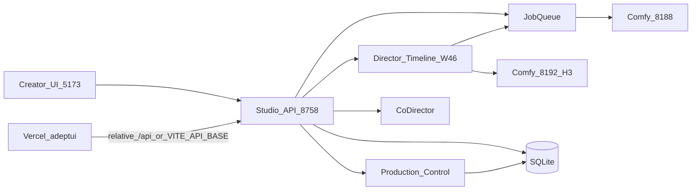

# ADEPT UI — PLATFORM-WIDE INTEGRITY & EVOLUTION AUDIT

**Law 30:** This is the single governing document for the 2026-08-29 / 2026-08-30 platform-wide integrity audit.  
**Not a feature certification.** Does not re-certify Timeline LTX/Comfy generation. Timeline E2E remains [TIMELINE_MASTER_PRODUCTION_CONTROL_COMFY_MCP_CERTIFICATION.md](../timeline/TIMELINE_MASTER_PRODUCTION_CONTROL_COMFY_MCP_CERTIFICATION.md).  
**Mode:** READ-ONLY. No repairs. No Git mutation.

**Lead:** Grok 4.6  
**Independent peers:** [Kimi K3](a4cd291d-11ac-4b16-8692-1d168395035f), [GLM 5.2](de7aa877-010c-429b-ab04-ffe532ec8d49)  
**Date:** 2026-08-29 (freeze) / 2026-08-30 (walkthrough)

Every material finding carries **Surface** and **Confidence**.

- **RELEASED** — `release/timeline-fullstack-comfy-mcp` @ `6c1a369913c4cc5b479d36eadfcf7f67d63c8944` / `https://adeptui.vercel.app`
- **CURRENT DEVELOPMENT** — dirty `feat/character-creator-final-closure` @ `b6156455` + live `:5173` / `:8758`
- **BOTH** — independently confirmed on both
- **HISTORICAL ONLY** — docs/evidence only
- **UNVERIFIED** — suspected, insufficient live proof

Confidence: **HIGH** live/runtime or directly traced production path · **MEDIUM** strong code, incomplete live · **LOW** docs/inference.

P0/P1 confirmed repairs require HIGH unless precautionary security/data-integrity.

---

## EXECUTIVE SUMMARY

Adept UI is a real, creator-facing production platform with a working Studio shell, a certified Timeline path, a live Character Creator, a dense but operational Spatial Map, and Production Control as the intended generator inventory. It is **not** a mock.

It is also carrying **too many authorities** for the same facts (who exists, what a model can do, whether it is ready, where a scene lives, how a job is stored). The released Timeline SHA is healthier than the 1947-file dirty development tree. Those must not be scored as one blob.

**Released product** is usable for owner Timeline/Character review on Desktop. **Current development** is a high-risk integration surface (dirty tree, dual Comfy on one GPU, retired `:8760` still up, Home empty-state vs 114 projects). **Public release** is not justified.

Comfy MCP was **unavailable** in this session. Phase 13 is BLOCKED. HTTP `:8188` / `:8192` is diagnostic only.

---

## FINAL VERDICT

`ADEPT UI PLATFORM INTEGRITY — CONDITIONAL / HIGH-PRIORITY REPAIRS REQUIRED`

| Question | Answer |
|---|---|
| SAFE TO CONTINUE FEATURE DEVELOPMENT? | **CONDITIONAL** — yes on one workstream at a time; do not expand generators until inventory/readiness is a single authority and the dirty tree is isolated or committed in slices |
| SAFE FOR OWNER PRODUCTION TESTING? | **CONDITIONAL** — yes for Timeline (LTX I2V), Character Creator, Spatial Map/ERS on the Desktop path with known honesty gaps; no for MiniMax 15s or WAN-as-Available Timeline |
| SAFE FOR PUBLIC RELEASE? | **NO** |

---

## PLATFORM HEALTH SCORE

| Area | Released /100 | Current dev /100 | Combined (labeled) | Evidence |
|---|---|---|---|---|
| Architecture | 72 | 58 | 64 | PC+Timeline join exists; leftover registries and dual supervisors remain |
| Canonical state integrity | 61 | 52 | 56 | Split inventory/capability/readiness/timeline/spatial/jobs |
| Frontend quality | 74 | 68 | 70 | Timeline shell/generator dock live; Home empty-state bug on CURRENT |
| UX coherence | 66 | 58 | 61 | Creator chrome good; Spatial density; Inspector stale engine list |
| Backend/API | 76 | 72 | 74 | W46 + queue real; leftover endpoints and swallowed writes |
| Persistence | 68 | 60 | 63 | SQLite + director_json real; write-on-read master; favorites localStorage |
| Generator architecture | 70 | 62 | 65 | Timeline join honest for LTX; WAN Available without adapter; MiniMax 5s vs 15s |
| Comfy integration | 58 | 54 | 55 | Live `:8188` healthy; MCP BLOCKED; second Comfy `:8192` on same GPU |
| Co-Director integration | 64 | 64 | 64 | Overlay + tools exist; Timeline tab is a launcher; LLM write-through swallowed |
| GPU/runtime management | 48 | 42 | 44 | Dual Comfy + Desktop Comfy + H3 worktree; supervisor does not own `:8192` |
| Performance | 68 | 60 | 63 | requestCache + jobs store exist; many independent pollers remain |
| Testing | 62 | 58 | 59 | Good unit islands; e2e often UI-open not generate→reload |
| Maintainability | 55 | 38 | 44 | 16 worktrees; CURRENT 1947 dirty; orphan UI; law-name drift |
| Owner-testing readiness | 74 | 62 | 66 | Local URLs live; status chip lies; Home library empty |

**Released-product class:** ~68 — Functional but fragile (do not apply CURRENT dirt to this number).  
**Current-development class:** ~55 — Significant remediation required (do not use RELEASED cleanliness to hide this).  
**Combined platform class:** **60–69 — Functional but fragile**, because the running Desktop is the dirty tree plus extra runtimes.

---

## ARCHITECTURE MAP



| Layer | Owner | Depends on |
|---|---|---|
| Studio Shell | `studio-web/src/App.tsx`, `core/workspaces.ts` | API, Co-Director host, Production dock |
| Projects | `projects` table / `/api/projects` | SQLite |
| Co-Director | `app/routers/codirector.py` + `components/CoDirector` | Project, tools, Ollama/PC LLM |
| Character Creator | `character_identity` + `CharacterCore` / `CharacterV2Studio` | Assets, Comfy/image |
| Prop Creator | `prop_creator` + `ProjectTraitRow` | Image core, Library |
| Spatial Map | `spatial_map_documents` + `SpatialMapPanel` | ERS, Library |
| ERS | `ers_persistence` / `environment_reference_sheet` | Spatial Map, image runtime |
| Scene Creator | `scene_creator` + traits | ERS, Timeline handoff |
| Timeline | `director_timeline_w46` + `timeline-master` | PC join, adapters, jobs |
| Image / Video / Audio | image_studio, Timeline, audio_studio | PC + runtimes |
| Library | `project_library` + `assets` | `/media` |
| Production Control / Footer Dock | `production_control` + `ProductionControlDock` | catalog + live inventory |
| Setup | `setup/lifecycle`, Source Manager | Supervisor |
| Comfy | `comfy_client` + supervisor `comfyui` | `:8188` (Desktop process observed) |
| Persistence | `app/db.py` + JSON sidecars | |
| Jobs | `Job` + MiniMax JSON + install jobs | |
| Continuity / JEPA | `continuity` + `world_intelligence` | Advisory; must not overwrite canon |
| Release | Vercel `adeptui` | Must not assume localhost Comfy |

---

## SERVICE / RUNTIME MAP

| Port | Process (observed) | Owner | Status |
|---|---|---|---|
| 5173 | Vite `studio-web` | Creator UI (CURRENT tree) | 200 HIGH |
| 8758 | uvicorn `app.main` | Studio API | healthz 200 HIGH |
| 8188 | Comfy Desktop 0.32.0 | EXTERNAL Desktop, not Adept venv | 200 HIGH |
| 8192 | H3 worktree Comfy 0.30.0 | `Start-AdeptUI-H3-RouteA` / not supervisor | 200 HIGH |
| 8760 | `scripts/beta_runtime/web_server.py` | Retired Law 15 UI | 200 HIGH — should not be the creator path |
| 11434 | ollama.exe | EXTERNAL/reused | listening HIGH |

Supervisor `SERVICES` = studio_api, comfyui, cloudflared, ollama. **Does not own `:8192`.** Parallel control planes: `runtime_supervisor`, `scripts/beta_runtime`, PowerShell Beta Backend. **BOTH · HIGH.**

---

## CANONICAL AUTHORITY MATRIX

| Domain | Intended | Actual | Duplicates | Verdict | Surface | Conf |
|---|---|---|---|---|---|---|
| Generator inventory | Production Control | PC `_CATALOG` + hosted + `GET /director-timeline/generators` | Inspector hardcoded engines (`ltx` 2.5, `wan`, `fal_*`) | SPLIT | BOTH | HIGH |
| Generator capability | Timeline adapters | Adapters + PC supports + CURRENT knowledge JSON | Three MiniMax documents | CONFLICT | BOTH / CURRENT extra | HIGH |
| Generator readiness | PC executable | Join uses **PC** `executable`, not adapter probe | Catalog default False vs live True | SPLIT | BOTH | HIGH |
| Projects | SQLite `projects` | Same + wiki/bible/working_context | Many documents per ID | SPLIT | BOTH | HIGH |
| Assets | `assets` + `/media` | Same | Favorites localStorage | SINGLE / SPLIT favorites | BOTH | HIGH |
| Characters | `character_identity` | Same | Props split | SINGLE profiles | BOTH | HIGH |
| Props | PropEntity | Prop Creator + character props + map slots | Three | SPLIT | BOTH | HIGH |
| Environments | Spatial Map + ERS | `spatial_map_documents` + `spatial_map_json` + ERS traits | Two map stores | SPLIT | BOTH | HIGH |
| Scene | `scenes` row | + Scene Creator shots in traits | Three clocks | SPLIT | BOTH | HIGH |
| Timeline | W46 `timelineMaster` | + legacy PUT `/director` | Dual write | SPLIT | BOTH | HIGH |
| Continuity | Timeline policy | + Wave 5 + scene JSON | Three | SPLIT | BOTH | MEDIUM |
| Jobs | `jobs` table | + MiniMax JSON + install jobs | Three families | SPLIT | BOTH | HIGH |
| Prompt profiles | Per-generator knowledge | CURRENT Inspector preview only; generate path unused | RELEASED absent | SPLIT / missing | CURRENT vs RELEASED | HIGH |
| Provider config | PC prefs | + hosted_providers + CD config + feature flags | Dock→CD swallowed | SPLIT | BOTH | HIGH |

---

## FRONTEND / UX

**Strong:** Home cinematic identity; Co-Director dock; workspace language (Timeline, Character, Library); Timeline snap/zoom/Video Generator live; Character one-project Library copy.

**Friction (CURRENT · HIGH unless noted):**

| Finding | Class | Surface | Conf |
|---|---|---|---|
| Home “No Projects Yet” (`!filtered.length`) while `GET /api/projects` count=114 — fetch/filter emptied the library, not a true first-use | REPAIR | CURRENT DEVELOPMENT | HIGH |
| Status “ComfyUI Starting…” while `:8188` reachable — label means `comfyNodeCatalogOk` is false (`SystemStatusStrip.tsx`), not “offline” | REPAIR / disclose | CURRENT DEVELOPMENT | HIGH |
| Inspector scene engine list: “LTX 2.5”, WAN, fal_* — not PC join | REPAIR | BOTH | HIGH |
| Spatial Map: Save Spatial Map ×3; ERS generator only GPT Image 2 | CONSOLIDATE | CURRENT DEVELOPMENT | HIGH |
| Video Generator live list honest: LTX 2.3 20s; 2.5 not ready; MiniMax **5s** | KEEP | CURRENT DEVELOPMENT (live) / RELEASED code | HIGH |
| WAN/Hunyuan PC Available+executable but omitted from Timeline (no adapter) | REPAIR honesty | BOTH | HIGH |
| Mock LLM `openai-compat` … `mock-chat-*` executable=True | REPAIR | CURRENT DEVELOPMENT (live PC) | HIGH |
| Co-Director Timeline is a launcher, not an editor | KEEP / disclose | BOTH | HIGH |
| Retired `:8760` still serves Adept HTML | REPAIR | CURRENT DEVELOPMENT | HIGH |

Control sample: Timeline Generate / Resume / snap / zoom / Video Generator **WORKING**. Hosted cancel **PARTIAL** (UI-only). Inspector engine **STALE**. Spatial Save **WORKING** but duplicated chrome. Home library **BROKEN** empty state.

---

## CREATOR WORKFLOW

Intended: Project → Character/Prop → Environment/ERS → Scene Creator → Timeline → generate → approve → Library.

Observed: Character and Spatial Map can share Jacob/prop IDs. Scene Creator “Use in Scene Creator” exists on Spatial Map. Timeline Video Generator is a second picker from Inspector engine. Co-Director does not edit Timeline master. **114 projects** makes “one project, one library” easy to violate operationally (not a code defect by itself).

Journey friction: creator must understand Local vs API vs Testing vs Available vs adapter-absent. MiniMax 15s exists in public contracts, **5s** in live Timeline. MAGI/Audio are separate islands.

---

## CO-DIRECTOR

Reads session-context, wiki/bible, character tools, timeline inspect tools, job.list. Writes gated proposals. Dock LLM save can write Co-Director config; failures `except: pass`. Timeline inside Co-Director is navigation. Approvals tab ≠ Timeline Approve this take. **BOTH · HIGH.**

Does not automatically overwrite canon if tools stay gated — KEEP. Risk is unused compile-preview vs generate on CURRENT.

---

## CHARACTER / PROP / ENVIRONMENT PIPELINE

Character Core + V2 cards live (Jacob, look locked, generate/approve). Prop slots on Spatial Map list “Glass coffee cup”. ERS regenerate present; generator menu **only GPT Image 2** on this project — may be project prefs, not platform-wide (**CURRENT · MEDIUM** for “only one generator exists”). Dual map persistence remains **BOTH · HIGH**.

---

## SCENE CREATOR

Handoff buttons exist. GET workspace documented read-only with derived reconcile. Not fully walked this pass (**UNVERIFIED** deep generate). Mini collapsed on Spatial Map.

---

## TIMELINE

Released cert still stands for LTX I2V 1280×704 MCP (historical HIGH evidence; this audit did not regenerate). Live picker matches PC join. Resume is re-queue. **RELEASED first-final auto-approve `auto_approve=not draft` · HIGH.** **CURRENT `auto_approve=False` · HIGH** — development improvement; do not score RELEASED as if this landed.

---

## LIBRARY

`assets` + enrich API. Favorites localStorage only (**BOTH · HIGH**). Home library empty-state contradicts API (**CURRENT · HIGH**).

---

## PRODUCTION CONTROL

Live inventory is the authority the Footer Dock uses. Timeline join consumes it. Capability labels mix Available / Testing / Certified / Requires Setup. WAN Available without Timeline adapter is dishonest to a creator who opens PC then Timeline.

---

## FOOTER DOCK

`ProductionControlDock` in `App.tsx`; 20s poll via `useProductionDock`. Timeline has a local Video Generator dock (not the footer). **BOTH · HIGH.**

---

## GENERATOR ARCHITECTURE

Path: PC models → join → W46 generate → adapter → Comfy 8188 or Route A 8192 or hosted API.

Leftovers: `useVideoGeneratorOptions` PC-only on Txt2Vid/JobPanel/settings. WAN/Hunyuan advertised executable on PC and Timeline `generators` with no generate adapter. LTX 2.5 IDs exec=True on Timeline `generators` and False on PC.

---

## GENERATOR KNOWLEDGEBASE

| Generator | Capability | Prompt dialect | Workflow | Surface |
|---|---|---|---|---|
| MiniMax H3 | Adapter 5s; PC may drop I2V | CURRENT profiles; generate path unused | Route A experimental graph | BOTH / CURRENT |
| LTX 2.3 | I2V 20s / 1280×704 | Timeline compile | Comfy MCP historically | BOTH |
| LTX 2.5 | Testing not exec | Aliased | Not live | BOTH |
| WAN / Hunyuan | PC + Timeline `generators` exec=True; **no** generate adapter (`supportsTimelineGeneration=False`; not in `timelineAdapters`) | None on generate path | Scene-render note only | CURRENT DEVELOPMENT · HIGH (live re-check; pack “no adapters” still true) |
| Seedance / Kling | Hosted Certified | API adapters | Hosted | BOTH |
| Veo | Adapter exists; picker omitted | — | UNVERIFIED why omitted | CURRENT live |

No universal fake video profile on the **generate** path. CURRENT Inspector preview is a second compiler. **Do not treat preview as production compile.**

---

## COMFYUI / MCP

**Phase 13 BLOCKED.** No Comfy MCP tools in this session.

HTTP diagnostic (not certification): `:8188` 0.32.0 Desktop; `:8192` 0.30.0 H3 worktree; both `cuda:0` RTX 5090. Workflow/node catalogue not MCP-verified. Prior Timeline MCP file `docs/release-gate/timeline/evidence/mcp_06ef7737.json` is **HISTORICAL** for this audit (still valid for Timeline E2E, not this session).

---

## GPU / VRAM

Idle 3478 MiB / 32607, 0% util. Two Comfy processes share one GPU. Desktop Comfy plus H3 Comfy is a residency risk even at idle. Supervisor does not lifecycle `:8192`. No new generation run this audit (plan: no expensive gen). **CURRENT DEVELOPMENT · HIGH** for process map; VRAM-after-video **UNVERIFIED** this session.

---

## JOBS / QUEUES

Queued→running→CandidateReady→Approve is real on Timeline. Stop cancels local jobs. Resume does not resume Comfy mid-prompt. Hosted cancel UI-only. RELEASED auto-approves first final. CURRENT does not. **Do not hide RELEASED auto-approve.**

---

## DATABASE / PERSISTENCE

SQLite is the product store. `load_master` write-on-read if `timelineMaster` missing. MiniMax jobs off-table. Asset file route trusts `Asset.path`. 114 projects in one API — operational sprawl.

---

## PERFORMANCE

`requestCache` (query-string key) and `projectJobsStore` are real repairs **BOTH · HIGH**. Remaining: VideoModelLibrary 10s Comfy poll, SystemStatus 15s, GpuVram 4s, Co-Director 5s, many feature pollers. Home/status staleness suggests a cache/probe mismatch **CURRENT · HIGH**.

---

## ERROR HANDLING

User-safe classes for runtime unavailable. VRAM/missing-model fall through to truncated exception. Details `<pre>` can show traceback **BOTH · HIGH**. Not a silent success.

---

## SECURITY

No committed `sk-` in app source **BOTH · HIGH**.  
`GET /api/assets/{id}/file` (and thumb) is **unscoped**: any `asset_id`, no project membership, no `resolve_data_file_path`. `/api/file` is already hardened. **P0 precautionary**, BOTH, HIGH (code). No live exploit attempted this session.  
Hosted frontend must not bake `:8188`; `studio-web/src` has none. Empty `VITE_API_BASE` on Vercel means `/api` on Vercel origin.

---

## RELEASE / GIT

| Item | Surface | Conf |
|---|---|---|
| 16 worktrees | BOTH | HIGH |
| CURRENT 1947 porcelain | CURRENT DEVELOPMENT | HIGH |
| RELEASED 5 dirty (report/vercel) | RELEASED | HIGH |
| Docs still saying Live UI `:8760` | HISTORICAL ONLY (text) + CURRENT comments | HIGH |
| `:8760` process live | CURRENT DEVELOPMENT | HIGH |
| Hosted SHA still 6c1a369 (prior release) | RELEASED | MEDIUM this session (not re-inspected) |

---

## TEST QUALITY

Prove: requestCache isolation, LTX capability units, snap/zoom Playwright, failure copy sanitization.  
Do not prove: full generate→Library→reload on most e2e; CURRENT auto-approve gate not in RELEASED; hydration-smoke swallows missing viewer.

---

## DEAD / DUPLICATE / FILLER

| Item | Class | Surface | Conf |
|---|---|---|---|
| SpatialSceneWorkspace, ImageGenPanel, UnifiedExperience, ApprovalCenterPanel unused | REMOVE | BOTH | MEDIUM |
| useVideoGeneratorOptions vs useTimelineVideoGenerators | CONSOLIDATE | BOTH | HIGH |
| Dual supervisors + live `:8760` | CONSOLIDATE / REPAIR | CURRENT | HIGH |
| M214 API without UI | CONSOLIDATE | BOTH | MEDIUM |
| messages_json legacy | KEEP | BOTH | HIGH |
| Workspace aliases director→timeline | KEEP | BOTH | HIGH |

---

## GROK 4.6 REVIEW

**Strong:** Creator shell; Timeline PC join; LTX I2V honesty; Stop/Resume semantics; Character Core; Spatial Map is a real blocking board; requestCache; no `:8188` in frontend source.

**Fragile:** Authority matrix; GPU dual-Comfy; dirty tree; status/Home lies; Inspector engine fossil; MiniMax duration split; knowledge compile not on generate.

**Confirmed defects:** listed in CONFIRMED REPAIRS.

**Architectural risk:** more generators will multiply the split.

**UX:** Spatial density; implementation leakage (ports, Testing, adapter-absent Available).

**Performance:** poller sprawl after a good cache core.

**Debt worth removing:** orphan workspaces, hardcoded Inspector engines, retired web server, mock LLMs in live PC.

**Improvements:** one inventory; one readiness; one Timeline persist; hide adapter-less models from Available; MiniMax say 5s everywhere or ship 15s; restore Comfy MCP; isolate GPU workers.

---

## KIMI K3 REVIEW

Peer: [Kimi K3](a4cd291d-11ac-4b16-8692-1d168395035f) — `READY FOR PRIMARY REVIEW`. Independent live sample against both worktrees. No platform GO.

**Verification sample Kimi re-checked (not trusted from the pack):** healthz / 114 projects / HEAD `b6156455` / dirty tree; unscoped asset file on **both** surfaces; watcher `auto_approve` divergence; `generator_knowledge` CURRENT-only; supervisor has no `:8192`.

**Correction Kimi proposed:** pack “no WAN/Hunyuan Timeline adapters” is stale because `/api/director-timeline/generators` now lists `wan-local`, `hunyuan-video-1.5-local`, `hunyuan-video-13b-local` with `executable=True`.

**Primary re-check (runtime wins):** that listing is **capability advertising**, not a generate adapter. Same response’s `timelineAdapters` is still six IDs (`minimax-h3-t2v-local`, `minimax-h3-i2v-local`, `ltx-local`, `seedance-api`, `kling-api`, `veo-api`). CURRENT `capabilities.py` sets `supportsTimelineGeneration=False` and notes “No Timeline adapter registered.” No `wan`/`hunyuan` class under `generation/adapters/`. **Pack remains true. Kimi over-read `generators` as adapters.** The honesty defect is worse: Timeline now *says* they are executable.

**Live contradiction Kimi found and primary confirmed (CURRENT, HIGH):**

| Model | PC `executable` | Timeline `generators` | Timeline `timelineAdapters` |
|---|---|---|---|
| ltx-2.5-full/distilled/comfy | False (Testing) | True | absent |
| wan-local / hunyuan-* | True (Available) | True | absent |
| seedance-kie / kling-kie | True (Certified) | seedance-kie False; kling-**fal** False | seedance-**api** / kling-**api** True |
| veo-kie | True (Testing) | absent | veo-**api** True |

ID drift (`kling-kie` vs `kling-fal` vs `kling-api`) is live, not latent.

**Other Kimi findings accepted:** dual `cudaMallocAsync` late-OOM risk (existence HIGH, impact MEDIUM); Audio ACE-Step/MMAudio **Certified + exec=False** (live confirmed); Gemma 4 **Available + exec=False**; hosted cancel dead on RELEASED (Law 9); Resume name vs re-queue; favorites localStorage; M214 API mounted without UI; `_tmp_gate_patch.py` provenance; dirty tree makes CURRENT findings short-lived; owner-named laws vs numbered canon.

**Five priorities (Kimi):** one generator registry; close asset-file gap (Kimi severity: precautionary P1); one supervisor + GPU admission; slice the dirty tree + document auto_approve; creator-state honesty (Home, status, cancel, Certified).

**Likely missed by a SHA-only audit (Kimi E):** RELEASED auto-approve; live readiness contradiction; dual-allocator OOM; asymmetric `/api/file` vs asset route; moving CURRENT target; script-written gate tests.

---

## GLM 5.2 REVIEW

Peer: [GLM 5.2](de7aa877-010c-429b-ab04-ffe532ec8d49) — `READY FOR PRIMARY REVIEW`. Independent code trace, not a rubber stamp. No platform GO.

**Summary:** Capability is broad. The problem is too many speakers for the same concept, plus silent failure paths. Chrome is mostly creator-first; plumbing drifts from what the UI promises.

**Findings GLM added or sharpened (not all were in Grok’s first pass):**

| ID | Finding | Surface | Conf |
|---|---|---|---|
| F1 | `GET /api/assets/{id}/file` is **unscoped** (no project_id, no membership). `/api/file` already scopes. Same gap on `/thumb`. Law 14 | BOTH | HIGH |
| F2 | Scene Inspector hardcoded engines include WAN/Runway with **no adapter** → `GeneratorNotFoundError` | BOTH | HIGH |
| F3 | Join `executable` is PC-only (`draftCapabilities.ts`) | BOTH (code) | HIGH |
| F4 | MiniMax 4–15s preflight vs Route A 5 frames / 480×256 | BOTH | HIGH |
| F5 | `generator_knowledge` unused by `director_timeline_w46` | CURRENT DEVELOPMENT | HIGH |
| F6 | `:8192` not in supervisor `SERVICES`; `:8760` orphan | BOTH / CURRENT | HIGH |
| F7 | Home empty vs 114; Comfy Starting vs reachable | CURRENT DEVELOPMENT | HIGH |
| F8 | PoseCraft/Library favorites in localStorage | BOTH | MEDIUM |
| F9 | auto_approve RELEASED vs CURRENT | BOTH | HIGH |
| F10 | 42 `_tmp_`/`_patch_` scratch files in `studio-api/` | CURRENT DEVELOPMENT | HIGH |
| F11 | Dual spatial + three job families | CURRENT DEVELOPMENT | HIGH |
| F12 | `orchestrator.py` legacy projection `except Exception: pass` | CURRENT DEVELOPMENT | HIGH |

**Five things GLM would do before more features:** (1) close unscoped asset file; (2) one generator authority; (3) kill or observe legacy Timeline projection; (4) one spatial system; (5) honest Home/Status.

**Refuse to add:** a fourth generator registry; more Spatial Save buttons; silent model fallback; localStorage-as-Library; a third Timeline store; new top-level routes before Home/Status/authority are honest; hardcoded runtime `<option>` lists.

**Journey leak:** world→scenes→animate crosses spatial_map → scene_creator → W46 with three translations.

**Ask primary before more features:** F1 and F12.

---

## THREE-WAY AGREEMENTS

All three (Grok 4.6 lead, [Kimi K3](a4cd291d-11ac-4b16-8692-1d168395035f), [GLM 5.2](de7aa877-010c-429b-ab04-ffe532ec8d49)) — runtime/code, HIGH unless noted:

- Split generator / readiness / Inspector authorities
- PC `executable` overwrites adapter at the join
- MiniMax public 4–15s vs Route A 5s / 5 frames / 480×256
- Dual Comfy on one GPU; supervisor does not own `:8192`
- Retired `:8760` still serving
- Home empty-state vs 114 projects (CURRENT)
- RELEASED `auto_approve=not draft` vs CURRENT `False`
- Unscoped `/api/assets/{id}/file` vs hardened `/api/file`
- Resume is re-queue; hosted cancel is UI-only
- `generator_knowledge` Inspector-only on CURRENT
- requestCache isolation is real
- Dirty 1947-file tree is unauditable / short-lived
- Do not add another inventory or hardcoded runtime `<option>` lists
- Audio **Certified + exec=False** (ACE-Step, MMAudio) — live PC
- Mock-chat LLMs executable in live PC

**Two-of-three accepted into the matrix:** GLM F12 silent Timeline projection `except: pass` (CURRENT, HIGH; also many other bare `pass` in `orchestrator.py`). GLM/Kimi scratch `_tmp_`/`_patch_` files. Kimi live PC↔Timeline exec contradiction (primary re-confirmed). Kimi ID drift. Gemma Available+not executable.

Grok pre-peer **scores are unchanged**. Matrix severity for the asset route was upgraded from P1 to **P0 precautionary** after GLM+Kimi both independently traced the same unscoped handler on both surfaces.

---

## REVIEWER DISAGREEMENTS

| Topic | Grok | Kimi | GLM | Resolution |
|---|---|---|---|---|
| Asset file severity | P1 precautionary | P1 precautionary | P0 Law 14 | **P0 precautionary.** Isolation gap is real; no exploit claimed |
| WAN/Hunyuan “now have adapters” | No Timeline adapter | Pack stale — generators list them exec=True | Inspector advertises WAN with no adapter | **Runtime:** no generate adapter. Listing them executable is the defect. Pack stands |
| Comfy “Starting…” | Catalog-not-ok | MEDIUM / pack-reported | Stale vs `:8188` up | Label is `!comfyNodeCatalogOk`. Creator-trust P1 stays |
| Dual persist `pass` | Dual persist P2; CD swallow MEDIUM | Dual persist HIGH | F12 before more features | **Accepted P1** CURRENT for W46→legacy `pass` |
| cudaMallocAsync ×2 | Dual Comfy P0 process | HIGH existence, MEDIUM late-OOM | Lifecycle orphan | Keep P0 process ownership; impact MEDIUM until a dual-load crash is observed |
| Certified audio dead-end | Implied by exec=False | Law 20 P1 | Journey friction | **Accepted P1** CURRENT (live PC) |

---

## CONFIRMED DEFECTS

See P0–P3 matrix. Evolution suggestions are separate.

---

## P0 / P1 / P2 / P3 REPAIR MATRIX

| Pri | Finding | Subsystem | Surface | Conf | Root cause | User impact | Source-level repair | Regression |
|---|---|---|---|---|---|---|---|---|
| P0 | Two Comfy processes on one GPU (`:8188` Desktop + `:8192` H3) | Runtime / VRAM | CURRENT DEVELOPMENT | HIGH | Route A not in supervisor; Desktop Comfy reused | Silent OOM / stolen VRAM | One owner; disclose second instance; idle unload | Stopping wrong Comfy |
| P0 | CURRENT dirty tree 1947 files vs released SHA | Release | CURRENT DEVELOPMENT | HIGH | Concurrent workstreams unisolated | Lost work / accidental ship | Slice commits; never `git add -A` | Process only |
| P1 | Inventory/readiness/capability split + Inspector hardcoded engines | Generators | BOTH | HIGH | Historical registries not retired | Wrong engine / fake Available | PC + adapters only; delete Inspector fossil list | Timeline picker |
| P1 | RELEASED first-final auto-approve | Timeline | RELEASED | HIGH | `auto_approve=not draft` | Take approved without click | Match CURRENT `False` + test | First-final UX |
| P0 | `GET /api/assets/{id}/file` (and thumb) unscoped — any `asset_id`, no project gate | Security | BOTH | HIGH | Route predates `/api/file` scoping | Cross-project file leak | Require project scope + `resolve_data_file_path` | Asset URLs |
| P1 | Home empty library vs 114 projects | Frontend | CURRENT DEVELOPMENT | HIGH | Query/cache/filter fail | Creator thinks nothing exists | Fix list hydration | Home perf |
| P1 | Status “ComfyUI Starting…” while `:8188` up | Runtime UX | CURRENT DEVELOPMENT | HIGH | `comfyNodeCatalogOk` false despite reachability | Creator thinks Comfy is booting | Fix catalog probe or say “catalog not ready” | False Healthy |
| P1 | WAN/Hunyuan Available without Timeline adapter | Generator truth | BOTH | HIGH | Catalog executable≠join | Dead end | Capability label Not on Timeline / not Available | PC copy |
| P1 | MiniMax 15s contract vs live 5s / Route A 5 frames | MiniMax | BOTH | HIGH | Public vs private-local | Failed generate / false hope | One duration authority | H3 plans |
| P1 | Live mock-chat LLMs executable | PC | CURRENT DEVELOPMENT | HIGH | Compat fixtures in inventory | Fake Co-Director models | Hide mock from production dock | Tests |
| P1 | PC vs Timeline live exec contradiction + ID drift (`kling-kie`/`kling-fal`/`kling-api`; Veo PC-only vs `veo-api`) | Generators | CURRENT DEVELOPMENT | HIGH | Three lists, one join | Picker and dock disagree in the same minute | One registry; one id | Timeline picker + PC dock |
| P1 | Audio ACE-Step / MMAudio Certified + `executable=False` | PC / Law 20 | CURRENT DEVELOPMENT | HIGH | Label not tied to readiness | Dead Certified control | Requires Setup / unlist | Audio dock |
| P2 | Traceback in Details | Error UX | BOTH | HIGH | details keep raw blob | Scare / leak paths | Redact details too | Debug |
| P2 | Hosted cancel UI-only | Jobs | BOTH | HIGH | Provider has no cancel | Stop does nothing | Disable or honest copy only | — |
| P2 | Dual Timeline persist | Timeline | BOTH | HIGH | Migration incomplete | Stale GET | One writer | DirectorTracks |
| P2 | Dual spatial JSON | Spatial | BOTH | HIGH | Legacy blob | Worker reads old map | One document | queue_worker |
| P2 | Dual video option hooks | Frontend | BOTH | HIGH | Txt2Vid predates join | Different menus | One hook | Txt2Vid |
| P1 | W46→legacy Timeline projection `except Exception: pass` | Timeline | CURRENT DEVELOPMENT | HIGH | “Best-effort” dual write | Tracks vs master can diverge silently | Log/metric or retire legacy lane | DirectorTracks |
| P2 | 42 `_tmp_`/`_patch_` scripts in `studio-api/` | Release hygiene | CURRENT DEVELOPMENT | HIGH | Debug leftovers | Clean-clone noise | Delete or gitignore | None |
| P2 | Swallowed CD LLM sync | Co-Director | BOTH | MEDIUM | bare except | Silent model mismatch | Surface error | Dock save |
| P2 | Retired `:8760` still up | Runtime | CURRENT DEVELOPMENT | HIGH | Old supervisor | Wrong URL testing | Do not start; Law 15 | e2e |
| P2 | generator_knowledge not on generate | Knowledge | CURRENT DEVELOPMENT | HIGH | Preview-only | Preview≠job | Wire or hide | Prompts |
| P3 | Save Spatial Map ×3 | UX | CURRENT DEVELOPMENT | HIGH | Duplicate chrome | Clutter | One primary Save | — |
| P3 | Docs cite `:8760` as Live UI | Docs | HISTORICAL ONLY | HIGH | Stale reports | Agent confusion | Mark historical | — |
| P3 | Orphan workspaces | Dead code | BOTH | MEDIUM | Unused imports | Maintain cost | Remove after grep | Tests |
| P3 | 16 worktrees | Git | BOTH | HIGH | Parallel missions | Wrong tree edits | Inventory + retire | — |

---

## UI SIMPLIFICATION RECOMMENDATIONS

- One Video Generator control (dock). Hide Inspector engine or bind it to the same join.
- Spatial Map: one Save; cameras/props behind Add; ERS generator in Advanced if only one model.
- Home: never show “No Projects Yet” when API has rows.
- Progressive disclosure: Testing/Certified/ports in Status/Diagnostics only.
- Co-Director Timeline: “Open Timeline” only — do not imply an in-chat editor.

---

## FUNCTIONALITY RECOMMENDATIONS

| Idea | Value | Complexity | Notes |
|---|---|---|---|
| Single generator authority + honest readiness | High | Moderate | Repair, not a feature |
| MiniMax true 15s or honest 5s everywhere | High | High if real 15s | Do not label 15s until Route A does |
| Generate→Library→reload e2e as default gate | High | Moderate | Test quality |
| Comfy MCP always on for cert | High | Low | Session tooling |
| Audio/music on the same Timeline clock | Medium | High | Missing finish path |
| MAGI as the edit step after Timeline | Medium | High | Already exists; handoff |
| Auto project hygiene (archive 114) | Medium | Low | Operational |
| In-chat Timeline editor | Experimental | High | Refuse until Standard Timeline is the only writer |

---

## THINGS ADEPT SHOULD REMOVE

Retired `:8760` from default start. Mock LLMs from production inventory. Inspector fossil engine list. Orphan workspace files. `auto_approve` on first Timeline final (RELEASED). Adapter-less executable WAN/Hunyuan/LTX 2.5. Certified-but-dead audio. Scratch `_tmp_`/`_patch_` scripts.

---

## THINGS ADEPT SHOULD CONSOLIDATE

PC + adapters + Inspector. `useVideoGeneratorOptions` + `useTimelineVideoGenerators`. Supervisors. Spatial document stores. Job families (or clearly separate Install vs Render vs H3). Prop surfaces.

---

## THINGS ADEPT SHOULD ADD

Honest “why disabled” on every not-ready generator. One duration chip from the adapter. MCP in the default agent session. Project picker that always lists the 114 (or paginates honestly).

---

## THINGS ADEPT SHOULD NOT ADD

A third generator registry. A 15s MiniMax UI without Route A 15s. Another Timeline persist format. Universal video prompt profile. Public release of the dirty tree. GPU “just run both Comfys.”

---

## OWNER-TESTING READINESS

| Surface | URL | Ready? |
|---|---|---|
| Local creator UI | http://127.0.0.1:5173/ | Yes, CURRENT tree — distrust Home empty state |
| Studio API | http://127.0.0.1:8758/ | Yes |
| Comfy | http://127.0.0.1:8188/ | Yes HTTP; MCP no |
| H3 Comfy | http://127.0.0.1:8192/ | Yes HTTP; experimental |
| Retired UI | http://127.0.0.1:8760/ | Do not use |
| Hosted | https://adeptui.vercel.app | Frontend only; no local Comfy |

SenseNova `0ffe56e2-…` opened Timeline + Character + Spatial this session.

---

## RECOMMENDED NEXT DEVELOPMENT SEQUENCE

1. Isolate or slice-commit CURRENT dirt; do not `git add -A`.
2. Scope `/api/assets/{id}/file` + `/thumb` like `/api/file` (peer F1 / Kimi #2).
3. One GPU owner: Desktop Comfy **or** H3, not silent both; put Route A in supervisor or label EXTERNAL.
4. One generator registry; delete Inspector fossil list; stop advertising WAN/Hunyuan/LTX 2.5 as executable without a Timeline adapter.
5. Observe or retire W46→legacy projection (`except: pass` — GLM F12).
6. Remove RELEASED auto-approve (CURRENT already gated — port the test + release note).
7. Fix Home project list + Comfy status chip; ban Certified/Available on `exec=False`.
8. Restore Comfy MCP; then MiniMax duration truth.
9. Then — and only then — new generators or 15s H3.

---

## MANDATORY CHECKLIST

```text
[x] Laws read (1–32 vs owner names flagged)
[x] Freeze branch/SHA/worktrees/ports/PC/GPU
[x] Architecture + authority matrix
[x] Dead/duplicate classified
[x] Live UX walkthrough (Home, Timeline, Character, Spatial)
[x] MiniMax 5s live vs 15s contract
[x] Comfy MCP BLOCKED
[x] Jobs/resume/auto-approve dual-surface
[x] Security scan without printing secrets
[x] Grok assessment before peers
[x] Peers Kimi K3 + GLM 5.2 launched on evidence only
[x] GLM 5.2 merged
[x] Kimi K3 merged
[x] Three-way agreements + disagreements written
[x] Live inventories re-checked after peers (PC video/llm/audio + Timeline generators/adapters)
[x] No repairs performed
[x] No git add / reset
```
