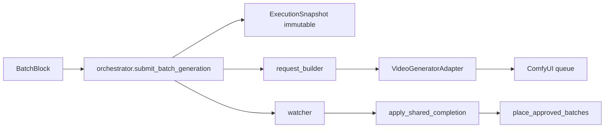

# TIMELINE COMFYUI MULTI-BATCH AUDIT

**Milestone:** Timeline Multi-Batch + Preview Monitor — Mandatory GO Closure
**Audit type:** Read-only architecture audit (independent)
**Date:** 2026-08-07
**Status:** ROOT CAUSE IDENTIFIED

## 1. End-to-end path (Timeline Batch -> ComfyUI -> Timeline)

| Stage | File | Role |
|-------|------|------|
| Batch contract | `studio-api/app/director_timeline_w46/contracts.py` | `BatchBlock`, `ExecutionSnapshot`, `GenerationJobRef` |
| Orchestrator | `studio-api/app/director_timeline_w46/orchestrator.py` | Submit, snapshot, scene generate, cancel |
| Request builder | `studio-api/app/director_timeline_w46/generation/request_builder.py` | Batch -> `TimelineGenerationRequest` |
| Adapter registry | `studio-api/app/director_timeline_w46/generation/registry.py` | Resolves generator -> adapter |
| Comfy (H3) | `studio-api/app/minimax_h3/route_a_adapter.py` | Builds & queues graphs on Route A `:8192` |
| Comfy (LTX/WAN) | `studio-api/app/queue_worker.py` | Legacy scene render path |
| Completion | `studio-api/app/director_timeline_w46/generation/completion.py` | Asset -> candidate -> approve -> placement |
| Watcher | `studio-api/app/director_timeline_w46/generation/watcher.py` | Poll adapter -> shared completion |

## 2. Explicit answers

### Q1. Does the current ComfyUI workflow truly support multiple Timeline batches?

**Partially.** W46 orchestrator submits one job per batch, stores immutable snapshots, starts a per-batch watcher, supports partial failure. **MiniMax H3** (T2V/I2V) is the only Comfy path fully integrated (W46 adapter -> Route A -> watcher -> `apply_shared_completion`). **LTX** enqueues `render_scene` jobs with batch metadata, but `queue_worker._build_and_run_scene` ([queue_worker.py:681-741](studio-api/app/queue_worker.py)) never reads `timelineGeneration`/`batchBlockId` — it renders the scene, not the batch. **WAN/Hunyuan** appear in the capability catalog but have no Timeline adapter in the registry.

### Q2. Are graphs isolated per Batch?

**Yes at the Python object level.** Each submit builds a fresh graph dict; no shared mutable workflow between batches. MiniMax `build_t2va_graph()`/`build_i2va_graph()` return new dicts; I2V copies T2V then adds LoadImage. ComfyUI receives separate `prompt_id`s per submission. **Caveat:** multiple batches share the same Comfy runtime instance (H3 on `:8192`, LTX/WAN on main Comfy); `comfy.interrupt()` is runtime-global, not batch-scoped.

### Q3. Are assets correctly injected per Batch?

**Yes for MiniMax I2V and request building; no for LTX Timeline batches.** `request_builder.py` reads per-batch `sourceAnchors`, `references`, resolves start/end images. MiniMax I2V uploads via `RouteARuntimeAdapter.upload_image()` and binds with `assert_i2va_graph_binding()`. LTX adapter stores batch asset IDs in `Job.params_json`, but `_build_and_run_scene` uses `scene.start_asset_id`/`scene.end_asset_id`, not job params.

### Q4. Can outputs return asynchronously without misbinding?

**Yes for MiniMax via explicit batch + snapshot lineage; broken for LTX.** Watcher passes `batch_id` + `execution_snapshot_id` into `apply_shared_completion`. Idempotency by `(executionSnapshotId, assetId)`; placement uses stable clip id `bbclip_{batch.id}` ordered by `batch.order`, not completion order. **Risk:** MiniMax `service._finalize_job()` also writes `scene.output_path` (scene-level), racing batch-level binding.

### Q5. Does Re-take preserve Batch identity?

**Yes.** Re-take calls `submit_batch_generation` on the same `batch.id`, creates a new `ExecutionSnapshot`, sets `priorSnapshotsPreserved: True`. Prior snapshots are never mutated (`ExecutionSnapshot.immutable = True`).

### Q6. Can one Batch fail without corrupting others?

**Yes at Timeline master state level.** `_mark_job_failed()` only sets status on the targeted batch. `generate_scene()` returns `partialFailure: true` when some succeed and others fail. `cancel_scene()` with `stop_remaining_scene_jobs` preserves `Approved`/`CandidateReady` batches. Stopping a Render Queue job cancels that Job row + Comfy prompt; it does not wipe Timeline master batch content or approved clips.

## 3. Generate Scene semantics for multi-batch

| `scope` | Behavior |
|---------|----------|
| `full` (default) | All batches in `order`, skipping `Approved`/`CandidateReady` |
| `selected` | Only IDs in `batchBlockIds` |
| `ready` | Only `Ready`, `Draft`, `RegenerationRecommended`, `ApprovedConfigurationChanged` |
| `current` | If `batch_ids` provided, only those; else same loop as full |

Submission is a **sequential `for` loop** — not parallel. UI **Generate Current** submits `batches[0]` only, not the selected batch ([TimelineMasterPanel.tsx:138-144](studio-web/src/components/timeline-master/TimelineMasterPanel.tsx)).

## 4. Is there an artificial batch limit?

**No explicit cap on `batchBlocks` count.** `orchestratorMode` (`parallel`/`sequential_continuity`) is defined but never read in orchestrator code. Studio `JobQueue` processes one Job at a time (async single consumer). MiniMax blocks duplicate submit for the same `(project_id, plan_id)` only (each batch gets a new plan). Image product `batchCount` max 8 is unrelated to Timeline W46.

## 5. Key evidence

**Orchestrator submit** ([orchestrator.py:121-273](studio-api/app/director_timeline_w46/orchestrator.py)): creates `ExecutionSnapshot`, builds `TimelineGenerationRequest`, validates, submits, appends `GenerationJobRef` to `batch.generationJobs`, sets `batch.status = "Generating"`, starts per-batch watcher with `batch_id` + `execution_snapshot_id`.

**Request builder** ([request_builder.py:10-95](studio-api/app/director_timeline_w46/generation/request_builder.py)): reads per-batch `sourceAnchors`/`references`, resolves `startImageAssetId`/`endImageAssetId`, returns `TimelineGenerationRequest` with `batchBlockId`/`executionSnapshotId`.

**MiniMax graph isolation** ([route_a_adapter.py:94-167](studio-api/app/minimax_h3/route_a_adapter.py)): `build_t2va_graph()`/`build_i2va_graph()` return fresh dicts; each submit gets unique `filename_prefix` and `client_id` ([route_a_adapter.py:316-334](studio-api/app/minimax_h3/route_a_adapter.py)).

**MiniMax I2V asset binding** ([minimax_h3_i2v_local.py:75-124](studio-api/app/director_timeline_w46/generation/adapters/minimax_h3_i2v_local.py)): `timelineContext.shotId = request.batchBlockId`; refuses to continue if graph omitted image binding. Route A upload + `assert_i2va_graph_binding()` ([route_a_adapter.py:448-471](studio-api/app/minimax_h3/route_a_adapter.py)).

**Output lineage** ([completion.py:15-175](studio-api/app/director_timeline_w46/generation/completion.py)): `lineage` dict carries `batchBlockId`/`executionSnapshotId`/`internalJobId`/`providerJobId`/`queueJobId`/`generatorId`/`outputAssetId`. Placement by `sorted(batchBlocks, key=order)` with stable `bbclip_{batch.id}`.

**Watcher** ([watcher.py:15-91](studio-api/app/director_timeline_w46/generation/watcher.py)): per-batch thread `tl-gen-{batch_id[:8]}`; on completed calls `apply_shared_completion(..., batch_id, execution_snapshot_id, auto_approve=True)`, else `_mark_job_failed`.

**Re-take** ([router.py:275-287](studio-api/app/director_timeline_w46/router.py)): calls `submit_batch_generation` on same `batch.id`; `priorSnapshotsPreserved: True`.

**Failure isolation** ([orchestrator.py:657-700](studio-api/app/director_timeline_w46/orchestrator.py)): sequential loop, `partialFailure` flag, per-batch errors list.

## 6. LTX gap — batch metadata not consumed

LTX adapter writes batch fields into `Job.params_json` ([ltx_local.py:58-87](studio-api/app/director_timeline_w46/generation/adapters/ltx_local.py)) including `batchBlockId`/`executionSnapshotId`/`timelineGeneration`/`startImageAssetId`. But `_build_and_run_scene` ([queue_worker.py:681-741](studio-api/app/queue_worker.py)) uses `self._scene_prompt(project, scene, db)` and `scene.start_asset_id`/`scene.middle_asset_id`/`scene.end_asset_id` — **ignoring job params**. `collect_result` ([ltx_local.py:186-199](studio-api/app/director_timeline_w46/generation/adapters/ltx_local.py)) expects `outputAssetIds` that queue_worker never sets for Timeline batches, returning `LTX_OUTPUT_PENDING`.

## 7. WAN/Hunyuan — no Timeline adapter

Registry ([registry.py:28-35](studio-api/app/director_timeline_w46/generation/registry.py)) has MiniMax H3 T2V/I2V, LTX, Seedance, Kling. Capabilities list ([capabilities.py:45-56](studio-api/app/director_timeline_w46/capabilities.py)) includes `wan-local` but no adapter is registered. Hunyuan likewise absent.

## 8. MiniMax scene-output race

`_place_on_timeline` ([service.py:368-385](studio-api/app/minimax_h3/service.py)) writes `scene.output_path = asset.path` at scene level, which can race with batch-level binding via `apply_shared_completion`. For Timeline batches this scene-level write should be suppressed in favor of W46 batch completion using `timelineContext.shotId` as `batchBlockId`.

## 9. Render Queue UI & backend

UI ([CompactRenderQueue.tsx:20-78](studio-web/src/components/timeline-master/CompactRenderQueue.tsx)) lists project `Job`s filtered by scene, with cancel calling `api.cancelJob`. MiniMax H3 jobs live outside the `Job` table (H3 job JSON on disk); they appear in `batch.generationJobs`, not `CompactRenderQueue`. Backend cancel ([api.py:1359-1366](studio-api/app/routers/api.py)) calls `job_queue.cancel_and_halt` on main Comfy — not batch-scoped Route A interrupt for H3.

## 10. Unused orchestrator mode

`OrchestratorMode` ([contracts.py:55-60](studio-api/app/director_timeline_w46/contracts.py)) and `SceneTimelineMaster.orchestratorMode` (line 205) are defined but never referenced in `orchestrator.py`. `generate_scene` always loops sequentially regardless of mode.

## 11. MiniMax / WAN / LTX batch-handling differences

| Engine | Timeline adapter | Comfy runtime | Batch assets | Completion path |
|--------|-----------------|---------------|--------------|-----------------|
| MiniMax H3 T2V | `minimax_h3_local.py` | Route A `:8192` | Planning anchors only | Watcher -> `apply_shared_completion` |
| MiniMax H3 I2V | `minimax_h3_i2v_local.py` | Route A `:8192` | Per-batch `startImageAssetId` uploaded & bound | Same + I2V graph verification |
| LTX | `ltx_local.py` | Main Comfy via `queue_worker` | **Not wired** — scene assets used | Watcher likely fails (`LTX_OUTPUT_PENDING`) |
| WAN | **None** in registry | Would use `wan_builder` | N/A for Timeline batches | N/A |

## 12. Files / functions that must change

| Priority | File | Function / area | Why |
|----------|------|-----------------|-----|
| P0 | `studio-api/app/queue_worker.py` | `_build_and_run_scene`, `_scene_prompt` | Honor `timelineGeneration` job params: per-batch prompt, duration, `startImageAssetId`, `batchBlockId`; register output asset; populate `outputAssetIds` or call `apply_shared_completion` |
| P0 | `studio-api/app/director_timeline_w46/generation/adapters/ltx_local.py` | `collect_result` | Bridge queue_worker output -> library asset id for watcher |
| P1 | `studio-api/app/director_timeline_w46/generation/registry.py` | `VideoGeneratorRegistry` | Add `wan-local`/Hunyuan adapters or block them via capability gating |
| P1 | `studio-api/app/director_timeline_w46/orchestrator.py` | `generate_scene` | Implement `orchestratorMode`; optional concurrency limits |
| P1 | `studio-api/app/minimax_h3/service.py` | `_finalize_job`, `_place_on_timeline` | Route through W46 batch completion using `timelineContext.shotId`; stop writing `scene.output_path` for Timeline batches |
| P2 | `studio-web/src/components/timeline-master/CompactRenderQueue.tsx` | job list | Surface `batchBlockId`/snapshot from job params or batch master |
| P2 | `studio-web/src/components/timeline-master/TimelineMasterPanel.tsx` | Generate Current | Use selected batch, not `batches[0]` |
| P2 | `studio-api/app/routers/api.py` | `cancel_job` | Batch-aware cancel for H3 jobs (Route A interrupt), not only main Comfy `Job` rows |

## 13. Summary verdict

The **W46 Timeline master model** (immutable snapshots, stable batch IDs, per-batch watchers, ordered clip placement, partial failure, retake lineage) is **architecturally ready** for multiple independent batches.

**ComfyUI execution is not uniformly safe across generators:**

- **MiniMax H3 Route A:** Best supported; graphs isolated; I2V assets per batch; async binding via watcher — with a minor scene-level placement race in `_finalize_job`.
- **LTX Timeline batches:** **Not actually multi-batch** today — adapter metadata is dropped in `queue_worker`.
- **WAN / Hunyuan:** Listed but **not adapter-wired** for Timeline batches.

For production multi-batch Comfy on Timeline, the critical gap is **`queue_worker` <-> LTX adapter <-> `apply_shared_completion` integration**; secondary gaps are **WAN adapter absence**, **unused `orchestratorMode`**, and **Render Queue / cancel UI** that does not reflect batch-scoped H3 jobs. Sequential generation is an orchestration-level decision — each batch must become its own isolated immutable request snapshot / provider graph / job, and the orchestrator decides when it runs (not one ComfyUI workflow holding many batches).
